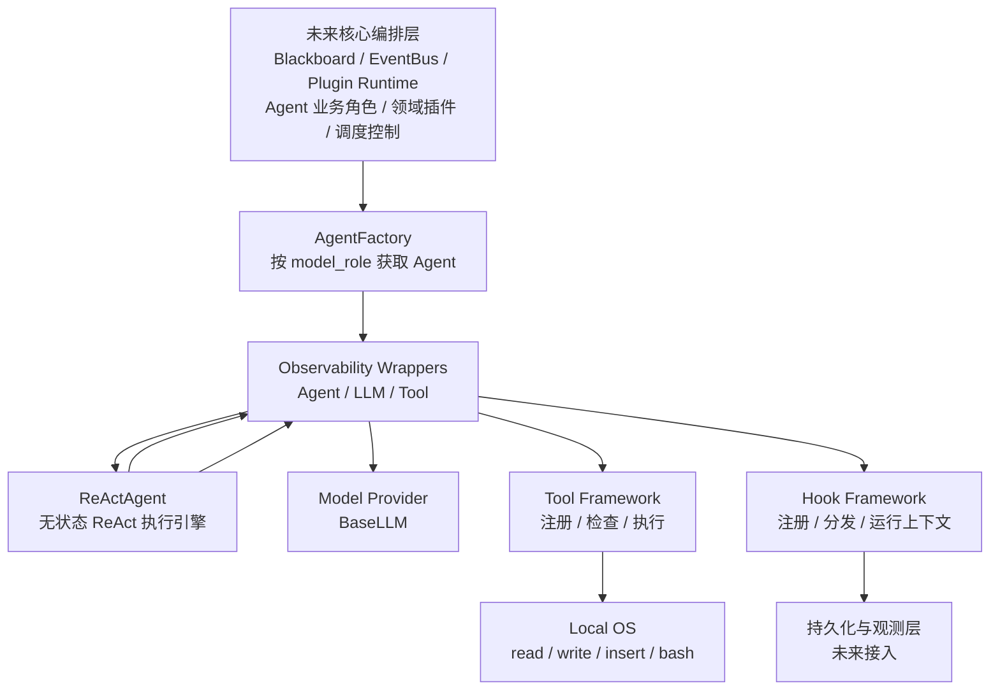
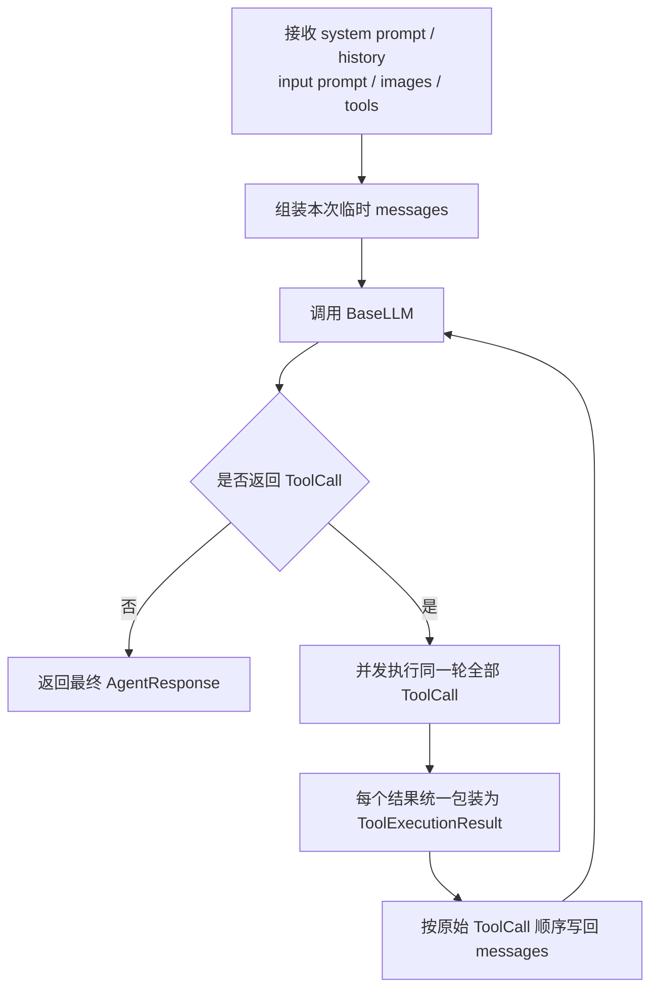
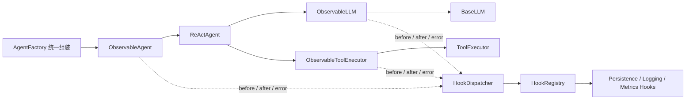

# Agent Orchestration Foundation Design｜Agent 编排基础能力初版设计

## 文档定位

本文描述 Agent 编排层中已经明确、可以先行开发的基础能力，不尝试一次性完成整个核心编排设计。

未来完整编排层将由 BlackboardPlugin 汇聚上下文，AgentPlugin 发布原始执行流，再由 Style、Skill、Memory、TTS、Emotion、L2D 等领域插件分别消费和处理。长期上下文、Agent 业务角色和多 Agent 调度仍需继续设计。

本期只实现以下四类已经确定的能力：

- Agent 工厂；
- 无状态 ReAct Agent 能力层；
- Agent 工具体系；
- 面向持久化、观测和未来业务扩展的 Hook 接口框架。

## 架构边界



### 本期负责

- 根据模型角色获取可复用的 Agent；
- 接收 Prompt、历史消息、图片和可用工具范围；
- 运行完整的 ReAct 循环；
- 执行 LLM 返回的 ToolCall；
- 将工具执行结果写回临时上下文并继续下一轮 LLM 对话；
- 管理工具注册、形式检查、查找和执行；
- 提供低侵入的基础观测 Hook；
- 为未来编排层提供低侵入的自定义业务 Hook 入口。

### 本期不负责

- 黑板及长期上下文存储；
- EventBus 及插件通信；
- Agent 执行流与领域插件处理；
- Agent 业务角色的定义和管理；
- 多 Agent 调度和任务传递；
- 超时、预算、取消、最大步骤和死循环控制；
- Hook 修改参数、结果或执行流程；
- 具体数据库、消息队列及持久化产品实现。

## 核心设计原则

### Agent 无状态

Agent 实例与其依赖长期复用，但不保存单次任务的运行状态。

长期复用的内容包括：

- Agent 实例；
- BaseLLM 实例及底层连接；
- ToolRegistry；
- ToolExecutor；
- HookRegistry 和 HookDispatcher。

单次调用传入或产生的内容包括：

- system prompt；
- history messages；
- input prompt；
- input images；
- 本次允许使用的工具；
- ReAct 中间消息；
- ToolCall 和工具结果；
- 最终响应。

调用结束后，单次运行状态不保留在 Agent 实例中。未来的 Session 或黑板负责长期上下文。

### 参数保持简单和扁平

公开函数优先使用含义直接、彼此独立的参数。即使参数数量较多，也不为了减少参数数量而引入多层嵌套 Request 对象。

Agent 入口采用如下语义：

```python
agent.invoke(
    system_prompt=...,
    history_messages=...,
    input_prompt=...,
    input_images=...,
    tools=...,
)
```

- `input_images=None` 表示本次没有图片；
- `tools=None` 表示使用注册中心内全部可用工具；
- `tools=[]` 表示本次禁用工具；
- `tools=["read", "bash"]` 表示本次只允许使用指定工具。

图片继续使用模型接入层统一的 `ImagePart`。本地图片、URL 或其他图片来源的协议转换属于模型接入层能力，不在 Agent 层重复实现。

### 模型角色不等于 Agent 业务角色

模型角色仅用于选择模型定位和性能参数。本期只保留：

- `thinking`：负责推理、规划、产生 ToolCall、消费工具结果并决定是否继续；
- `perception`：负责图像、环境或过程信息的感知与响应。

`execution` 不再作为模型角色。真正的执行能力来自本地工具，而不是一个名为 execution 的模型。

Planner、Coder、Reviewer 等 Agent 业务角色由未来核心编排层定义。编排层可以为不同业务角色选择相同的模型角色，并通过不同的 Prompt、History 和工具范围调用同一个无状态 Agent。

## AgentFactory

AgentFactory 是上层获取 Agent 的唯一入口。上层不直接实例化 ReActAgent，也不直接组装观测包装器。

AgentFactory 负责：

- 根据 `model_role` 获取对应 BaseLLM；
- 创建并长期复用无状态 ReActAgent；
- 注入共享的 ToolExecutor；
- 使用观测包装器组装 Agent、LLM 和 ToolExecutor；
- 向上返回统一的 Agent 抽象，不暴露内部包装关系。

典型调用方式：

```python
thinking_agent = agent_factory.get_agent(model_role="thinking")
perception_agent = agent_factory.get_agent(model_role="perception")
```

同一个模型角色可以被未来编排层中的多个业务角色使用。AgentFactory 不定义或保存 Agent 业务角色。

## ReActAgent

ReActAgent 是通用、无状态的单 Agent 执行引擎。

第一阶段提供：

- `invoke`：同步执行并返回最终完整响应；
- `ainvoke`：异步执行并返回最终完整响应。

`stream` 和 `astream` 已作为第二阶段实现并完成真实模型验证。详细设计见
`apps/agent/docs/arch/agent-stream-event-design.md`。

### ReAct 数据流



一轮 LLM 返回 ToolCall 后，只表示当前 LLM 对话轮次暂停，不表示整个 Agent 调用结束。Agent 执行本地工具、写回结果后，再发起下一轮 LLM 对话。

### 多 ToolCall

同一轮返回的多个 ToolCall 默认并发执行。

- 不在初版实现资源锁、冲突分析、依赖分析或 `concurrency_key`；
- 等待本轮所有 ToolCall 执行完成后再调用 LLM；
- 每个结果通过原始 `tool_call_id` 与 ToolCall 关联；
- 写回 LLM 上下文时按原始 ToolCall 顺序排列，保证上下文稳定；
- 初版相信模型不会发出彼此冲突的本地操作，进一步控制由未来编排层补充。

### 结束规则

Agent 复用模型接入层已有的 `FinishReason`，不重复定义同义结束类型。

- `tool_call` 表示当前 LLM 轮次暂停，Agent 继续执行；
- 没有 ToolCall 时，Agent 返回最终一轮 LLM 响应及其 `FinishReason`；
- 工具失败不会直接结束 Agent，而是作为统一工具结果写回上下文；
- 不设置默认 `max_steps`；
- 不通过重复调用、重复参数或重复结果推测死循环。

初版信任模型能够自主结束 ReAct 循环。超时、预算、取消、步骤上限和循环控制由未来核心编排层负责。

## Agent 工具体系

### 类型边界

模型接入层已有的 `ToolDefinition` 继续作为统一工具描述，不再定义一套重复的工具元数据。

| 组件 | 职责 |
|---|---|
| `ToolDefinition` | 描述工具名称、用途和参数结构，提供给 LLM |
| `BaseTool` | 本地可执行工具的统一抽象 |
| `ToolCall` | LLM 发起的一次工具调用 |
| `ToolExecutionResult` | 所有工具成功或失败时的统一返回结构 |
| `ToolRegistry` | 注册、保存和按名称查找可用工具 |
| `ToolChecker` | 注册时检查工具形式和定义是否符合框架约定 |
| `BaseToolExecutor` | Agent 能力层依赖的统一工具执行契约 |
| `ToolExecutor` | 查找并执行工具，捕获异常并统一包装结果 |

`ToolDefinition` 是“模型看到的工具说明”，`BaseTool` 是“本地可执行工具实体”，二者职责不同但共享同一份定义。

### 工具注册

应用启动时将当前可用工具注册到 ToolRegistry。

```text
工具实例
  → ToolChecker 检查
  → 检查通过：加入 ToolRegistry
  → 检查失败：记录错误日志并跳过
```

注册检查采用工具级 fail-open：

- 单个工具检查失败不阻塞应用启动；
- 检查失败的工具不进入注册中心，后续等同于不存在；
- 工具名称冲突或定义不合法时记录明确日志；
- Agent 默认只使用成功注册的工具。

首批本地工具包括：

- `read`；
- `write`；
- `insert`；
- `bash`。

### 工具执行结果

所有工具执行都返回统一的 `ToolExecutionResult`，不是只有失败和异常才包装。

- 正常返回包装为成功结果；
- 工具主动返回失败时包装为失败结果；
- 工具抛出异常时由 ToolExecutor 捕获并包装为失败结果；
- 工具不存在时也转换为可写回 LLM 的失败结果。

Agent 将 `ToolExecutionResult` 序列化为模型接入层已有的 tool Message，并使用原始 `ToolCall.id` 作为 `tool_call_id`。

## Hook 接口框架

### 目标

Hook 框架需要同时支持两类未来需求：

- 基础 Hook：面向对话轨迹、日志、Trace、指标和自动持久化，要求对核心代码无侵入；
- 自定义业务 Hook：未来由编排层在明确的业务节点触发，允许少量且清晰的业务代码侵入。

本期只实现容易扩展的接口框架，不绑定具体数据库、消息队列或持久化产品。

文件持久化与监测层的独立设计见：

- `apps/agent/docs/arch/file-persistence-observability-design.md`

### 组件

| 组件 | 职责 |
|---|---|
| `HookEvent` | 统一事件信封，承载事件名称、阶段、运行标识、时间和观测数据 |
| `BaseHook` | 自定义 Hook Handler 的统一抽象 |
| `HookRegistry` | 注册和查询 Hook，支持一个事件注册多个 Handler |
| `HookDispatcher` | 统一同步/异步触发入口，构造事件、分发 Handler 并隔离异常 |
| `HookContext` | 保存当前运行的关联信息，例如 `run_id` |
| `ObservableAgent` | 无侵入观测 Agent 调用边界 |
| `ObservableLLM` | 无侵入观测每一轮 LLM 调用 |
| `ObservableToolExecutor` | 无侵入观测每一个 ToolCall 的执行 |

### 基础 Hook 的低侵入实现



包装器与真实组件实现相同抽象，并由 AgentFactory 统一完成组装。因此：

- ReActAgent 内部不出现 Hook 调用；
- BaseLLM 的厂商实现不出现 Hook 调用；
- ToolExecutor 和具体工具实现不出现 Hook 调用；
- 上层调用方不感知真实对象外部是否存在观测包装器。

基础观测边界包括：

- Agent 整体调用；
- ReAct 内部每一轮 LLM 调用；
- 每一个工具调用。

这些边界足以让未来 Handler 自动记录完整轨迹：

```text
Agent 开始
  → LLM 第 1 轮
  → ToolCall
  → Tool 执行
  → ToolExecutionResult
  → LLM 第 2 轮
  → Agent 结束
```

### Hook 运行上下文

ObservableAgent 在一次 Agent 调用开始时建立 HookContext。ObservableLLM 和 ObservableToolExecutor 自动继承同一个 `run_id`，使不同边界产生的事件可以关联为一条完整轨迹。

运行上下文通过 `ContextVar` 等运行时机制传播，不要求在 Agent、LLM、Tool 的所有公开函数中额外传递 Hook 参数。

### 自定义业务 Hook

包装器只能自动观测稳定的技术调用边界，无法推断“规划完成”“等待用户确认”等业务语义。

未来编排层可以在明确业务节点通过统一入口主动触发：

```python
hook_dispatcher.trigger(
    hook_name="orchestration.plan.completed",
    data=...,
)
```

异步流程使用对应异步入口。业务层只决定：

- 在什么业务节点触发；
- 使用什么事件名称；
- 对外暴露什么业务信息。

注册、查询、多 Handler 分发和异常隔离继续由 Hook 框架负责，因此业务侵入保持在单个清晰触发点。

### Hook 能力边界

当前 Hook 只用于观测：

- Hook 返回值被忽略；
- Hook 不修改 Agent、LLM 或工具参数；
- Hook 不修改执行结果；
- Hook 不暂停、取消或重试主流程；
- 单个 Hook 失败只记录日志，不影响其他 Hook 和主流程；
- Hook 不承担组件通信、黑板同步或任务调度，因此不等同于 EventBus。

基础 Hook 由包装器自动触发，自定义业务 Hook 由未来编排层按需触发。

## 建议包结构

```text
apps/agent/src/
├── model_config/
├── model_provider/
└── agent_orchestration/
    ├── __init__.py
    ├── agent_factory.py
    ├── capability/
    │   ├── __init__.py
    │   ├── base_agent.py
    │   ├── react_agent.py
    │   └── types.py
    ├── tools/
    │   ├── __init__.py
    │   ├── base_tool.py
    │   ├── tool_registry.py
    │   ├── tool_checker.py
    │   ├── tool_executor.py
    │   ├── types.py
    │   └── builtin/
    │       ├── __init__.py
    │       ├── read_tool.py
    │       ├── write_tool.py
    │       ├── insert_tool.py
    │       └── bash_tool.py
    └── hooks/
        ├── __init__.py
        ├── base_hook.py
        ├── hook_event.py
        ├── hook_context.py
        ├── hook_registry.py
        ├── hook_dispatcher.py
        └── wrappers/
            ├── __init__.py
            ├── observable_agent.py
            ├── observable_llm.py
            └── observable_tool_executor.py
```

`agent_orchestration` 是编排层的代码边界：

- `agent_factory.py` 是该层对上游的统一组装与获取入口；
- `capability/` 承载通用、无状态的 Agent 能力实现；
- `tools/` 承载工具注册、检查、执行及内置工具；
- `hooks/` 承载 Hook 注册、分发、运行上下文和低侵入观测包装器。

文档继续统一保存在 `apps/agent/docs/`，不放入源码包。具体文件可以在实现时根据依赖方向小幅调整，但必须保持以下约束：

- ReActAgent 不依赖具体 Hook Handler；
- BaseTool 不依赖 Agent；
- 模型厂商实现不依赖 Agent 和 Tool 实现；
- 观测包装器只负责调用边界观测，不承载 ReAct 或工具业务；
- 所有组装集中在 AgentFactory 或应用启动入口。

## 分阶段实现

### 第一阶段

当前分支已经完成：

- 模型角色收敛为 `thinking` 和 `perception`；
- AgentFactory；
- 无状态 ReActAgent；
- `invoke` 和 `ainvoke`；
- ToolDefinition 复用；
- BaseTool、ToolRegistry、ToolChecker、ToolExecutor；
- ToolExecutionResult；
- `read`、`write`、`insert`、`bash`；
- 同轮多 ToolCall 并发执行；
- HookEvent、BaseHook、HookRegistry、HookDispatcher、HookContext；
- ObservableAgent、ObservableLLM、ObservableToolExecutor；
- 同步与异步主链路测试。

### 第二阶段

当前分支已经完成：

- `stream`；
- `astream`；
- Agent 级流式事件；
- 多轮 LLM Stream 与工具执行过程的串联。

第二阶段的具体事件协议、工具分批规则、Hook 边界和未来插件系统边界以
`apps/agent/docs/arch/agent-stream-event-design.md` 为准。

### 未来核心编排

- 黑板；
- EventBus；
- 长期上下文与 Session；
- Agent 业务角色；
- Style、Skill、Memory、TTS、Emotion、L2D 等领域插件；
- perception 模型在具体插件中的按需使用策略；
- 多 Agent 调度；
- 超时、取消、预算和循环控制；
- Hook 安全干预能力；
- 具体持久化与观测 Handler。

## 初版验收标准

- 上层可以通过 AgentFactory 获取 `thinking` 或 `perception` Agent；
- Agent 实例可重复调用且不同调用之间不存在运行状态泄漏；
- Agent 可以完成“LLM → ToolCall → 本地工具 → ToolResult → LLM”的完整循环；
- 同一轮多个 ToolCall 可以并发完成并稳定写回上下文；
- 所有工具结果都使用统一结构；
- 工具注册检查失败只记录日志并跳过，不阻塞应用；
- `tools=None`、空列表和指定工具列表具有明确且可验证的语义；
- Agent、每轮 LLM 和每个 ToolCall 都能通过包装器自动产生基础 Hook 事件；
- 核心 ReAct、模型厂商实现和具体工具中不存在基础 Hook 触发代码；
- 未来编排层可以通过 HookDispatcher 触发自定义业务 Hook；
- Hook 异常不改变主流程参数、结果和异常语义；
- `invoke` 与 `ainvoke` 具有一致的 ReAct 行为。
