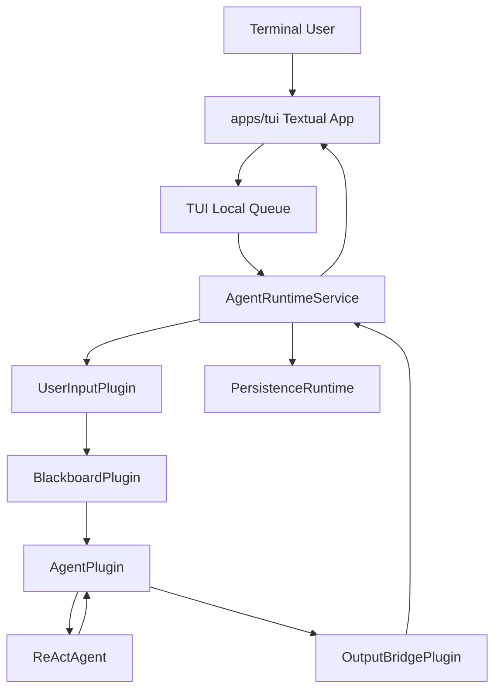

# Agent Runtime Service and Textual TUI Integration Design｜Agent 应用服务与 Textual TUI 集成设计

## 文档定位

本文描述 Agent Core 对外提供的进程内应用服务，以及 Textual 终端应用如何只通过该服务
完成输入提交和实时输出消费。

目标是提供：

- 一个进程内 `AgentRuntimeService`；
- 一个独立 `apps/tui` Textual 全屏应用；
- 从终端输入到真实 Agent、Tool、Stream、Trace 的完整链路；
- 未来 HTTP/SSE Transport 可以复用的应用服务入口。

本文不定义 HTTP Server、WebSocket、后端适配器和用户产品功能。

Textual 布局、持久输入框、本地队列、Markdown 投影和按键交互以
`apps/tui/docs/arch/tui-persistent-input-queue-design.md` 为准。本文只保留
`AgentRuntimeService`、输出订阅、TUI 集成路径和业务 History 的应用层边界。

## Monorepo 位置

```text
apps/
├── agent/
│   └── src/
│       ├── agent_orchestration/
│       └── application/
│           ├── __init__.py
│           ├── agent_runtime_service.py
│           └── output_bridge.py
└── tui/
    ├── src/
    │   ├── __init__.py
    │   ├── app.py
    │   ├── chat_state.py
    │   ├── event_pipeline/
    │   ├── main.py
    │   ├── replay.py
    │   ├── styles.tcss
    │   ├── transcript.py
    │   └── widgets/
    └── test/
```

`apps/agent` 提供可复用 Agent 应用服务。

`apps/tui` 只负责终端交互和渲染，不直接组装 PluginManager、EventBus、Blackboard 或 AgentFactory。

## 总体架构



## AgentRuntimeService

`AgentRuntimeService` 是当前 Agent 应用的统一进程内入口。

职责：

- 加载 Agent 配置；
- 创建并启动 PersistenceRuntime；
- 打开一个固定 Session；
- 创建 HookRegistry；
- 创建 AgentFactory；
- 创建 PluginManager；
- 创建和注册核心 Plugin；
- 建立订阅关系；
- 对外提供输入提交与 Event 消费接口；
- 关闭时 Drain Plugin Runtime 和 Trace Writer。

### 对外接口

```python
class AgentRuntimeService:
    async def start(self) -> None:
        ...

    async def submit(
        self,
        prompt: str,
        input_images: list[ImagePart] | None = None,
    ) -> InputAccepted:
        ...

    def subscribe_events(self) -> OutputEventSubscription:
        ...

    async def stop(self, timeout: float | None = 30) -> None:
        ...
```

每个应用层消费者通过 `subscribe_events()` 创建独立实时订阅。订阅只接收创建后的 Event，
不回放历史；每个订阅拥有独立队列，因此 TUI、SSE 或其他 Transport 不会竞争消费。
消费者在 Service 生命周期内从 `OutputEventSubscription.next_event()` 持续读取 Event，使用
`InputFinishedEvent` 判断对应任务结束，并在自身退出时调用 `close()`。

当前最小实现使用无界队列。未及时消费的 Event 会暂存在该订阅自己的队列中，不阻塞
其他订阅；暂不实现容量限制、淘汰和慢消费者断开策略。

未来 HTTP/SSE Adapter 可以基于同一 Service 封装为 AsyncIterator 或网络流。

当前 Service 对象采用单次生命周期：`start()` 后可重复调用而不重复启动；`stop()` 完成后不可重新启动，需要创建新的 Service 实例。

## 核心 Plugin 组装

初版注册：

```text
UserInputPlugin
SkillPlugin
BlackboardPlugin
AgentPlugin
OutputBridgePlugin
```

订阅关系：

```text
user-input → skill
user-input → blackboard
user-input → output-bridge

skill → blackboard
blackboard → agent

agent → user-input
agent → skill
agent → blackboard
agent → output-bridge
```

### OutputBridgePlugin

这是 TUI MVP 的内部输出桥接 Plugin。

职责：

- 订阅 UserInputPlugin 和 AgentPlugin；
- 将 Event 广播到每个当前实时订阅的独立队列；
- 不转换 Event；
- 不处理业务逻辑；
- 不直接打印终端。

它属于应用组装组件，可放在 `apps/agent/src/application/`，不作为通用领域 Plugin。

## Blackboard 配置

当前应用服务已经接入 SkillPlugin，Blackboard 每轮等待 Skill Context 后再生成 Agent
Context：

```python
BlackboardPlugin(
    required_context_sources={"skill"},
    model_role="thinking",
    system_prompt=<stable prompt>,
    tools=None,
)
```

`tools=None` 表示使用全部已注册工具。Memory、Knowledge 等其他 Context Plugin 尚未接入。

System Prompt 使用稳定固定值，不从用户输入动态修改。

## Session 与持久化

一个 TUI 进程启动一个 AgentRuntimeService 和一个 Session。

```text
TUI Process
└── AgentRuntimeService
    └── fixed PersistenceSession
```

Session ID：

- CLI 参数允许显式传入；
- 未传时 Agent Runtime 生成 UUID；
- 当前 MVP 不提供历史会话恢复；
- 每次进程启动默认新 Session。

数据通过 `ICARUS_DATA_DIR` 写入：

```text
workspaces/<workspace_key>/sessions/<session_id>/
├── session.json
├── trace.jsonl
├── runtime.log
└── assets/
```

TUI 不读取 Trace 恢复 History。需要恢复业务历史时，由上层在创建
`AgentRuntimeService` 时通过 `initial_messages` 一次性注入 Blackboard。

## Textual TUI 交互

当前终端应用保持一个持久 Composer，并在 TUI 层维护待发送队列：

```text
Enter
→ 消息进入 TUI 本地 deque
→ Runtime 空闲时提交队首
→ 流式展示当前任务 Event
→ InputFinishedEvent 结束当前活动任务
→ 若队列非空则自动提交下一条
```

Agent 执行期间 Composer 仍可编辑，`Enter` 可以继续加入本地队列。TUI 一次只向 Runtime
提交一个活动任务：正常消费从队首开始，只有当前任务的 `InputFinishedEvent` 到达后才调度
下一条。Runtime 的内部 FIFO 不替代面向用户展示和撤回的 TUI 队列。

队首消息仅在 `submit()` 返回 `InputAccepted` 后从本地队列移除。TUI 保存返回的 `task_id`，
只让匹配当前活动任务的 Event 改变当前任务状态；Output Bridge 广播的原始 Event 不承担
UI 排队语义。

### 退出

完整输入 `exit` / `quit`、空输入上的 `Ctrl+D`，或 Agent 空闲且草稿和队列均为空时按
`Ctrl+C`，都会退出整个 TUI。退出流程为：

```text
停止接受输入
→ 关闭 Output Event 订阅
→ PluginManager Drain
→ Persistence Writer Drain
→ 关闭 LLM Client
→ 退出进程
```

## Event 展示

### AgentTextDeltaEvent

连续文字增量由 TUI 投影到当前 Textual Markdown 消息组件，并在应用内 Conversation
滚动区域实时刷新；工具或终止事件到达时结束当前流式段。应用服务只广播原始 Event，
不参与样式处理。

### AgentToolStartedEvent

单独输出：

```text
[tool] read {"path": "README.md"}
```

### AgentToolCompletedEvent

默认只显示状态：

```text
[tool] read completed: success
```

失败时显示错误摘要。

不默认打印完整 ToolResult，避免大文件和命令输出淹没终端。

### InputQueuedEvent

```text
[task] accepted by runtime, position=0
```

该事件只表示 Runtime 已接收当前活动任务，不作为 TUI 本地待发送队列项重复展示。

### InputStartedEvent

初版可以不显示，或作为 Debug 输出。

### InputFinishedEvent

用于结束当前活动任务；TUI 随后回到等待状态，或自动调度本地队列中的下一条消息。

### TaskErrorEvent

```text
[error] RuntimeError: ...
```

## History

TUI 不维护业务 History，也不在每轮提交时传递历史消息。

当前 Agent 实例的跨轮 User/Assistant Message 由 BlackboardPlugin 维护。
AgentCompletedEvent 更新 Blackboard，下一轮上下文快照自动携带已有消息。
ToolCall、ToolResult 和已实际应用的 Plugin Context 进入跨轮业务 History；Reasoning 和原始
Plugin Event 不进入。取消 Task 只提交最近的协议完整消息前缀。

正式业务历史继续由后端数据库保存。恢复会话时，上层从后端数据库读取业务消息，
并在 Agent Runtime 初始化时一次性注入 Blackboard；本地 Trace 不用于恢复 History。

## 错误处理

- 配置缺失：启动失败并打印明确错误；
- `ICARUS_DATA_DIR` 缺失：启动失败；
- TaskErrorEvent：显示错误；只有 `fatal=True` 时等待 failed InputFinishedEvent；
- Plugin Runtime 启动失败：关闭已启动组件；
- 空输入上的 EOF / `Ctrl+D`：退出整个 TUI；
- `Ctrl+C` 按上下文只执行一个动作：
  - 草稿非空：清空草稿；
  - 草稿为空且本地队列非空：从队尾撤回最新消息并恢复到 Composer；
  - 草稿和队列为空但任务运行中：调用 `cancel_task(task_id)`，等待 cancelled 终态；
  - 草稿和队列为空且 Agent 空闲：正常退出整个 TUI。

任务级取消已经通过 TaskChannel 和 Agent Run 协程取消实现；不会通过停止并重启整个 Runtime
或发送普通消息伪造取消。运行中 Context 只面向内部 Plugin，不属于 TUI 应用服务接口。

## 应用服务层不实现

- 全屏布局与 Textual；
- HTTP/SSE/WebSocket；
- 历史 Session 恢复；
- 任务取消；
- 队列重排；
- StylePlugin；
- Memory/Knowledge 等尚未接入的 Context Plugin；
- 图片本地上传；
- 配置页面；
- 自动补全和快捷键。

Textual 输入、Markdown 渲染和快捷键属于 `apps/tui`，不属于
`AgentRuntimeService` 职责。

## 验收标准

- `apps/tui` 可直接启动；
- 真实模型可以完成纯文本对话；
- 工具调用能展示开始和完成状态；
- 文字按 Delta 流式更新 Markdown 消息；
- Agent 运行中仍可编辑并把消息加入 TUI 本地队列；
- Runtime 的多个实时订阅各自收到相同 Event，不竞争消费；
- 多轮输入使用内存 History；
- `exit/quit/EOF` 和空闲 `Ctrl+C` 正常 Drain；
- Trace 和 runtime.log 正常生成；
- TUI 不直接依赖 PluginManager、EventBus、BlackboardPlugin；
- AgentRuntimeService 可以被未来 Transport 复用；
- 相关 Runtime 测试和 TUI 测试通过。
