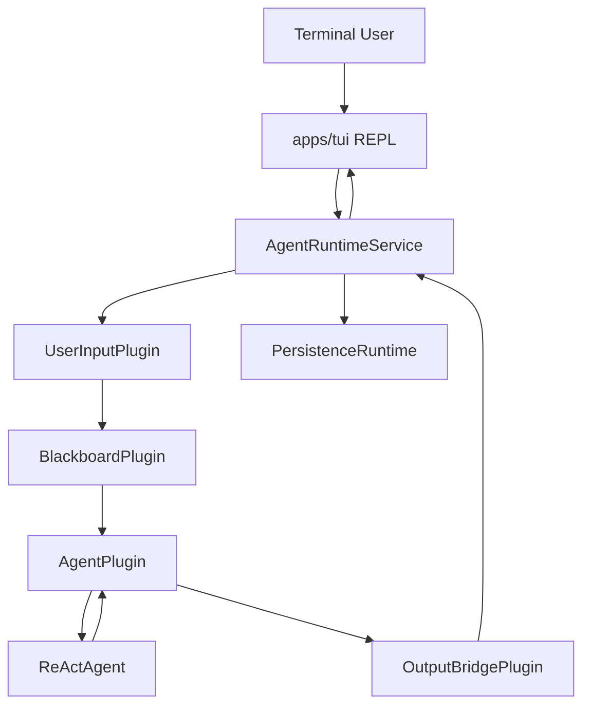

# Agent Runtime Service and REPL TUI Design｜Agent 应用服务与 REPL TUI 设计

## 文档定位

本文描述用于验证 Agent Core 的最小应用层与终端应用。

目标是提供：

- 一个进程内 `AgentRuntimeService`；
- 一个独立 `apps/tui` REPL 应用；
- 从终端输入到真实 Agent、Tool、Stream、Trace 的完整链路；
- 未来 HTTP/SSE Transport 可以复用的应用服务入口。

本文不实现正式全屏 TUI、HTTP Server、WebSocket、后端适配器和用户产品功能。

## Monorepo 位置

```text
apps/
├── agent/
│   └── src/
│       ├── agent_orchestration/
│       └── application/
│           ├── __init__.py
│           └── agent_runtime_service.py
└── tui/
    ├── __init__.py
    ├── main.py
    ├── renderer.py
    └── test/
```

`apps/agent` 提供可复用 Agent 应用服务。

`apps/tui` 只负责终端交互和渲染，不直接组装 PluginManager、EventBus、Blackboard 或 AgentFactory。

## 总体架构



## AgentRuntimeService

`AgentRuntimeService` 是当前 Agent 应用的统一进程内入口。

职责：

- 加载 Agent 配置；
- 创建并启动 PersistenceRuntime；
- 打开一个固定 Session；
- 创建 HookRegistry；
- 创建 AgentFactory；
- 创建 PluginManager；
- 创建和注册核心 Plugin；
- 建立订阅关系；
- 对外提供输入提交与 Event 消费接口；
- 关闭时 Drain Plugin Runtime 和 Trace Writer。

### 对外接口

```python
class AgentRuntimeService:
    async def start(self) -> None:
        ...

    async def submit(
        self,
        prompt: str,
        history_messages: list[Message],
        input_images: list[ImagePart] | None = None,
    ) -> InputAccepted:
        ...

    async def next_event(self) -> tuple[str, Event]:
        ...

    async def stop(self) -> None:
        ...
```

初版使用 `next_event()`，而不是提供复杂的多订阅 Stream API。TUI 每次提交后循环读取 Event，直到收到对应任务的 `InputFinishedEvent`。

未来 HTTP/SSE Adapter 可以基于同一 Service 封装为 AsyncIterator 或网络流。

当前 Service 对象采用单次生命周期：`start()` 后可重复调用而不重复启动；`stop()` 完成后不可重新启动，需要创建新的 Service 实例。

## 核心 Plugin 组装

初版注册：

```text
UserInputPlugin
BlackboardPlugin
AgentPlugin
OutputBridgePlugin
```

订阅关系：

```text
user-input → blackboard
user-input → output-bridge

blackboard → agent

agent → user-input
agent → blackboard
agent → output-bridge
```

### OutputBridgePlugin

这是 TUI MVP 的内部输出桥接 Plugin。

职责：

- 订阅 UserInputPlugin 和 AgentPlugin；
- 将 Event 放入 Service 的输出队列；
- 不转换 Event；
- 不处理业务逻辑；
- 不直接打印终端。

它属于应用组装组件，可放在 `apps/agent/src/application/`，不作为通用领域 Plugin。

## Blackboard 配置

TUI MVP 暂未接 Memory、Skill、Knowledge 等 Context Plugin，因此：

```python
BlackboardPlugin(
    required_context_sources=set(),
    model_role="thinking",
    system_prompt=<stable prompt>,
    tools=None,
)
```

`tools=None` 表示使用全部已注册工具。

System Prompt 使用稳定固定值，不从用户输入动态修改。

## Session 与持久化

一个 TUI 进程启动一个 AgentRuntimeService 和一个 Session。

```text
TUI Process
└── AgentRuntimeService
    └── fixed PersistenceSession
```

Session ID：

- CLI 参数允许显式传入；
- 未传时 Agent Runtime 生成 UUID；
- 当前 MVP 不提供历史会话恢复；
- 每次进程启动默认新 Session。

数据通过 `ICARUS_DATA_DIR` 写入：

```text
workspaces/<workspace_key>/sessions/<session_id>/
├── session.json
├── trace.jsonl
├── runtime.log
└── assets/
```

TUI 不读取 Trace 恢复 History。

## REPL 交互

采用串行 REPL：

```text
Icarus> 用户输入
→ 提交 UserInputPlugin
→ 流式展示 Agent 事件
→ 等待 InputFinishedEvent
→ 更新内存 History
→ 再显示 Icarus>
```

任务执行期间不开放新输入，避免标准终端中输入行与流式输出冲突。

底层 UserInputPlugin 仍支持 FIFO 队列；未来全屏 TUI 可以开放任务执行中的继续输入。

### 退出

输入：

```text
exit
quit
```

执行：

```text
停止接受输入
→ PluginManager Drain
→ Persistence Writer Drain
→ 关闭 LLM Client
→ 退出进程
```

## Event 展示

### AgentTextDeltaEvent

原地输出：

```python
print(event.text, end="", flush=True)
```

### AgentToolStartedEvent

单独输出：

```text
[tool] read {"path": "README.md"}
```

### AgentToolCompletedEvent

默认只显示状态：

```text
[tool] read completed: success
```

失败时显示错误摘要。

不默认打印完整 ToolResult，避免大文件和命令输出淹没终端。

### InputQueuedEvent

```text
[queue] task accepted, position=0
```

### InputStartedEvent

初版可以不显示，或作为 Debug 输出。

### InputFinishedEvent

用于结束当前 REPL 等待并显示下一次提示。

### AgentErrorEvent

```text
[error] RuntimeError: ...
```

## History

REPL 只在内存中维护当前进程的业务 History：

```text
User Message
Assistant Final Message
```

当前原始 Agent 输出尚未经过 StylePlugin，因此 MVP 将 `AgentCompletedEvent.response.message` 作为助手消息加入 History。

这只用于验证当前 Agent 功能，不改变“正式业务历史由后端数据库保存”的长期边界。

ToolCall、ToolResult、Reasoning 和 Plugin Event 不进入业务 History。

## 错误处理

- 配置缺失：启动失败并打印明确错误；
- `ICARUS_DATA_DIR` 缺失：启动失败；
- AgentErrorEvent：显示错误并等待 InputFinishedEvent；
- Plugin Runtime 启动失败：关闭已启动组件；
- EOF / Ctrl+D：等价于退出；
- KeyboardInterrupt / Ctrl+C：
  - 输入阶段：退出；
  - 任务执行阶段：当前 MVP 不实现任务取消，打印提示并继续等待任务完成。

取消能力在后续阶段加入。

## 不实现

- Textual/Rich/prompt_toolkit；
- 全屏布局；
- HTTP/SSE/WebSocket；
- Markdown 渲染；
- 历史 Session 恢复；
- 任务取消；
- 队列重排；
- StylePlugin；
- Memory/Skill/Knowledge；
- 图片本地上传；
- 配置页面；
- 自动补全和快捷键。

## 验收标准

- `apps/tui` 可直接启动；
- 真实模型可以完成纯文本对话；
- 工具调用能展示开始和完成状态；
- 文字按 Delta 流式打印；
- 多轮输入使用内存 History；
- `exit/quit/EOF` 正常 Drain；
- Trace 和 runtime.log 正常生成；
- TUI 不直接依赖 PluginManager、EventBus、BlackboardPlugin；
- AgentRuntimeService 可以被未来 Transport 复用；
- 全量 Agent 测试不回归。
