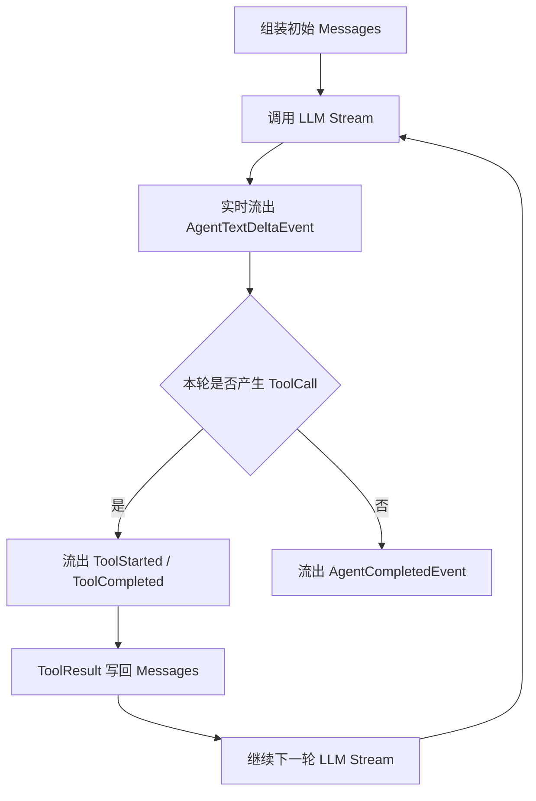

# Agent Stream Event Design｜Agent 流式事件设计

## 文档定位

本文描述 Agent 编排基础能力第二阶段的流式输出设计。

当前分支已经完成本文定义的 Stream 能力；Plugin、EventBus 和 Blackboard 仍属于后续阶段。

第一阶段已经实现：

- 无状态 ReActAgent；
- `invoke` 和 `ainvoke`；
- 工具注册、检查、执行及并发调用；
- Agent、LLM、Tool 的基础 Hook 观测；
- AgentFactory。

第二阶段将实现：

- 通用 Event 基类；
- Agent Stream Event 子类；
- `stream` 和 `astream`；
- 有序工具分批执行；
- 流式路径的聚合 Hook 观测。

本文不实现完整 Plugin、EventBus、Blackboard、Skill、Memory 和多控制面编排，只为这些未来能力保留统一事件接口。

## 设计目标

Agent 流式输出需要同时支持：

- GUI、WebUI、TUI 的文字流式展示；
- 工具调用过程展示；
- TTS 对文字增量进行独立缓冲和分段处理；
- 未来 L2D 动作、情绪、语义风格化和自定义插件消费；
- 未来 AgentPlugin 将事件发布到 EventBus；
- Hook 对流式生命周期进行持久化、观测和监督。

Agent 层不绑定 HTTP、SSE、WebSocket、GUI Signal 或终端框架，只提供 Python 原生：

```python
Iterator[Event]
AsyncIterator[Event]
```

不同客户端和未来插件系统在外层完成适配。

## Event 基类

Event 是未来插件系统中的统一消息基础。

```python
@dataclass(frozen=True)
class Event:
    event_id: str
    occurred_at: datetime
    correlation_id: str | None = None
```

### 字段语义

| 字段 | 说明 |
|---|---|
| `event_id` | 当前 Event 的唯一标识 |
| `occurred_at` | Event 产生时间 |
| `correlation_id` | 关联同一次 Agent Run、用户任务或未来插件事件链 |

Event 基类只定义所有消息共有的身份信息，不预设 EventBus 路由规则。

未来 Registry 只按来源插件维护订阅关系；来源插件身份由 EventBus 的发布信封或 AgentPlugin 发布入口补充，而不是由纯能力内核中的 Event 固定持有。EventBus 不解析 Event 具体类型和 Payload，目标插件收到 Event 后自行决定处理或忽略。

## Agent Stream Event

Agent 流式事件继承 Event。

```text
Event
├── AgentTextDeltaEvent
├── AgentToolStartedEvent
├── AgentToolCompletedEvent
├── AgentCompletedEvent
└── AgentErrorEvent
```

### AgentTextDeltaEvent

表示模型向当前调用方产生的一段文字增量。

```python
@dataclass(frozen=True)
class AgentTextDeltaEvent(Event):
    step: int
    text: str
```

行为约束：

- 模型产生多少文字就实时流出多少；
- 包含调用工具前的说明性文字，例如“让我读取一下文件”；
- 不流出原始 `reasoning_delta`；
- TTS 等消费者自行缓冲并按标点、长度或时间阈值分段；
- Agent 不承担 TTS 切句、语义风格化或动作控制。

### AgentToolStartedEvent

表示一个 ToolCall 即将执行。

```python
@dataclass(frozen=True)
class AgentToolStartedEvent(Event):
    step: int
    tool_call: ToolCall
```

面向用户和其他层面提供：

- 工具名称；
- 工具参数；
- `tool_call_id`。

工具调用作为完整结构化事件流出，不拆成 Token 或文本增量。

### AgentToolCompletedEvent

表示一个 ToolCall 已完成。

```python
@dataclass(frozen=True)
class AgentToolCompletedEvent(Event):
    step: int
    tool_call: ToolCall
    result: ToolExecutionResult
```

提供：

- 工具名称；
- 工具参数；
- 成功或失败状态；
- 完整 `ToolExecutionResult`。

具体客户端可以选择只展示简要状态，未来插件可以使用完整结果。

### AgentCompletedEvent

表示一次完整 Agent Stream 正常结束。

```python
@dataclass(frozen=True)
class AgentCompletedEvent(Event):
    step: int
    response: AgentResponse
```

`response` 包含：

- 最终 Message；
- 聚合后的 reasoning；
- 聚合 Usage；
- 最终 FinishReason；
- LLM 调用步数；
- 本次完整临时消息轨迹。

### AgentErrorEvent

表示 Agent Stream 发生不可恢复异常。

```python
@dataclass(frozen=True)
class AgentErrorEvent(Event):
    step: int
    error_type: str
    error_message: str
```

异常语义：

```text
已有 Stream Event
→ AgentErrorEvent
→ 生成器原样抛出异常
```

- 客户端可以先收到结构化错误并展示；
- 上层服务仍然能够捕获原始异常；
- `AgentCompletedEvent` 和 `AgentErrorEvent` 互斥。

## Stream 与 Hook 的边界

### Stream

Stream 是当前调用方的主输出通道：

- 严格有序；
- 支持背压；
- 支持调用方取消；
- GUI、WebUI、TUI 和 TTS 可以直接消费；
- 未来 AgentPlugin 可以将 Event 发布到 EventBus。

### Hook

Hook 是旁路持久化、观测和监督机制：

- 不承担用户响应的可靠送达；
- 不记录每个 `AgentTextDeltaEvent`；
- 记录 `agent.stream` 生命周期；
- 每轮 `llm.stream` 结束后记录聚合结果；
- 继续记录每个工具执行；
- 记录最终 `AgentResponse` 或异常；
- Hook 失败不改变 Stream 主流程。

不逐 Delta 触发 Hook，避免：

- 增加首字延迟；
- 产生大量持久化事件；
- 让慢 Hook 阻塞用户显示和 TTS。

## 多轮 ReAct Stream

一个 Agent Stream 内部串联多轮 LLM Stream。



每轮 LLM Stream 需要在 Agent 内部聚合：

- 完整 Assistant 文本；
- 完整 reasoning；
- 完整 ToolCall；
- Usage；
- FinishReason。

聚合结果用于：

- 写入下一轮上下文；
- 最终构造 AgentResponse；
- 触发一次聚合后的 LLM Stream Hook。

## 工具有序分批执行

模型返回的 ToolCall 列表视为有序执行计划。

执行器保持原始顺序，并根据每个 ToolCall 是否可并行划分批次：

- 连续且可并行的 ToolCall 合并为一个并发批次；
- 不可并行的 ToolCall 单独形成一个批次和顺序屏障；
- 当前批次全部完成后才进入下一批；
- 所有结果最终按原始 ToolCall 顺序写回 LLM 上下文。

示例：

```text
parallel flags: 0 0 1 1 0 1 0 1 1 1 0 1

batches:
[0] → [0] → [11] → [0] → [1] → [0] → [111] → [0] → [1]
```

### 工具并行能力

工具通过本次调用参数判断是否可并行：

```python
def can_run_parallel(
    self,
    arguments: dict[str, Any],
) -> bool:
    return False
```

当前工具规则：

| 工具 | 并行规则 |
|---|---|
| `read` | 始终可并行 |
| `write` | 不可并行 |
| `insert` | 不可并行 |
| `bash` | 由本次调用参数声明，默认不可并行 |

Bash ToolDefinition 增加可选参数：

```json
{
  "parallel": false
}
```

未来编排层 Prompt 需要要求模型：

- ToolCall 列表必须体现执行依赖顺序；
- 存在依赖的调用必须按先后排列；
- 只有确认 Bash 与相邻任务不存在资源冲突时才设置 `parallel=true`。

初版不进行命令语义分析、资源锁或依赖图推理。

## 工具事件顺序

对于一个批次：

```text
按 ToolCall 原始顺序流出 AgentToolStartedEvent
→ 执行当前批次
→ 按真实完成顺序流出 AgentToolCompletedEvent
→ 等待批次全部完成
→ 进入下一批
```

ToolCompleted 的真实完成顺序用于及时向用户展示进展。

写回 LLM 时仍按原始 ToolCall 顺序排列，通过 `tool_call_id` 关联结果，不依赖完成事件顺序。

## 同步与异步语义

```python
def stream(...) -> Iterator[Event]:
    ...

async def astream(...) -> AsyncIterator[Event]:
    ...
```

两者必须具备相同事件语义：

- 相同的 Event 类型；
- 相同的 Step 编号；
- 相同的工具批次规则；
- 相同的上下文回填方式；
- 相同的完成与异常语义。

同步与异步分别调用：

```text
stream  → BaseLLM.stream  → ToolExecutor 同步执行
astream → BaseLLM.astream → ToolExecutor 异步执行
```

不使用 `asyncio.run()` 互相包装。

## 取消语义

调用方停止消费或取消异步任务时：

- 停止发起后续 LLM 调用；
- 停止进入后续工具批次；
- 尚未开始的工具不再执行；
- 当前正在运行的同步 OS 工具初版不强制终止；
- 取消信号保持原始语义向上传播；
- Hook 记录流式调用未正常完成。

更复杂的子进程终止和任务恢复策略留给未来编排层。

## 客户端适配

Agent 层不绑定具体传输协议。

### TUI

```python
for event in agent.stream(...):
    render(event)
```

### WebUI

Web 服务使用 `astream()`，将 Event 转换为 SSE 或 HTTP Streaming。

```text
Agent Event → JSON → SSE / HTTP Stream → WebUI
```

如果未来需要客户端实时发送暂停、取消、确认等双向控制，再引入 WebSocket。

### GUI

GUI 后台任务消费 `astream()`，再通过 GUI 框架的 Signal 或消息队列更新主线程。

### TTS

未接 StylePlugin 的基础场景可以直接消费 `AgentTextDeltaEvent`。完整用户响应链默认由 TTS 消费 StylePlugin 产生的风格化文本 Event：

```text
接收文字增量
→ 追加到自身 Buffer
→ 标点 / 长度 / 时间达到阈值
→ 提交一段 TTS
→ 继续收集后续增量
```

切分策略不进入 Agent。TTS、Emotion、L2D 和 VAC 参数也不由 Agent 或 StylePlugin 统一生成，而由各领域 Plugin 自行转换。

## 与未来插件系统的边界

未来系统统一使用 Plugin 模型：

- AgentPlugin；
- BlackboardPlugin；
- SkillPlugin；
- KnowledgePlugin；
- MemoryPlugin；
- UserInputPlugin；
- WebUI、TUI、TTS、L2D 和自定义插件。

所有插件都可以生产 Event 和消费 Event。

### Plugin Registry

Registry 只维护按来源插件的订阅关系：

```text
source_plugin → subscriber plugins
```

不按 Event 类型路由。

### EventBus

EventBus 只是通道：

- 接受插件发布的 Event；
- 根据发布方插件身份查询 Registry；
- 将 Event 投递到目标插件的统一消费入口；
- 不理解 Event 具体类型；
- 不等待目标插件处理完成。

### Plugin

每个插件拥有一个统一消费入口，处理所有已订阅来源的 Event：

```python
async def consume(self, event: Event) -> None:
    ...
```

插件自行根据 Event 子类决定处理或忽略。

### BlackboardPlugin

Blackboard 是一个普通插件，职责是：

- 消费 UserInput、Skill、Knowledge、Memory 和其他上下文插件的 Event；
- 维护当前上下文状态；
- 整合 Agent 所需上下文；
- 生产可供 AgentPlugin 消费的上下文 Event。

正常任务中 AgentPlugin 只消费 BlackboardPlugin 生产的上下文，不直接订阅各上下文来源。

### AgentPlugin

AgentPlugin 负责：

- 消费 BlackboardPlugin 生产的上下文 Event；
- 调用 ReActAgent；
- 消费 ReActAgent Stream；
- 将 Stream Event 发布到 EventBus；
- 只等待 EventBus 接受事件，不等待其他插件处理。

ReActAgent 仍是纯能力内核，不直接依赖 EventBus、Plugin Registry 或 Blackboard。

Plugin、EventBus、Registry 和 Blackboard 的具体实现不属于本次 Stream 开发范围。下一阶段的初版架构见
`apps/agent/docs/arch/plugin-eventbus-blackboard-design.md`。

## 本次实现范围

### 实现

- 通用 Event 基类；
- Agent Stream Event 子类；
- BaseAgent `stream` 和 `astream`；
- ReActAgent 多轮流式执行；
- 工具有序分批执行；
- Bash `parallel` 参数；
- ObservableLLM 流式聚合 Hook；
- ObservableAgent 流式生命周期 Hook；
- 同步和异步流式测试；
- 非流式回归测试。

### 不实现

- Plugin 基类；
- Plugin Registry；
- EventBus；
- 插件统一消费队列；
- AgentPlugin；
- BlackboardPlugin；
- Skill、Knowledge、Memory 插件；
- SSE、WebSocket、GUI 和 TTS 具体适配器；
- 工具资源锁和 Bash 命令语义分析。

## 验收标准

- `stream` 和 `astream` 可以完成纯文本和多轮 ToolCall；
- 工具调用前的模型文本实时流出；
- reasoning 不进入用户 Stream；
- ToolStarted 包含工具名称和参数；
- ToolCompleted 包含工具名称、参数和执行结果；
- 连续可并行工具按批次并发执行；
- 不可并行工具形成顺序屏障；
- 工具完成事件按真实完成顺序流出；
- ToolResult 按原始顺序写回模型上下文；
- Completed 携带完整 AgentResponse；
- Error Event 后抛出原始异常；
- Hook 不逐 Delta 记录，只记录流式聚合结果和生命周期；
- `invoke` 和 `ainvoke` 行为不回归；
- Event 类型可以被未来 AgentPlugin 直接发布到 EventBus。
