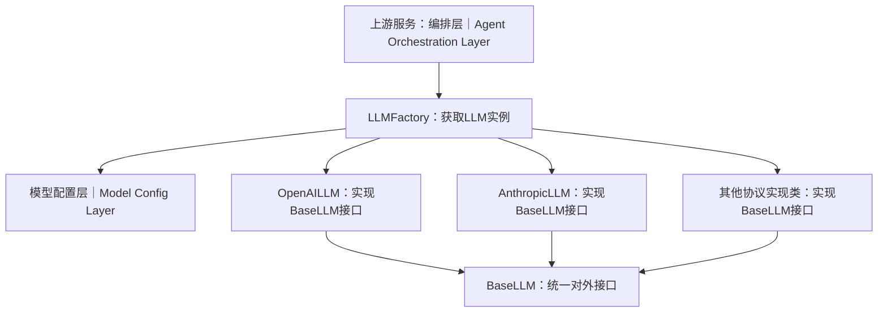

# Model Access Layer Design｜模型接入层架构设计

## 1. 概述
模型接入层作为Agent编排层与大模型服务之间的中间层，采用**工厂模式 + 适配器模式**，屏蔽不同大模型厂商API协议差异。上层编排层不需要感知OpenAI、Anthropic以及其他第三方模型的具体调用细节，只依赖统一的`BaseLLM`抽象接口；模型实例参数由模型配置层提供。

## 2. 组件说明
|中文名称|英文名称| 职责描述                                                      |
|---|---|-----------------------------------------------------------|
|Factory工厂|LLMFactory| 从模型配置层读取模型参数，根据模型协议产出对应`BaseLLM`实例，是本层对外主要入口。 |
|LLM抽象类|BaseLLM| 定义`invoke`、`ainvoke`、`stream`、`astream`以及资源释放接口。 |
|OpenAI协议实现类|OpenAILLM| 实现OpenAI兼容协议的请求封装、响应解析、流式处理和ToolCall聚合。 |
|Anthropic协议实现类|AnthropicLLM| 封装Anthropic Messages接口，转换为内部统一输入输出格式。 |
|统一输入输出类型|types.py| 定义Message、TextPart、ImagePart、ToolDefinition、ToolCall、LLMResponse等统一类型。 |
|模型配置层|Model Config Layer| 向工厂提供模型配置：api_key、base_url、model_name、最大最小token数等参数。      |

## 3. 数据流
1. Agent编排层向`LLMFactory`发起请求，根据`thinking`或`perception`模型角色获取LLM实例；
2. Factory从**模型配置层**读取目标模型完整配置参数；
3. Factory根据配置内的模型协议，实例化对应的具体`BaseLLM`实现类；
4. 返回`BaseLLM`类型对象给编排层；
5. 编排层调用统一的`invoke`、`ainvoke`、`stream`或`astream`接口，底层由不同厂商实现类完成真实网络请求；
6. 各实现类将厂商异构响应统一转换为内部标准数据结构向上返回。

## 4. Python包与模块划分
> 包归属：`apps/agent/src/model_provider/`

|组件|模块文件|
|---|---|
|LLM抽象基类|`model_provider/base_llm.py`|
|工厂类|`model_provider/llm_factory.py`|
|统一输入输出类型|`model_provider/types.py`|
|OpenAI实现|`model_provider/impl/openai_llm.py`|
|Anthropic实现|`model_provider/impl/anthropic_llm.py`|

## 5. 架构约束
1. **上层编排层只依赖抽象`BaseLLM`，禁止直接实例化`OpenAILLM`等具体实现类，全部通过Factory获取实例。**
2. 新增模型支持时，优先新增`impl`下的实现并保持统一输入输出协议，上层业务不做厂商分支判断。
3. 所有密钥、端点、模型名称全部来源于模型配置层，适配器内部不硬编码任何密钥与地址。
4. 各厂商适配器内部完成协议转换；向上输出数据结构必须统一，编排层不需要做厂商分支判断。
5. 网络异常、超时、限流错误，适配器层统一封装为内部自定义异常向上抛出，由编排层处理重试、降级逻辑。
