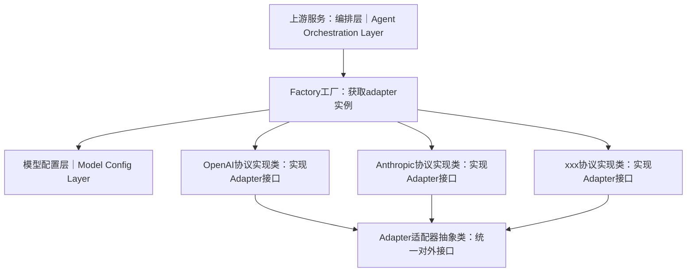

# Model Access Layer Design｜模型接入层架构设计

## 1. 概述
模型接入层作为Agent编排层与大模型服务之间的中间层，采用**工厂模式 + 适配器模式**，屏蔽不同大模型厂商API协议差异。上层编排层不需要感知OpenAI、Anthropic以及其他第三方模型的具体调用细节，只依赖统一的Adapter抽象接口；模型实例参数由模型配置层提供。

## 2. 组件说明
|中文名称|英文名称| 职责描述                                                      |
|---|---|-----------------------------------------------------------|
|Factory工厂|ModelAdapterFactory| 适配器工厂类。接收配置，从模型配置层读取模型参数，根据模型类型产出对应具体Adapter实例，是本层对外主要入口。 |
|Adapter适配器抽象类|BaseModelAdapter| 抽象基类，定义统一模型调用接口，规定对话、流式输出、token统计等抽象方法。所有模型实现类必须继承并实现该接口。 |
|OpenAI协议实现类|OpenAIModelAdapter| 继承`BaseModelAdapter`，实现OpenAI兼容协议的请求封装、响应解析、流式处理。         |
|Anthropic协议实现类|AnthropicModelAdapter| 继承`BaseModelAdapter`，封装Anthropic Claude接口，转换为内部统一返回格式。    |
|xxx协议实现类|XxxModelAdapter| 其他模型厂商适配器，扩展时新增实现类，无需修改上层业务与抽象接口。                         |
|模型配置层|Model Config Layer| 向工厂提供模型配置：api_key、base_url、model_name、最大最小token数等参数。      |

## 3. 数据流
1. Agent编排层向`ModelAdapterFactory`发起请求，需要获取模型适配器实例；
2. Factory从**模型配置层**读取目标模型完整配置参数；
3. Factory根据配置内的模型类型，实例化对应的具体Adapter实现类，传入配置；
4. 返回`BaseModelAdapter`类型对象给编排层；
5. 编排层调用适配器统一接口（chat、stream_chat等），底层由不同厂商实现类完成真实网络请求；
6. 各实现类将厂商异构响应统一转换为内部标准数据结构向上返回。

## 4. Python包与模块划分
> 包归属：`model_provider_layer`内部，对应文件路径 `apps/agent/src/model_provider/`

|组件|模块文件|
|---|---|
|Adapter抽象基类|`model_provider/base_adapter.py`|
|工厂类|`model_provider/model_adapter_factory.py`|
|OpenAI适配器|`model_provider/implement/openai_adapter.py`|
|Anthropic适配器|`model_provider/implement/anthropic_adapter.py`|
|其他扩展适配器|`model_provider/implement/xxx_adapter.py`|

## 5. 架构约束
1. **上层编排层只依赖抽象`BaseModelAdapter`，禁止直接实例化`OpenAIModelAdapter`等具体实现类，全部通过Factory获取实例。**
2. 新增模型支持：只需要新增`implement`下的适配器实现，不修改工厂、抽象接口、上层业务代码，遵循开闭原则。
3. 所有密钥、端点、模型名称全部来源于模型配置层，适配器内部不硬编码任何密钥与地址。
4. 各厂商适配器内部完成协议转换；向上输出数据结构必须统一，编排层不需要做厂商分支判断。
5. 网络异常、超时、限流错误，适配器层统一封装为内部自定义异常向上抛出，由编排层处理重试、降级逻辑。