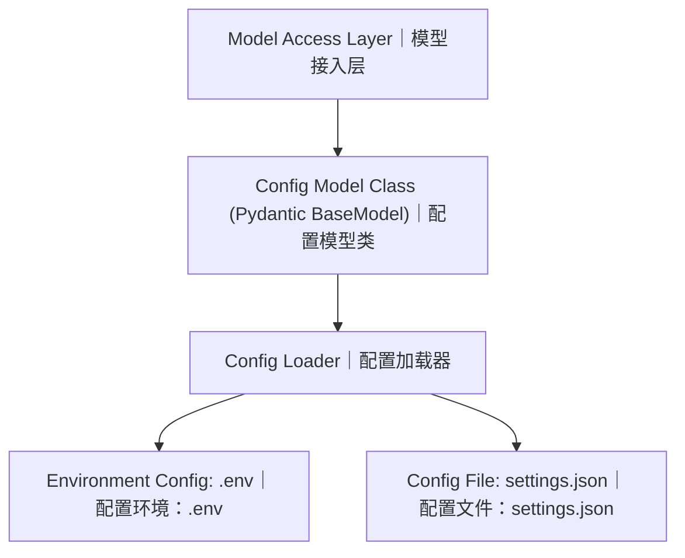

# Model Config Layer Design｜模型配置层架构设计

## 层级组件说明

| 中文名称 | 英文名称 | 职责描述 |
| --- | --- | --- |
| 模型接入层 | Model Access Layer | 模型配置对外访问入口。上层业务通过该层获取已经实例化完成的配置对象，**禁止业务代码直接读取配置文件与环境变量**。 |
| 配置模型类 | Config Model Class(Pydantic BaseModel) | 强类型配置数据契约。基于Pydantic定义配置字段、数据类型、校验规则、默认值，对加载完成后的配置数据做合法性校验。 |
| 配置加载器 | Config Loader | 配置核心加载组件。负责读取多源配置数据，处理配置合并逻辑、配置优先级，输出校验完成的配置模型实例。 |
| 配置环境(.env) | Environment Config(.env) | 环境变量配置源，存放密钥、敏感信息、环境区分参数；本地开发使用，不纳入版本管理。 |
| 配置文件(settings.json) | Config File(settings.json) | 静态业务配置源，存放通用业务参数，可提交到代码仓库进行版本管控。 |

## 配置优先级

> **`.env 环境变量 > settings.json 配置文件 > Pydantic模型内部默认值`**

## 数据流说明

1. 模型接入层向上给上层调用方提供配置实例，向下依赖配置模型类；
2. 配置加载器读取`.env`、`settings.json`两个配置源，完成解析合并；
3. 将合并之后的数据送入Pydantic配置模型类执行校验、类型转换；
4. 校验通过后产出可用的配置对象，向上交付至模型接入层对外暴露。

## 架构约束

1. 业务层只能依赖**模型接入层**，不能直接调用配置加载器；
2. 敏感密钥统一放置在`.env`，禁止写入`settings.json`并提交仓库；
3. 所有外部来源配置必须经过Pydantic模型校验，不允许裸字典直接对外使用。