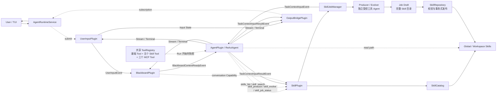
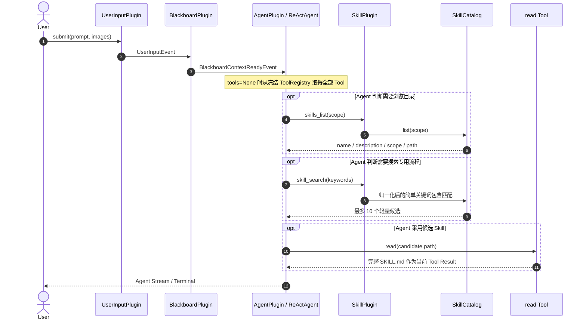
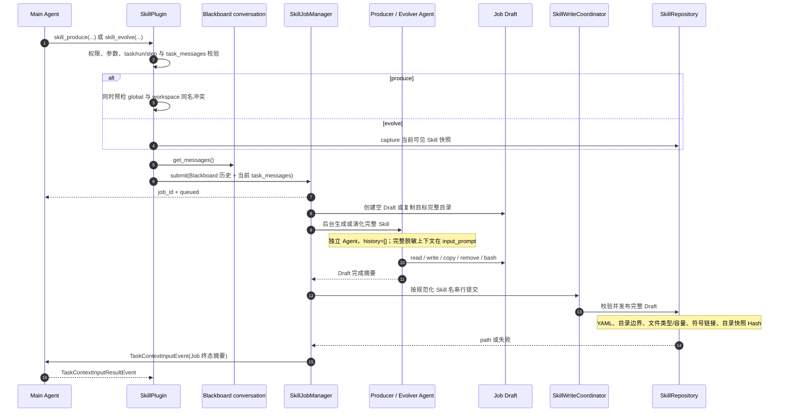

# Plugin Runtime Current State｜插件运行时当前状态与事件流

> 本文的 Runtime 内部 EventBus 与 Plugin 拓扑仍是当前实现事实；其中 AgentRuntimeService 和
> OutputBridge 对外链路属于迁移前历史。当前应用入口是 AgentRuntime，内部 Event 由
> RuntimeUpdatePlugin 投影为公共 RuntimeUpdate，Gateway 和 TUI 不直接消费 Plugin Event。

## 文档定位

本文记录当前 Manifest Runtime 的 Plugin 装配、来源订阅、Tool 注入、事件流和状态所有权。
长期架构原则见 `plugin-eventbus-blackboard-design.md`，Manifest 与生命周期契约见
`plugin-runtime-manifest-lifecycle-design.md`，SkillPlugin 细节见 `skill-plugin-design.md`。
本文以当前 Manifest、Factory 和测试生成的冻结运行图为准。

## 当前 Runtime 组件

| 组件 | 当前职责 |
|---|---|
| `PluginRuntimeHost` | 发现 Manifest，校验依赖，并原子装配 Capability、Tool、Event 订阅和状态提供者 |
| `PluginManager` | 注册 Plugin，启动独立 inbox Worker，执行 quiesce、drain、snapshot 和 stop |
| `EventBus` | 只按来源 `source_plugin_id` 路由 Event，不解释事件类型和业务 Payload |
| `ToolRegistry` | 汇总内置 Tool 与 Plugin Tool，在 Runtime READY 后冻结 |
| Runtime Hook Wrapper | 观测 Event、Plugin、Agent、LLM 和 Tool 生命周期，不干预主流程 |
| `PersistencePlugin` | 提供 Runtime、Session、State Store 和 Redactor Capability |

当前注册的 Plugin：

| Plugin ID | 主要职责 |
|---|---|
| `persistence` | Trace、日志、Session 元数据，以及 Workspace / Session Plugin 状态 |
| `builtin-tools` | 注册 `read`、`write`、`insert`、`bash` |
| `user-input` | FIFO 接收输入，发布排队、开始、输入和结束 Event |
| `blackboard` | 维护跨轮对话和当前任务状态，发布主 Agent 调用快照 |
| `agent` | 适配无状态 ReActAgent，执行 Run，处理运行中 Context 与取消请求 |
| `skill` | 提供显式 Skill 发现、搜索、生产、演化和 Job 查询 |
| `mcp` | 按需连接配置的 MCP Server，通过固定的 list/search/execute Tool 提供外部能力 |
| `runtime-update` | 把用户输入状态、Agent Stream 和控制结果投影为公共 RuntimeUpdate |

Agent 文本具有两种明确语义：`assistant.text_delta` 是低延迟实时投影，不进入 Session Conversation；
`assistant.message` 是一个模型 Step 完成后的完整文本，作为恢复历史持久化。取消或失败前已经显示的
部分文本同样会收束为完整消息。旧版本持久化的 delta 在读取时兼容聚合，不修改原始数据库记录。

`ReActAgent`、Skill Catalog、Producer、Evolver、JobManager、Repository 和 WriteCoordinator
都是所属 Plugin 内的普通组件，不注册为子 Plugin。

## 当前运行图

图中的 Plugin 实线通信都经过 EventBus；点线表示同一进程内的 Capability 或普通组件调用。
EventBus 仍只按来源路由，订阅者在入队前通过 `accepts_event` 判断具体 Event。

## Manifest 生成的来源订阅

| 来源 Plugin | 订阅 Plugin | 当前处理内容 |
|---|---|---|
| `user-input` | `blackboard` | `UserInputEvent`、`InputFinishedEvent` |
| `user-input` | `output-bridge` | 输入队列、开始、输入和结束状态 |
| `blackboard` | `agent` | `BlackboardContextReadyEvent` |
| `agent` | `user-input` | Agent 完成、失败或取消终态 |
| `agent` | `blackboard` | 提交成功或安全取消前缀，清理失败任务 |
| `agent` | `output-bridge` | 原始 Agent Stream、终态和运行中操作结果 |
| `agent` | `skill` | `TaskContextInputResultEvent`，记录 Job 通知是否被接受 |
| `skill` | `agent` | Job 完成后发布的 `TaskContextInputEvent` |

SkillPlugin 不再订阅 UserInput 或 AgentCompleted，不再发布
`ContextContributionEvent`。Blackboard 默认没有必需 Context 来源，所以普通用户请求不等待
Skill 检索，也不会被自动注入 Skill 内容。Blackboard 仍保留通用 ContextContribution 实现，
未来有真实上下文 Plugin 接入时再由对应 Manifest 声明发布与消费关系。

## 主 Agent 与 Skill 发现流程

Catalog 每次调用重新扫描全局和 Workspace 目录。Workspace 同名 Skill 覆盖全局 Skill。
搜索只对 `name`、`description` 和可选 `keywords` 做 casefold、分隔符归一化和转义后的
包含匹配；不使用 Embedding、BM25、编辑距离、拼写纠错或自动分词。

五个 Skill Tool 由 Skill Manifest 声明，由 Factory 作为 `PluginRegistration.tools` 返回，
Runtime Host 注册到与 AgentFactory 共享的 `ToolRegistry`。Registry 在 READY 后冻结；
ReActAgent 在每次 Run 开始时取得允许 Tool 的执行快照，因此 Kernel 不包含 Skill 专用分支。

## Produce 与 Evolve Job

`allow_produce` 和 `allow_evolve` 是独立严格布尔配置，默认都是 `false`。权限关闭时 Tool
仍存在，但执行返回 `disabled_by_policy`。

Produce 必须显式选择 `workspace` 或 `global`。预检失败不创建 Job；提交时再次检查两个
物理作用域，生成期间出现同名 Skill 时失败且不覆盖。Evolve 对 Workspace Skill 事务式更新；
对全局 Skill 只在当前 Workspace 创建同名覆盖，不修改全局文件。分析后目标内容或路径发生
变化时，Hash 校验失败并拒绝提交。

Producer/Evolver 的输入证据是 Blackboard 已提交历史与当前只读 `task_messages` 的顺序拼接。
完整 Message、ToolCall 和图片元数据被稳定序列化；URL 凭据被移除，嵌套秘密被脱敏，强凭据
标记触发 fail-closed。未配对的当前 ToolCall 因此不进入模型历史，而是作为当前 User Prompt
中的数据。生成 Agent 使用长期复用的私有 ToolRegistry，只能通过 `read`、`write`、`copy`、
`remove` 和受限 `bash` 在 Job Draft 内工作；Repository 仍是正式 Skill 目录的唯一发布边界。
文件 Tool 强制 Draft 写边界。`bash` 固定工作目录、清理敏感环境，并限制直接网络/安装命令、
单次时长与输出，但它是实用型防护，不是不可绕过的操作系统沙箱。Job 本身不再设置固定
120 秒总超时。

Workspace Skill 位于 `<current-workspace>/skills/<name>/...`，全局 Skill 位于
`$ICARUS_DATA_DIR/skills/<name>/...`。Skill 可包含脚本、参考资料、模板和二进制资源；Evolve
按完整目录快照检测并发变化。Workspace 运行状态目录不保存 Workspace Skill 源文件。

Job 状态为 `queued → running → succeeded|failed|interrupted`。终态保存在 Workspace 状态，
每个 Workspace 最多保留 100 个；Session 状态保存本 Session 关联 Job 和通知结果。未知 Job
通过 `skill_job_status` 返回失败。Runtime 退出时先停止接收新 Job，取消仍在生成的任务，等待
已经进入提交阶段的线程完成，再保存状态；不会恢复 asyncio Task 或 Agent 运行栈。

通知是尽力而为的业务 Event：若原 Task 仍活跃，Agent 在稳定边界接收终态摘要；若 Task 已结束
或拒绝通知，Job 本身的成功或失败结果不被改写，之后仍可通过 `skill_job_status` 查询。

## 状态所有权

| 状态 | 所有者 | 生命周期 |
|---|---|---|
| 跨轮完整对话 | `BlackboardPlugin` | 当前 Session，保存到 Session Plugin State |
| 当前任务输入与汇聚状态 | `BlackboardPlugin` | `task_id` 双终态结束后清理 |
| 活动 Run、Context 队列与取消墓碑 | `TaskChannelRegistry` | 当前 Runtime Session |
| Skill 目录事实 | Global / Workspace Skill 完整目录 | 文件持久化 |
| 生成 Agent 的内部 Run 与 Tool 轨迹 | Session `trace.jsonl` | 当前 Session；按 `skill_job_id`、子 `run_id` 关联 |
| Skill Job 终态 | `SkillJobManager` Workspace State | 有界保留 100 个 |
| Session Job 关联和通知状态 | `SkillJobManager` Session State | 当前 Session |

已删除的旧状态包括 Embedding 缓存、Skill usage SQLite、会话累计注入列表、轮级检索状态和
自动维护 Workspace claim。Event 是通信事实，状态由明确所有者投影；Hook 只负责持久化、
观测与监督，不替代 EventBus，也不改变主流程。

## 当前未接入能力

Memory、Knowledge、Style、Character、TTS、Emotion / L2D 等 Plugin 尚未接入当前 Runtime。
正式 WebUI/TUI 也不是 Runtime Plugin；当前由应用内部 `OutputBridgePlugin` 提供实时订阅边界。
