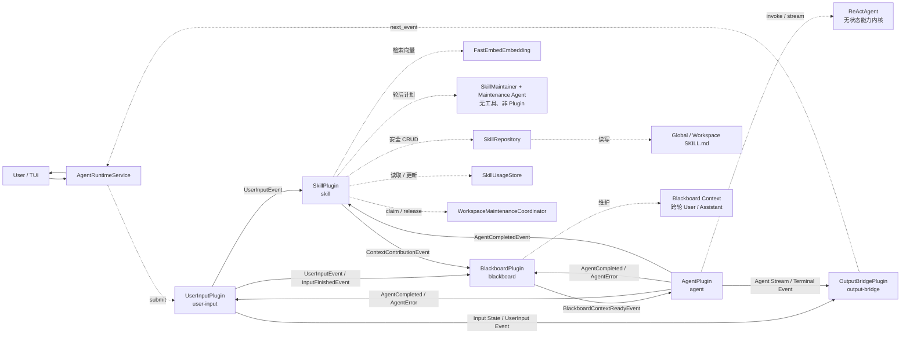
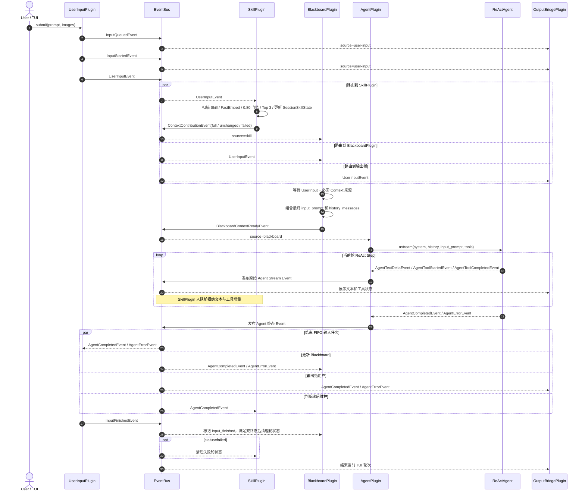
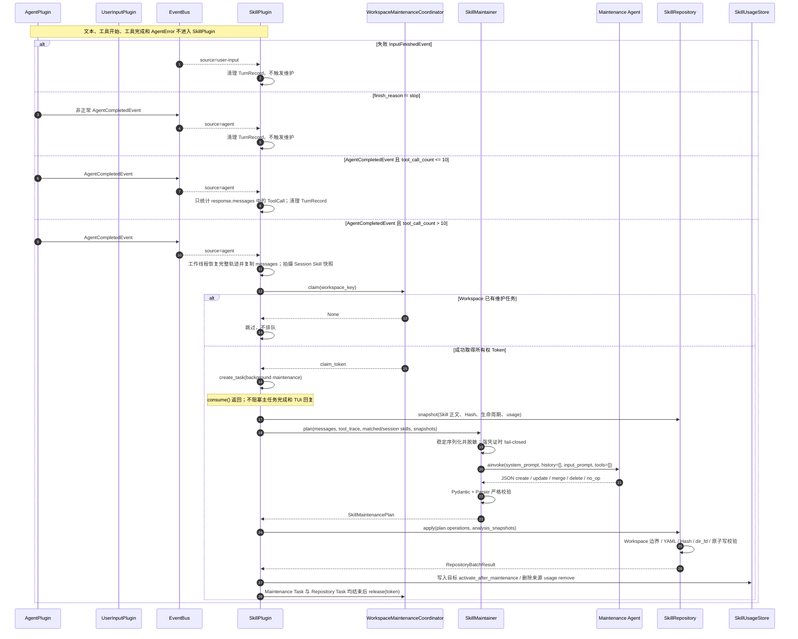
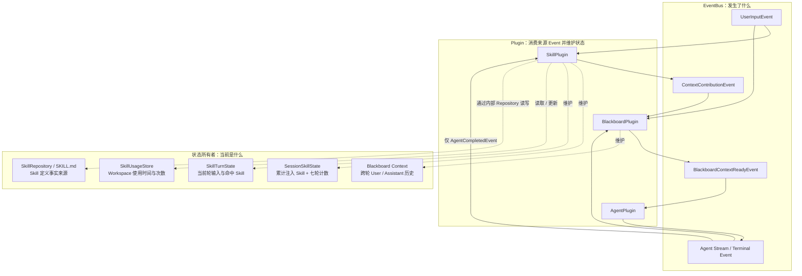

# Plugin Runtime Current State｜插件运行时当前状态与事件流

## 文档定位

本文是当前 `AgentRuntimeService` Plugin 组装、订阅关系、事件流和状态所有权的事实快照，帮助读者快速判断：

- 当前有哪些 Plugin 已注册并参与运行；
- Plugin 之间通过哪些来源 Event 通信；
- 哪些能力只是 Plugin 内部组件，不是独立 Plugin；
- 哪些 Plugin 仍处于规划阶段，尚未接入当前 Runtime。

长期架构原则见 `plugin-eventbus-blackboard-design.md`；具体 Skill 检索与维护设计见 `skill-plugin-design.md`。本文以当前代码和 `AgentRuntimeService` 的实际订阅关系为准。

## 当前状态总览

### Runtime Infrastructure

| 组件 | 当前状态 | 职责 |
|---|---|---|
| `PluginRegistry` | 已实现、已使用 | 注册 Plugin，并维护 `source_plugin_id → subscriber_plugin_ids` |
| `EventBus` | 已实现、已使用 | 接收 Plugin 发布的 Event，只按来源异步路由 |
| `PluginRuntime` | 已实现、已使用 | 为每个 Plugin 提供独立 inbox 和顺序消费 Worker |
| `PluginManager` | 已实现、已使用 | 统一注册、订阅、启动、Drain 和停止 Plugin Runtime |
| Runtime Hook Wrapper | 已实现、已使用 | 观测 Event 发布、路由、Plugin 消费和生命周期 |
| `PersistenceRuntime` | 已实现、已使用，但不是 Plugin | 通过 Hook 和 Logging 持久化 Trace、日志和 Session 元数据 |

EventBus 不检查 Event 类型，不解析 Payload，也不执行 Plugin 业务逻辑。每个订阅 Plugin 在自己的统一入口中判断是否处理：

```python
async def consume(
    self,
    source_plugin_id: str,
    event: Event,
) -> None:
    ...
```

### 当前已注册 Plugin

| Plugin ID | 实现 | 当前状态 | 主要职责 |
|---|---|---|---|
| `user-input` | `UserInputPlugin` | 已实现、已接入 | FIFO 接收用户输入，发布队列/开始/输入/结束 Event |
| `skill` | `SkillPlugin` | 第一、二阶段已实现并接入 | 对话前动态检索和注入 Skill；对话后从完整 Agent 终态恢复工具轨迹并尝试后台维护 Skill |
| `blackboard` | `BlackboardPlugin` | 已实现、已接入 | 汇聚必需 Context，维护跨轮历史，发布主 Agent 完整调用快照 |
| `agent` | `AgentPlugin` | 已实现、已接入 | 适配无状态 ReActAgent，并发布原始 Agent Stream / Terminal Event |
| `output-bridge` | `OutputBridgePlugin` | 已实现、应用内部接入 | 将 UserInput 和 Agent Event 转交 `AgentRuntimeService.next_event()`，供 TUI/Transport 消费 |

### 当前不是独立 Plugin 的组件

| 组件 | 所属边界 | 说明 |
|---|---|---|
| `ReActAgent` | Agent 能力内核 | 无状态，不注册到 PluginRegistry；由 AgentPlugin 适配 |
| `BlackboardPromptComposer` | BlackboardPlugin 内部组件 | 组合动态 Context 和用户请求，生成最终 User Prompt |
| `FastEmbedEmbedding` | `model_provider` | 生成 Skill 检索向量，不感知 Plugin 业务 |
| `SkillMaintainer` | SkillPlugin 内部组件 | 调用独立、无工具的维护 Agent，只生成结构化计划 |
| Maintenance Agent | 应用组装的独立 AgentFactory | 无 Plugin 身份，不发布业务 Event，不获得文件工具 |
| `SkillRepository` | SkillPlugin 内部文件边界 | 校验并执行 Workspace Skill CRUD，全局 Skill 只读 |
| `SkillUsageStore` | SkillPlugin 内部状态存储 | 按 Workspace 保存发现、使用和维护激活时间 |
| `WorkspaceMaintenanceCoordinator` | 进程级内部组件 | 使用所有权 Token 保证同进程同 Workspace 同时最多一个维护任务 |
| `SkillTurnState` | SkillPlugin 会话内状态 | 按 correlation_id 保存当前轮输入和命中 Skill；终态时从完整 Agent messages 恢复工具轨迹 |

这些组件是普通对象，不注册为子 Plugin，也不通过 EventBus 互相通信。

### 尚未接入当前 Runtime 的规划 Plugin

| 规划能力 | 当前状态 | 备注 |
|---|---|---|
| `MemoryPlugin` | 未实现/未接入 | 未来提供记忆检索和轮后沉淀 |
| `KnowledgePlugin` | 未实现/未接入 | 未来提供知识检索 Context |
| `StylePlugin` | 未实现/未接入 | 未来消费 Agent 原始文本流并输出风格化文本 |
| `CharacterPlugin` | 未实现/未接入 | 未来提供角色风格配置 |
| `TTSPlugin` | 未实现/未接入 | 未来消费文本流并生成语音 |
| `Emotion / L2D Plugin` | 未实现/未接入 | 未来生成情绪、动作或表现层参数 |
| 正式 WebUI/TUI Plugin | 未实现 | 当前只有应用内部 `OutputBridgePlugin`，TUI 本身不注册到 PluginRuntime |

## 当前总图

为突出 Plugin 的生产/消费关系，本图隐藏 EventBus。每条实线表示 `Producer Plugin → Consumer Plugin`，实际实现仍由 EventBus 按来源异步路由；虚线表示 Plugin 内部或应用组装组件调用。



图中没有画出 EventBus 节点，但实线并非 Plugin 之间的直接方法调用。生产方仍调用 `publish(event)`，EventBus 根据生产方 `source_plugin_id` 将同一 Event 投递到订阅者各自的 inbox，最终由订阅者统一 `consume(source_plugin_id, event)` 处理。

## 来源订阅关系

| 来源 Plugin | 订阅 Plugin | 订阅者实际处理的主要 Event |
|---|---|---|
| `user-input` | `skill` | `UserInputEvent`：启动本轮 Skill 检索并建立轮状态；失败的 `InputFinishedEvent`：清理轮状态 |
| `user-input` | `blackboard` | `UserInputEvent`、`InputFinishedEvent`：保存本轮输入和终态 |
| `user-input` | `output-bridge` | 用户输入队列及任务状态 Event，转交 TUI / 上层应用 |
| `skill` | `blackboard` | `ContextContributionEvent`：本轮 Skill 上下文或降级错误 |
| `blackboard` | `agent` | `BlackboardContextReadyEvent`：完整历史、最终 User Prompt、模型角色和工具配置 |
| `agent` | `user-input` | `AgentCompletedEvent`、`AgentErrorEvent`：结束当前 FIFO 任务 |
| `agent` | `blackboard` | `AgentCompletedEvent`、`AgentErrorEvent`：成功提交历史或结束失败任务 |
| `agent` | `output-bridge` | 原始 Agent Stream Event，转交 TUI / 上层应用 |
| `agent` | `skill` | 只接收 `AgentCompletedEvent`：从完整 messages 恢复轮轨迹并判断轮后维护 |

同一个来源可能发布其他 Event，例如 `AgentTextDeltaEvent`。EventBus 仍只按来源找到
订阅者；每个 Plugin Runtime 在入队前调用订阅者的 `accepts_event`。SkillPlugin 拒绝文本
和工具增量，因此这些事件不进入其 inbox，也不触发其 `plugin.consume` Hook。

当前代码中的订阅关系：

```text
skill        <- user-input
skill        <- agent
blackboard   <- user-input
blackboard   <- skill
output-bridge<- user-input
agent        <- blackboard
user-input   <- agent
blackboard   <- agent
output-bridge<- agent
```

## 对话前检索与主 Agent 执行



Blackboard 是主会话跨轮状态的权威所有者。SkillPlugin 不直接读取 Blackboard；它通过订阅 `agent` 来源，在 `AgentCompletedEvent.response.messages` 中取得主 Agent 本轮真实使用的多轮消息快照。

## 对话后自动维护



`SkillMaintainer`、Maintenance Agent、`SkillRepository`、`SkillUsageStore` 和 Coordinator 都是 SkillPlugin 内部或应用组装组件，不注册为子 Plugin，也不通过 EventBus 互相通信。后台维护只通过 Hook 记录 `skill.maintenance` 的 before / after / error，不发布新的用户可见业务 Event。

Agent 文本、工具开始和工具完成增量继续交给 OutputBridge / TUI，但关闭 EventBus 和
Plugin Runtime 级 Trace。每轮 Skill 检索只记录一条 `skill.retrieval` 聚合结果；完整
Agent、LLM 和 Tool Executor 边界记录保持不变。

## Event 与状态所有权



状态职责：

| 状态 | 所有者 | 生命周期 |
|---|---|---|
| 跨轮 User / Assistant 历史 | BlackboardPlugin | 当前 Agent Runtime / Session |
| 本轮 UserInput 和 Context 汇聚状态 | BlackboardPlugin | correlation_id 双终态结束后清理 |
| 当前会话累计 Skill 与七轮刷新计数 | SessionSkillState | 当前 Agent Runtime |
| 当前轮输入与命中 Skill；由完整 messages 恢复出的工具轨迹 | SkillTurnState | Agent 终态到达后 pop/discard |
| Skill 使用时间与次数 | SkillUsageStore | Icarus 级 SQLite，按 Workspace 隔离 |
| Skill 定义正文 | `SKILL.md` / SkillRepository | 全局或 Workspace 文件 |
| 自动维护 Workspace claim | WorkspaceMaintenanceCoordinator | 后台维护与 Repository Task 均结束后释放 |

Event 是不可变的通信事实，状态所有者负责把 Event 投影为当前可查询状态。Hook 只负责持久化、观测和监督，不替代 EventBus，也不改变主流程。
