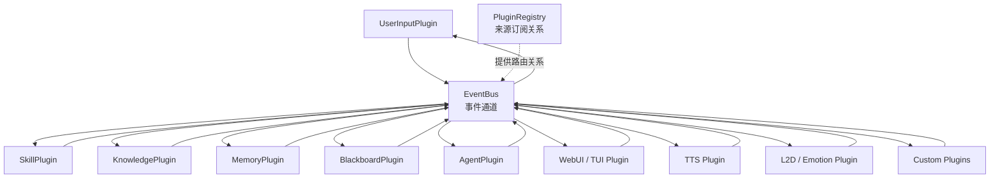

# Plugin EventBus Blackboard Design｜插件事件总线与黑板初版设计

## 文档定位

本文描述 Agent Stream Event 完成后的下一阶段编排架构。

系统中的 Agent、Blackboard、Skill、Knowledge、Memory、用户输入、UI、TTS、L2D 和未来自定义能力统一抽象为 Plugin。Plugin 之间通过 EventBus 异步通信，Plugin Registry 维护来源订阅关系。

本文记录已经确认的架构边界，不提前确定尚未讨论完整的队列容量、失败重试、事件持久化、插件恢复和分布式运行策略。

该架构属于 **Agent 编排层的 Runtime Infrastructure 子层**：

```text
Agent Orchestration Layer
├── Capability
│   ├── ReActAgent
│   ├── Agent Stream
│   └── Tool Executor
├── Runtime Infrastructure
│   ├── Event
│   ├── Plugin
│   ├── Plugin Registry
│   ├── Plugin Runtime
│   └── EventBus
└── Orchestration Plugins
    ├── AgentPlugin
    ├── BlackboardPlugin
    ├── SkillPlugin
    ├── KnowledgePlugin
    └── MemoryPlugin
```

其中 `plugin_runtime/` 提供通用运行基础设施，`plugins/` 承载运行于该基础设施上的具体编排插件。

当前分支已经完成：

- Plugin 通信类型与 BasePlugin；
- PluginRegistry；
- 每 Plugin 一个统一消费通道的 PluginRuntime；
- 只按来源路由的 EventBus；
- PluginManager 与 Shutdown Drain；
- Runtime Hook 观测；
- AgentPlugin；
- AgentContextReadyEvent；
- BlackboardPlugin；
- Blackboard Context 状态；
- ContextBlock 与 ContextContributionEvent；
- BlackboardContextConverter；
- 真实模型 Plugin 链路验证。

SkillPlugin、KnowledgePlugin、MemoryPlugin、StylePlugin 和其他领域 Plugin 仍属于后续阶段。

## 设计目标

插件系统需要解决：

- Agent 不直接依赖 UserInput、Skill、Knowledge、Memory 等具体上下文来源；
- 不把文字、TTS、动作、情绪、插件触发和核心任务执行全部堆入同一个 Agent；
- 各控制面可以独立生产和消费信息；
- 新增或移除插件时尽量不修改 Agent 和其他插件；
- 插件消费异步执行，不阻塞事件生产者；
- EventBus 不理解业务 Event 内容；
- Blackboard 统一维护 Agent 所需上下文；
- Agent Stream Event 可以直接进入未来插件通信体系；
- Hook 继续负责持久化、观测和监督。

## 整体架构



所有 Plugin 都可以同时是：

- Producer：生产并发布 Event；
- Consumer：消费已订阅来源生产的 Event。

Agent 和 Blackboard 不具有特殊通信权限，它们只是职责不同的 Plugin。

## 通用 Plugin 模型

每个 Plugin 具有：

- 唯一 `plugin_id`；
- 一个统一 Event 消费入口；
- Event 发布能力；
- 启动和停止所需的生命周期边界；
- 自身业务状态；
- 对收到的 Event 自行识别、处理或忽略的能力。

概念接口：

```python
class Plugin:
    plugin_id: str

    async def consume(
        self,
        source_plugin_id: str,
        event: Event,
    ) -> None:
        ...

    async def start(self) -> None:
        ...

    async def stop(self) -> None:
        ...
```

Event 发布不要求每个 Plugin 自己实现路由。Plugin 通过 EventBus 的发布入口提交 Event。

### 一个统一消费入口

每个 Plugin 只有一个消费入口，用于消费所有已订阅生产者的 Event：

```text
Producer A ─┐
Producer B ─┼→ Plugin 的统一输入通道 → consume(source_plugin_id, event)
Producer C ─┘
```

不是：

```text
Producer A → 一个队列 / 一个 Handler
Producer B → 另一个队列 / 另一个 Handler
Producer C → 另一个队列 / 另一个 Handler
```

Plugin 自行根据 Event 子类判断：

- Event 来自哪个 Plugin；
- 是否认识；
- 是否处理；
- 是否忽略；
- 是否处理后生产新的 Event。

## Event

Event 使用 `agent-stream-event-design.md` 定义的通用 Event 基类。

当前已确认的公共字段：

- `event_id`；
- `occurred_at`；
- `correlation_id`。

来源插件身份不固定写入纯能力内核的 Event 基类，而由 Plugin 调用 EventBus 发布时一并提交，或由 EventBus 发布信封补充。

概念发布信封：

```python
@dataclass(frozen=True)
class PublishedEvent:
    source_plugin_id: str
    event: Event
```

`PublishedEvent` 属于未来插件通信层，不属于当前 ReActAgent Stream Event 本身。

具体 Plugin 生产的 Event 由该 Plugin 目录维护：

```text
plugins/user_input/events.py
plugins/blackboard/events.py
```

ReActAgent Stream Event 仍属于 `capability/`，避免能力层反向依赖具体 Plugin。

## Plugin Registry

Plugin Registry 负责维护插件身份和来源订阅关系。

### 路由粒度

Registry 只按照来源插件匹配：

```text
source_plugin_id → subscriber_plugin_ids
```

示例：

```text
agent-plugin
  → webui-plugin
  → tts-plugin
  → memory-plugin
  → blackboard-plugin

skill-plugin
  → blackboard-plugin

memory-plugin
  → blackboard-plugin

user-input-plugin
  → blackboard-plugin

blackboard-plugin
  → agent-plugin
  → webui-plugin
```

Registry 不负责：

- 检查 Event 类型；
- 解析 Event Payload；
- 判断目标插件是否需要该 Event；
- 调用 Plugin 业务代码；
- 维护 Blackboard 上下文。

### 注册内容

Registry 初步需要维护：

- `plugin_id`；
- Plugin 实例或 Plugin 创建信息；
- 当前订阅的来源插件集合；
- 启用或禁用状态；
- 注册和注销关系。

具体是直接保存 Plugin 实例，还是保存 Plugin Definition 并由 PluginManager 创建实例，在实现前继续确认。

## EventBus

EventBus 只是 Plugin 之间的异步事件通道。

### 发布语义

```text
Plugin 发布 Event
→ EventBus 确认事件已进入入口
→ 发布方法返回
→ Plugin 继续自己的流程
→ EventBus 后续异步路由和投递
```

生产者只等待 EventBus 接受事件，不等待：

- Registry 路由完成；
- 目标 Plugin 开始消费；
- 目标 Plugin 消费完成；
- TTS 合成完成；
- L2D 动作完成；
- Memory 持久化完成；
- Blackboard 更新完成。

### 路由语义

EventBus：

1. 获取发布方 `source_plugin_id`；
2. 从 Registry 查询订阅该来源的目标 Plugin；
3. 将 `source_plugin_id` 和 Event 投递到每个目标 Plugin 的统一消费入口；
4. 不理解 Event 类型；
5. 不等待目标 Plugin 业务处理完成。

### EventBus 不负责

- Event 业务类型判断；
- Plugin 业务逻辑；
- Agent 上下文拼装；
- Blackboard 状态维护；
- Hook 持久化实现；
- ToolCall 执行；
- TTS、UI 或 L2D 具体控制。

## Plugin 消费模型

### 异步消费

Plugin 之间的生产和消费是异步解耦的：

```text
AgentPlugin 发布 AgentTextDeltaEvent
→ EventBus 接受
→ AgentPlugin 继续读取下一段 Stream
→ WebUI / TTS / Memory 等插件各自异步消费
```

一个慢 Plugin 不能要求 Agent 等待其完成一轮输入输出。

### 每个 Plugin 的统一输入通道

每个 Plugin 应有自己的统一消费通道，用于接收所有已订阅来源的 Event。消费入口直接获得来源 Plugin ID 和 Event：

```python
async def consume(
    self,
    source_plugin_id: str,
    event: Event,
) -> None:
    ...
```

已确认：

- 不为不同来源分别创建独立消费入口；
- 不让所有 Plugin 共享同一个消费队列；
- 不由 EventBus 替 Plugin 判断 Event 类型；
- Plugin 可以根据 `source_plugin_id` 区分相同类型 Event 的不同来源；
- Plugin 按自己的消费顺序处理 Event。

消费通道的具体实现形式，例如每 Plugin 一个 asyncio.Queue、Actor Mailbox 或其他模型，在实现前继续确认。

## BlackboardPlugin

Blackboard 是普通 Plugin，其职责是维护当前上下文状态，并为 Agent 整理可直接执行的输入。

当前初版由 BlackboardPlugin 构造时维护固定 Context 来源集合，例如：

```python
BlackboardPlugin(
    plugin_id="blackboard",
    required_context_sources={
        "memory",
        "skill",
        "knowledge",
    },
)
```

BlackboardPlugin 同时持有当前 Agent 实例的稳定执行配置：

- `model_role`
- `system_prompt`
- `tools`

这些字段不从 UserInputPlugin 或外部输入获取。

后续可以替换为动态来源策略，不改变 EventBus 和 AgentPlugin 接口。

### 消费来源

BlackboardPlugin 可以订阅：

- UserInputPlugin；
- SkillPlugin；
- KnowledgePlugin；
- MemoryPlugin；
- AgentPlugin；
- 其他提供 Agent 上下文或任务状态的 Plugin。

### 内部维护

BlackboardPlugin 的状态分为两部分。

当前 Agent 实例的跨轮上下文状态：

- History；
- 已成功完成的 User Message；
- Agent 最终 Assistant Message；
- 初始化 Agent Runtime 时恢复的历史消息。

每轮任务的临时组装状态：

- 当前用户输入；
- 当前任务需要等待的 Context 来源；
- Skill、Knowledge、Memory 等 Plugin 的本轮 ContextContribution；
- 是否已经发布本轮 Agent Context；
- Agent 和 UserInput 两个终态事件是否均已到达。

BlackboardPlugin 收到 AgentCompletedEvent 后，将本轮 User Message 和最终
Assistant Message 写入跨轮上下文。收到 AgentErrorEvent 时不写入失败任务。
Agent 与 UserInput 的终态事件都到达后，删除该轮临时组装状态。

### 生产

BlackboardPlugin 整合上下文后，生产 AgentPlugin 可以消费的上下文 Event。

当前上下文 Event 使用固定核心字段和可扩展 ContextBlock：

```python
@dataclass(frozen=True)
class ContextBlock:
    source_plugin_id: str
    context_type: str
    content: str
    metadata: Mapping[str, Any]


@dataclass(frozen=True)
class BlackboardContextReadyEvent(Event):
    model_role: LLMRole
    system_prompt: str
    history_messages: list[Message]
    prompt: str
    input_images: list[ImagePart]
    tools: list[str] | None
    context_blocks: list[ContextBlock]
    context_errors: dict[str, str]
```

每个固定来源必须返回 ContextContributionEvent：

- `completed + context_blocks`：有内容；
- `completed + []`：没有内容但已经完成；
- `failed + error`：加载失败但已经完成。

BlackboardPlugin 等待 UserInput 和全部固定来源返回后，只发布一次 BlackboardContextReadyEvent。

### 上下文汇聚

已确认：

- 可以为 Skill、Knowledge、Memory 的上下文加载等待一小段时间；
- 这些上下文来源通常异步并行加载；
- AgentPlugin 不直接消费它们的零散结果；
- BlackboardPlugin 聚合后再发布给 AgentPlugin；
- AgentPlugin 正常任务的输入只来自 BlackboardPlugin。
- ContextBlock 声明来源必须与真实发布方一致；
- Agent Stream Event 使用原始任务 correlation_id 回写 Blackboard；
- AgentCompletedEvent 用于更新 Blackboard 的跨轮消息上下文；
- AgentErrorEvent 用于结束失败任务，但失败任务不写入跨轮消息上下文；
- InputFinishedEvent 与 Agent 终态事件共同触发本轮临时状态清理；
- 不依赖 AgentCompletedEvent 与 InputFinishedEvent 的异步消费顺序。

等待超时、必选/可选上下文、失败降级和进度事件不是当前主要范围，留到 Blackboard 阶段确定。

## AgentPlugin

AgentPlugin 是当前 ReActAgent 在插件系统中的适配层。

AgentPlugin 内部持有 BlackboardContextConverter 组件对象。Converter 不是 Plugin，不注册到 Registry，也不直接使用 EventBus。

### 消费

正常任务中，AgentPlugin 只订阅 BlackboardPlugin。

AgentPlugin 不直接订阅：

- UserInputPlugin；
- SkillPlugin；
- KnowledgePlugin；
- MemoryPlugin；
- 其他上下文来源 Plugin。

这保证 Agent 的输入来源单一、稳定且易管理。

### 执行

AgentPlugin：

1. 消费 BlackboardPlugin 生产的 Agent Context Event；
2. 使用 BlackboardContextConverter 拍平动态 ContextBlock；
3. 动态 Context 追加到当前 User Prompt，不修改稳定 System Prompt；
4. 获取对应模型角色的 ReActAgent；
5. 调用 `stream` 或 `astream`；
6. 消费 Agent Stream Event；
7. 将原始执行流 Event 发布到 EventBus；
8. 只等待 EventBus 接受，不等待其他 Plugin 消费。

### 生产

AgentPlugin 可以生产：

- AgentTextDeltaEvent；
- AgentToolStartedEvent；
- AgentToolCompletedEvent；
- AgentCompletedEvent；
- AgentErrorEvent。

未来如需额外 Agent 业务 Event，应由 AgentPlugin 或核心编排层生成，不污染 ReActAgent 能力内核。

AgentPlugin 不内置固定 Responder，也不在内部处理角色风格、TTS、情绪或动作参数。

## UserInputPlugin

UserInputPlugin 是单个 Agent Runtime 实例的统一输入入口，与 HTTP、SSE、WebSocket 或其他 Transport 无关。

一个 Agent Runtime 只拥有一个 UserInputPlugin。多会话和多 Agent 实例由后端或部署层管理，不由 UserInputPlugin 分发。

公开入口：

```python
await user_input.submit(
    prompt=...,
    input_images=...,
)
```

`submit()`：

- 为本轮输入生成 `task_id`；
- 将输入加入 FIFO 队列；
- 发布 InputQueuedEvent；
- 立即返回 `task_id` 和 `queue_position`；
- 不等待 Agent 完成。

队列 Worker：

```text
InputQueuedEvent
→ InputStartedEvent
→ UserInputEvent
→ BlackboardPlugin
→ AgentPlugin
→ AgentCompletedEvent / AgentErrorEvent
→ InputFinishedEvent
→ 处理下一条输入
```

初版同一时间只执行一个用户任务。队列位置只在入队时发布，不为剩余任务反复更新位置。

UserInputPlugin 不维护也不接收 History。当前 Agent 实例的跨轮 History 由
BlackboardPlugin 维护；恢复已有业务会话时，在 Agent Runtime 初始化阶段一次性
注入历史消息。

当前不实现取消、删除排队任务、优先级、暂停和调整顺序。

当前分支已经完成 UserInputPlugin FIFO、队列状态 Event 和真实模型双输入串行验证。

## 原始执行流与领域 Plugin

AgentPlugin 发布的是原始执行流：

```text
AgentTextDeltaEvent
AgentToolStartedEvent
AgentToolCompletedEvent
AgentCompletedEvent
AgentErrorEvent
```

过程中需要的更新由各领域 Plugin 自行消费和判断：

```text
AgentPlugin
├── StylePlugin
├── SkillPlugin
├── MemoryPlugin
└── 其他领域 Plugin
```

### StylePlugin

StylePlugin 订阅 AgentPlugin，将原始文本流转换为角色风格化文本流：

```text
AgentTextDeltaEvent
→ StylePlugin
→ StyledTextDeltaEvent
→ WebUI / TUI / TTS / Emotion / L2D
```

StylePlugin 只生产风格化文本，不统一生成 TTS、情绪、动作或 VAC 参数。具体参数转换由对应领域 Plugin 自行完成。

角色风格由 CharacterPlugin 提供，只包含语言风格、语气、情绪倾向、声线和动作偏好，不包含执行策略。角色风格不注入 Executor，也不修改稳定 System Prompt。

## Context Plugin

Skill、Knowledge、Memory 都是普通 Plugin。

### SkillPlugin

- 消费相关任务或上下文 Event；
- 选择、加载或执行 Skill；
- 生产 Skill 上下文或结果 Event；
- BlackboardPlugin 消费这些 Event。

### KnowledgePlugin

- 检索知识；
- 生产 Knowledge Context Event；
- BlackboardPlugin 消费并整合。

### MemoryPlugin

- 读取历史记忆；
- 记录 Agent、Tool 和任务结果；
- 生产 Memory Context 或 Memory Updated Event；
- BlackboardPlugin 消费当前任务需要的记忆结果。

这些 Plugin 的内部接口与具体 Event 在各自开发阶段设计。

## UI 与控制面 Plugin

### WebUI / TUI Plugin

- 默认订阅 StylePlugin；
- 消费风格化文本 Event；
- 如需展示工具状态，可额外订阅 AgentPlugin；
- 可以生产用户交互或控制 Event。

### TTS Plugin

- 默认订阅 StylePlugin；
- 消费风格化文本 Event；
- 自行缓冲和分段；
- 可以直接合成，也可以在插件内部先做额外处理；
- 可以生产 TTS 状态或完成 Event。

### L2D / Emotion Plugin

- 订阅 StylePlugin 或其他相关来源 Plugin；
- 根据风格化文本自行调用规则、分类器或轻量模型；
- 将文本转换为动作、情绪或 VAC 等领域参数；
- 可以再次发布状态 Event；
- 不阻塞 AgentPlugin。

## Hook 与 Plugin Event 的边界

Hook 和 Plugin Event 都可以观察到系统行为，但职责不同。

### Plugin Event

- 业务通信主通道；
- Plugin 生产和消费；
- 需要被目标 Plugin 可靠接收；
- 可以触发下游业务；
- 通过 EventBus 路由。

### Hook

- 持久化、观测和监督；
- 不作为关键 Plugin 通信通道；
- Hook 失败不改变主流程；
- 不参与 EventBus 路由；
- 可以记录 Event 发布、路由、消费和失败。

未来可以在以下边界自动触发 Hook：

- EventBus 接受 Event；
- EventBus 路由完成；
- Plugin 开始消费；
- Plugin 消费完成；
- Plugin 消费失败；
- Plugin 生命周期变化。

不需要为每个文字 Delta 单独执行持久化 Hook，可以继续按聚合策略记录。

## 与 ReActAgent 的边界

ReActAgent 保持纯能力内核：

- 不注册 Plugin；
- 不订阅 EventBus；
- 不直接读取 Blackboard；
- 不知道 Skill、Knowledge 或 Memory Plugin；
- 不负责 UI、TTS 和 L2D；
- 只执行 LLM、Tool 和 Stream Event。

AgentPlugin 负责系统接入：

```text
Blackboard Event
→ AgentPlugin
→ ReActAgent.astream
→ Agent Stream Event
→ AgentPlugin
→ EventBus
```

## 已确认的关键决策

- 所有系统组件统一抽象为 Plugin；
- 所有 Plugin 都可以生产和消费 Event；
- Agent 和 Blackboard 都是普通 Plugin；
- Registry 只按来源 Plugin 维护订阅关系；
- Registry 和 EventBus 不判断 Event 类型；
- Event 类型由目标 Plugin 自行处理或忽略；
- 每个 Plugin 只有一个统一消费入口；
- 每个 Plugin 的消费入口接收所有已订阅来源 Event；
- 每个 Plugin 的消费入口同时获得来源 Plugin ID 和 Event；
- EventBus 只是异步通道；
- 生产者只等待 EventBus 接受 Event；
- 生产者不等待目标 Plugin 消费完成；
- AgentPlugin 正常任务只消费 BlackboardPlugin；
- BlackboardPlugin 聚合 Skill、Knowledge、Memory 等上下文后再提供给 AgentPlugin；
- AgentPlugin 内部只使用 Converter 进行参数转换，不存在固定 Responder；
- AgentPlugin 发布原始执行流；
- StylePlugin 独立负责角色风格化；
- TTS、Emotion、L2D 等插件自行完成领域参数转换；
- SkillPlugin 和 MemoryPlugin 可以直接订阅 AgentPlugin，自行判断更新；
- ReActAgent 不依赖 Plugin 和 EventBus；
- Hook 用于持久化、观测和监督，不替代 EventBus。

## 尚未确定

以下问题在 Plugin/EventBus 实现前继续讨论：

- Plugin 基类最终接口；
- EventBus 入口和投递队列的具体技术实现；
- 每个 Plugin 统一消费通道的具体实现；
- 队列容量和积压策略；
- 消费失败重试；
- 事件丢弃和死信处理；
- Event 是否需要持久化；
- Plugin 启动、停止、重启和卸载；
- PluginManager 是否独立存在；
- Registry 保存实例还是 Plugin Definition；
- 插件健康状态模型；
- 插件消费顺序和内部并发策略；
- EventBus 关闭和进程退出时的 Drain；
- Blackboard 上下文等待、超时和降级策略；
- 关键控制 Event 是否需要不同可靠性级别。

## 推荐开发阶段

### 阶段一：Plugin 与 Registry

- Plugin 抽象；
- Plugin Definition；
- Registry；
- 按来源订阅；
- 注册与注销；
- 统一消费入口。

### 阶段二：EventBus

- 发布入口；
- 异步路由；
- Plugin 投递；
- 生产者只等待接受；
- Hook 观测；
- 启动和关闭。

### 阶段三：AgentPlugin

- 消费 Blackboard Context；
- 调用 ReActAgent Stream；
- 发布 Agent Stream Event；
- 错误和取消传播。

### 阶段四：BlackboardPlugin

- 上下文状态；
- UserInput、Skill、Knowledge、Memory 汇聚；
- Context Ready Event；
- Agent 输入快照。

### 阶段五：其他 Plugin

- UserInputPlugin；
- WebUI/TUI Plugin；
- SkillPlugin；
- KnowledgePlugin；
- MemoryPlugin；
- TTS/L2D/Emotion Plugin；
- 自定义 Plugin SDK。

## 初版验收方向

正式制定开发计划前，插件系统至少需要满足：

- 两个 Producer Plugin 可以发布 Event；
- 一个 Subscriber Plugin 可以从统一入口消费多个来源；
- Registry 只按来源完成路由；
- EventBus 不解析 Event 类型；
- 一个慢 Consumer 不阻塞 Producer；
- AgentPlugin 只消费 BlackboardPlugin；
- BlackboardPlugin 可以生产 Agent Context Event；
- Agent Stream Event 可以由 AgentPlugin 原样发布；
- Hook 可以观测发布、路由和消费生命周期；
- ReActAgent 不新增 Plugin/EventBus 依赖。
