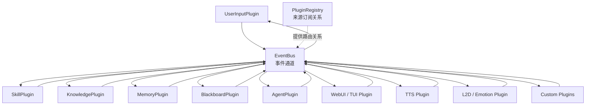

# Plugin EventBus Blackboard Design｜插件事件总线与多区域黑板设计

## 文档定位

本文描述 Agent Stream Event 完成后的编排架构，以及 Blackboard 从一次性 Context 聚合器演进为多 Region 当前状态板的设计。当前已经实现的运行图以 `plugin-event-flow-current-state.md` 为准；Region、只读 Blackboard Tool 和 Product Conversation 投影已实现，MemoryPlugin/KnowledgePlugin 仍按本文边界继续接入。

系统中的 Agent、Blackboard、Skill、Knowledge、Memory、用户输入、UI、TTS、L2D 和未来自定义能力统一抽象为 Plugin。Plugin 之间通过 EventBus 异步通信，Plugin Registry 维护来源订阅关系。

本文记录已经确认的架构边界，不提前确定尚未讨论完整的队列容量、失败重试、事件持久化、插件恢复和分布式运行策略。

该架构属于 **Agent 编排层的 Runtime Infrastructure 子层**：

```text
Agent Orchestration Layer
├── Capability
│   ├── ReActAgent
│   ├── Agent Stream
│   └── Tool Executor
├── Runtime Infrastructure
│   ├── Event
│   ├── Plugin
│   ├── Plugin Registry
│   ├── Plugin Runtime
│   └── EventBus
└── Orchestration Plugins
    ├── AgentPlugin
    ├── BlackboardPlugin
    ├── SkillPlugin
    ├── KnowledgePlugin
    └── MemoryPlugin
```

其中 `plugin_runtime/` 提供通用运行基础设施，`plugins/` 承载运行于该基础设施上的具体编排插件。

当前分支已经完成 Plugin Runtime、EventBus 和 Blackboard 的基础能力，包括：

- Plugin 通信类型与 BasePlugin；
- PluginRegistry；
- 每 Plugin 一个统一消费通道的 PluginRuntime；
- 只按来源路由的 EventBus；
- PluginManager 与 Shutdown Drain；
- Runtime Hook 观测；
- AgentPlugin；
- BlackboardContextReadyEvent；
- BlackboardPlugin；
- Blackboard 跨轮消息状态；
- ContextBlock 与 ContextContributionEvent；
- SkillPlugin 与 MCPPlugin 的显式 Tool 路径；
- 真实模型 Plugin 链路验证。

Region Registry、Region Snapshot、Blackboard 只读 Tool 和 Product Conversation 投影已经实现；MemoryPlugin/KnowledgePlugin 仍属于后续阶段。当前实现事实继续以 `plugin-event-flow-current-state.md` 为准。

## 设计目标

插件系统需要解决：

- Agent 不直接依赖 UserInput、Skill、Knowledge、Memory 等具体上下文来源；
- 不把文字、TTS、动作、情绪、插件触发和核心任务执行全部堆入同一个 Agent；
- 各控制面可以独立生产和消费信息；
- 新增或移除插件时尽量不修改 Agent 和其他插件；
- 插件消费异步执行，不阻塞事件生产者；
- EventBus 不理解业务 Event 内容；
- Blackboard 统一维护 Agent 所需上下文；
- Agent Stream Event 可以直接进入未来插件通信体系；
- Hook 继续负责持久化、观测和监督。

## 整体架构



所有 Plugin 都可以同时是：

- Producer：生产并发布 Event；
- Consumer：消费已订阅来源生产的 Event。

Agent 和 Blackboard 不具有特殊通信权限，它们只是职责不同的 Plugin。

## 通用 Plugin 模型

每个 Plugin 具有：

- 唯一 `plugin_id`；
- 一个统一 Event 消费入口；
- Event 发布能力；
- 启动和停止所需的生命周期边界；
- 自身业务状态；
- 对收到的 Event 自行识别、处理或忽略的能力。

概念接口：

```python
class Plugin:
    plugin_id: str

    async def consume(
        self,
        source_plugin_id: str,
        event: Event,
    ) -> None:
        ...

    async def start(self) -> None:
        ...

    async def stop(self) -> None:
        ...
```

Event 发布不要求每个 Plugin 自己实现路由。Plugin 通过 EventBus 的发布入口提交 Event。

### 一个统一消费入口

每个 Plugin 只有一个消费入口，用于消费所有已订阅生产者的 Event：

```text
Producer A ─┐
Producer B ─┼→ Plugin 的统一输入通道 → consume(source_plugin_id, event)
Producer C ─┘
```

不是：

```text
Producer A → 一个队列 / 一个 Handler
Producer B → 另一个队列 / 另一个 Handler
Producer C → 另一个队列 / 另一个 Handler
```

Plugin 自行根据 Event 子类判断：

- Event 来自哪个 Plugin；
- 是否认识；
- 是否处理；
- 是否忽略；
- 是否处理后生产新的 Event。

## Event

Event 使用 `agent-stream-event-design.md` 定义的通用 Event 基类。

当前已确认的公共字段：

- `event_id`；
- `occurred_at`；
- `task_id`。

来源插件身份不固定写入纯能力内核的 Event 基类，而由 Plugin 调用 EventBus 发布时一并提交，或由 EventBus 发布信封补充。

概念发布信封：

```python
@dataclass(frozen=True)
class PublishedEvent:
    source_plugin_id: str
    event: Event
```

`PublishedEvent` 属于未来插件通信层，不属于当前 ReActAgent Stream Event 本身。

具体 Plugin 生产的 Event 由该 Plugin 目录维护：

```text
plugins/user_input/events.py
plugins/blackboard/events.py
```

ReActAgent Stream Event 仍属于 `capability/`，避免能力层反向依赖具体 Plugin。

## Plugin Registry

Plugin Registry 负责维护插件身份和来源订阅关系。

### 路由粒度

Registry 只按照来源插件匹配：

```text
source_plugin_id → subscriber_plugin_ids
```

示例：

```text
agent-plugin
  → webui-plugin
  → tts-plugin
  → memory-plugin
  → blackboard-plugin

skill-plugin
  → blackboard-plugin

memory-plugin
  → blackboard-plugin

user-input-plugin
  → blackboard-plugin

blackboard-plugin
  → agent-plugin
  → webui-plugin
```

Registry 不负责：

- 检查 Event 类型；
- 解析 Event Payload；
- 判断目标插件是否需要该 Event；
- 调用 Plugin 业务代码；
- 维护 Blackboard 上下文。

### 注册内容

Registry 初步需要维护：

- `plugin_id`；
- Plugin 实例或 Plugin 创建信息；
- 当前订阅的来源插件集合；
- 启用或禁用状态；
- 注册和注销关系。

当前实现由 Manifest Discovery 发现声明、GraphBuilder 调用 Factory 构造 `PluginRegistration`，Plugin Registry 保存已构造实例与来源订阅；ToolRegistry 和 Region Registry 在 Runtime READY 前冻结。

## EventBus

EventBus 只是 Plugin 之间的异步事件通道。

### 发布语义

```text
Plugin 发布 Event
→ EventBus 确认事件已进入入口
→ 发布方法返回
→ Plugin 继续自己的流程
→ EventBus 后续异步路由和投递
```

生产者只等待 EventBus 接受事件，不等待：

- Registry 路由完成；
- 目标 Plugin 开始消费；
- 目标 Plugin 消费完成；
- TTS 合成完成；
- L2D 动作完成；
- Memory 持久化完成；
- Blackboard 更新完成。

### 路由语义

EventBus：

1. 获取发布方 `source_plugin_id`；
2. 从 Registry 查询订阅该来源的目标 Plugin；
3. 将 `source_plugin_id` 和 Event 投递到每个目标 Plugin 的统一消费入口；
4. 不理解 Event 类型；
5. 不等待目标 Plugin 业务处理完成。

### EventBus 不负责

- Event 业务类型判断；
- Plugin 业务逻辑；
- Agent 上下文拼装；
- Blackboard 状态维护；
- Hook 持久化实现；
- ToolCall 执行；
- TTS、UI 或 L2D 具体控制。

## Plugin 消费模型

### 异步消费

Plugin 之间的生产和消费是异步解耦的：

```text
AgentPlugin 发布 AgentTextDeltaEvent
→ EventBus 接受
→ AgentPlugin 继续读取下一段 Stream
→ WebUI / TTS / Memory 等插件各自异步消费
```

一个慢 Plugin 不能要求 Agent 等待其完成一轮输入输出。

### 每个 Plugin 的统一输入通道

每个 Plugin 应有自己的统一消费通道，用于接收所有已订阅来源的 Event。消费入口直接获得来源 Plugin ID 和 Event：

```python
async def consume(
    self,
    source_plugin_id: str,
    event: Event,
) -> None:
    ...
```

已确认：

- 不为不同来源分别创建独立消费入口；
- 不让所有 Plugin 共享同一个消费队列；
- 不由 EventBus 替 Plugin 判断 Event 类型；
- Plugin 可以根据 `source_plugin_id` 区分相同类型 Event 的不同来源；
- Plugin 按自己的消费顺序处理 Event。

当前实现采用每个 Plugin 一个 `asyncio.Queue` 和一个顺序消费 Worker；Plugin 内需要并行或长耗时工作时，通过 Plugin Runtime 托管的 background work 显式启动，不让 EventBus 解释业务并发。

## BlackboardPlugin

Blackboard 是普通 Plugin，也是 Session 内的当前状态投影面。它回答“现在已知什么”，不承担“应该执行什么”。

```text
Tool      -> 主 Agent 明确要求 Plugin 执行业务动作
EventBus  -> 传递发生了什么
Plugin    -> 执行业务并发布状态更新
Blackboard-> 保存各 Plugin 当前对外状态，并投影本轮 Agent Context
```

Blackboard 不是请求队列、长期业务数据库或领域协调器。Plugin 不通过 Blackboard 请求其他 Plugin 工作，主 Agent也不能直接写 Region。

当前实现与目标设计的差异：

| 能力 | 当前实现 | 目标设计 |
| --- | --- | --- |
| 跨轮历史 | `_messages` 保存完整 `task_messages` | Product Conversation 只保存 User 与最终 Assistant |
| 初始上下文 | UserInput + 一次性 ContextContribution | Conversation + 当前输入 + ContextContribution + Region 紧凑投影 |
| Plugin 当前状态 | 没有统一存放位置 | owner Plugin 持续更新自己的 Region |
| Region 结构 | 不存在 | 统一 `input / output / state` 当前 Snapshot |
| 乱序保护 | 依赖 TaskState 与事件顺序 | input Region 使用 `input_id` 防止旧结果覆盖 |
| Agent 查看状态 | 没有 Blackboard Tool | `blackboard_list / blackboard_read` 只读访问 |
| 业务操作 | Plugin Tool / EventBus | 保持不变，不通过 Blackboard 发命令 |
| 运行中介入 | Owner Plugin 直接发 `TaskContextInputEvent` | 保持不变，Region Update 不自动触发介入 |

### 顶层状态模型

目标 Blackboard 分为三层：

```text
Blackboard
├── conversation
│   └── 跨轮 Product Conversation
├── regions
│   ├── memory
│   ├── skill
│   ├── mcp
│   ├── emotion
│   └── <future-plugin>
└── active_context
    └── 当前 Task / Agent Run 的派生工作集
```

| 层 | 内容 | 生命周期 |
| --- | --- | --- |
| Conversation | 原始 User 输入、最终 Assistant 输出和必要附件引用 | 跨轮、可恢复 |
| Regions | 各 owner Plugin 当前公开的 `input / output / state` | Input 或 Session |
| Active Context | System、Conversation 投影、当前输入、Region 紧凑投影和运行中 Context | 当前 Task |

Conversation 和 Regions 都是 Active Context 的来源，但三者不是同一份数据。完整 ReAct ToolCall、ToolResult、中间 Assistant 消息和推理属于 Run Transcript，只进入 Trace，不默认进入 Conversation。

### Region 注册

Blackboard 提供 `blackboard/region_registry` Capability。需要暴露当前状态的 Plugin 在 Factory 构造阶段注册自己的 Region Definition：

```json
{
  "region": "memory",
  "owner_plugin_id": "memory",
  "lifetime": "input",
  "required_for_start": true,
  "auto_expose": true,
  "allowed_statuses": ["idle", "recalling"],
  "initial_status": "idle",
  "max_summary_chars": 500,
  "max_refs": 3,
  "max_data_chars": 6000
}
```

注册规则：

- `region` 在当前 SessionRuntime 内唯一；
- 一个 Region 只有一个 `owner_plugin_id`；
- `lifetime` 只能是 `input` 或 `session`；
- `required_for_start=true` 只允许用于 `input` Region；session Region 不参与某一输入的完成判断；
- `initial_status` 必须属于 `allowed_statuses`；
- Region Registry 在所有 Plugin Factory 构造完成、Runtime 启动前冻结；
- 重复名称、非法预算或 owner 不一致使对应 Plugin Factory 失败；
- Plugin Runtime 不理解 Region 业务，注册与校验逻辑属于 Blackboard Capability。

注册生命周期与当前 Manifest 装配保持一致：

```text
Blackboard Factory
-> 创建 BlackboardPlugin 与 RegionRegistry
-> 提供 blackboard/region_registry Capability

Owner Plugin Manifest
-> 声明依赖 blackboard/region_registry
-> GraphBuilder 按依赖顺序调用 Factory
-> Owner Factory 构造 PluginRegistration
-> 返回前最后一个可失败动作是注册 Region Definition

全部 Factory 完成
-> BlackboardPlugin.start() 冻结 RegionRegistry
-> Runtime READY 后不再增删 Region
```

`register()` 返回 Registration Handle，由 owner Plugin 持有并在 `stop()` 中幂等释放。Owner Factory 必须先完成其他组件与 `PluginRegistration` 的构造，再把 Region 注册作为返回前最后一个可失败动作；注册失败时不产生 Handle，注册成功后不再执行可能抛错的 Factory 逻辑。后续 Manifest、Tool、Event 校验或 Plugin 启动失败时，GraphBuilder 现有的 `plugin.stop()`、禁用级联与 rollback 路径会释放该 owner 的 Region，不能留下孤儿 Region。Registry 冻结后禁止新增或改写 Definition，但允许 Handle 在回滚、禁用或停止时释放已有注册。正常 Runtime stop 最终销毁整套 RegionRegistry。Region Definition 变化从下一次 SessionRuntime 启动或恢复生效，不热改当前 Runtime。

目标 Manifest 契约：

| Plugin | Capability 依赖/提供 | Tool | Event |
| --- | --- | --- | --- |
| BlackboardPlugin | 提供 `blackboard/conversation@1.x`、`blackboard/region_registry@1.x` | 提供 `blackboard_list`、`blackboard_read` | 消费 `BlackboardRegionUpdatedEvent` |
| MemoryPlugin | 依赖 `blackboard/region_registry >=1,<2` | 提供 Memory 领域 Tool | 发布 `BlackboardRegionUpdatedEvent` |
| 未来 Region owner | 依赖 `blackboard/region_registry >=1,<2` | 由领域自行决定 | 发布 `BlackboardRegionUpdatedEvent` |

Blackboard 不依赖任一具体 owner Plugin Capability，因此不会形成反向依赖环。GraphBuilder 通过 Capability 依赖保证 Blackboard Factory 先于 owner Factory 构造。

第一阶段不额外提供 `blackboard/region_view` Capability，因为当前只有 Blackboard 自己的只读 Tool 需要访问 Snapshot。两个 Tool 直接持有 Blackboard 创建的同一只读 Store，不取得 Registry 写句柄，也不创建第二份状态。未来出现其他 Plugin 或多个 Agent 读取 Region 的真实调用方时，再从该 Store 提取只读 Capability。

第一阶段只有 MemoryPlugin 注册 Region：

```text
region=memory
lifetime=input
required_for_start=true
auto_expose=true
allowed_statuses=idle|recalling
```

Blackboard 框架允许未来 Skill、MCP、Emotion 等 Plugin 注册 Region，但本阶段不强制迁移它们。KnowledgePlugin 当前不注册 Region。

### Region 当前值

每个 Region 只有一个当前 Snapshot，不保存 revision 链：

```json
{
  "region": "memory",
  "owner_plugin_id": "memory",
  "input_id": "user-input-event-id",
  "input": {
    "summary": "根据当前用户输入召回相关记忆",
    "data": {}
  },
  "output": {
    "summary": "召回 2 条相关记忆",
    "refs": ["memory:mem-001", "memory:mem-002"],
    "data": {},
    "error": null
  },
  "state": {
    "status": "idle"
  },
  "complete_for_input": true,
  "updated_at": "2026-09-14T10:00:00Z"
}
```

三个业务 section 使用固定外壳：

```text
RegionInput
├── summary: str | null
└── data: JSON object

RegionOutput
├── summary: str | null
├── refs: list[str]
├── data: JSON object
└── error: str | null

RegionState
└── status: str
```

`summary` 和 `refs` 是 Blackboard 能统一列举与自动投影的公共字段；领域扩展只能进入 `data`，不能向顶层任意增加字段。`input` 或 `output` 暂无内容时允许为 `null`。需要让 `blackboard_read(refs=...)` 精确筛选的 Region，应把可按 ref 读取的条目放在 `output.data.items` 中，并让每个条目包含唯一 `ref`；`output.refs` 是这些当前公开 ref 的有界索引，不要求 Blackboard 理解其他领域字段。

固定语义：

- `input`：owner Plugin 当前正在处理什么；
- `output`：owner Plugin 当前能够公开给 Agent 的结果；
- `state`：owner Plugin 当前运行状态；
- `input_id`：该值对应的 `UserInputEvent.event_id`；
- `complete_for_input`：该 Region 是否已经完成当前输入所需的判断；
- `updated_at`：Blackboard 接受此次更新的时间。

`input_id` 不是版本号。它只用于防止上一输入的慢结果覆盖当前状态。`input`、`output` 和 `state` 使用 JSON 兼容对象，由 Region Definition 的预算约束；敏感信息和内部堆栈不得写入 Region。

生命周期规则：

- `input` Region 在新 UserInput 到来时重置为新 `input_id`、初始状态和 `complete_for_input=false`，上一输入的 output 不进入新 Active Context；
- `input` Region 的当前终态可以保留到下一输入开始，便于 UI 和 Agent 读取“刚刚发生了什么”；
- `session` Region 跨输入保留当前值，并随 Blackboard Session State 恢复；
- `input` Region 不写入 Session State；
- Task 结束只清理 Active Context 和 TaskState，不删除 Session Region；
- 不维护 Region 历史，历史变化只进入 Trace。

### Region 更新事件

Plugin 不直接取得 Blackboard 可变状态，而是发布完整替换事件：

```text
BlackboardRegionUpdatedEvent
├── task_id: str | null
├── region
├── input_id: str | null
├── input
├── output
├── state
└── complete_for_input: bool | null
```

事件类型属于 Blackboard 公共协议。EventBus 只负责把更新从发布方路由到 Blackboard；Blackboard 原子替换 Region 当前 Snapshot。

Blackboard 接受更新前必须校验：

- Region 已注册；
- `source_plugin_id` 等于 Region owner；
- `state.status` 属于该 Region 允许值；
- `input`、`output`、summary、refs 和 data 未超过注册预算；
- `input` Region 的 `task_id` 指向当前未清理 Task；
- `input` Region 的 `input_id` 等于该 Task 的当前 UserInput ID。

校验失败或旧 `input_id` 更新不覆盖当前状态，并进入 Trace。更新采用完整 Snapshot 替换，不提供字段级 Patch，也不为高频状态建立 revision 链。

`BlackboardRegionUpdatedEvent` 只携带 owner 提交的 `task_id / region / input_id / input / output / state / complete_for_input`。input Region 必须提供当前 `task_id`、`input_id` 和布尔 `complete_for_input`；session Region 的 `task_id`、`input_id` 和 `complete_for_input` 均为 `null`。`owner_plugin_id` 由 Region Definition 决定，`updated_at` 由 Blackboard 接受更新时生成，发布者不能伪造这两个字段。

这与 EventBus 不重复：EventBus 保存和传递“发生了更新”，Blackboard 保存“现在是什么”。

### 所有权与写权限

Region 的写权限固定为 owner-only：

```text
owner Plugin -> BlackboardRegionUpdatedEvent -> 更新自己的 Region
其他 Plugin  -> 无权更新
主 Agent      -> 只能 blackboard_list / blackboard_read
```

不提供 `blackboard_write`、`blackboard_patch` 或 `blackboard_clear`。主 Agent 需要改变业务状态时，必须调用 `memory_*`、`skill_*`、`mcp_*` 等所属 Plugin Tool，由 Plugin 完成业务校验和 Region 更新。Region 的 `input` 只是请求的状态投影，不是请求入口。

### Agent 只读视图

Blackboard 通过两种方式让主 Agent 看到 Region。

第一种是初始 Prompt 中的紧凑自动视图。只包含 `auto_expose=true` 且对当前输入有效的 Region：

```text
<blackboard_regions>
{
  "memory": {
    "status": "idle",
    "complete_for_input": true,
    "summary": "召回 2 条相关记忆",
    "refs": ["memory:mem-001", "memory:mem-002"],
    "updated_at": "2026-09-14T10:00:00Z"
  }
}
</blackboard_regions>
```

自动视图不展开完整 data、完整 Skill、MCP Tool Schema、内部错误堆栈或历史 Region Snapshot。它属于动态 User Prompt，不修改稳定 System Prompt。

自动视图使用确定性选择，不运行 LLM 二次判断：

- input Region 只有 `input_id` 等于当前输入时才可见；
- session Region 按 `auto_expose` 直接决定是否可见；
- required Region 无论结果非空、为空、失败或超时，都投影其安全 summary 和状态；
- Region Definition 的 `max_summary_chars / max_refs` 控制单区预算；
- Blackboard 的全局 Region Context 预算控制总量，超出时按注册顺序保留完整条目，不截断成无效 JSON；
- `output.error` 只投影稳定错误类别或安全摘要，不暴露内部堆栈。

第二种是 BlackboardPlugin 提供的两个只读 Tool：

| Tool | 输入 | 返回 |
| --- | --- | --- |
| `blackboard_list` | 无必填参数 | 当前 Region 名、owner、status、summary、refs、freshness、updated_at |
| `blackboard_read` | `region`、可选 `sections`、`refs`、`limit_chars` | Region 中已经存在的有界 input/output/state |

`blackboard_list` 的 `fresh_for_current_input` 对 input Region 表示其 `input_id` 是否等于当前 UserInput；对 session Region 返回 `null`。`blackboard_read.sections` 只能从 `input / output / state` 中选择，省略时返回三者；可选 `refs` 同时过滤 `output.refs` 与 `output.data.items` 中已经存在且带同名 `ref` 的条目，其他 `data` 字段不因 refs 过滤而变化。`limit_chars` 只能缩小 Region 注册预算，不能扩大。

`blackboard_read` 不解析 `refs`、不调用底层服务，也不读取 Region 未公开的数据。Agent 需要 Memory 详情、完整 Skill 或 MCP Tool Schema 时，继续调用所属 Plugin Tool。

调用示例：

```json
{
  "region": "memory",
  "sections": ["output", "state"],
  "refs": ["memory:mem-001"],
  "limit_chars": 1500
}
```

返回示例：

```json
{
  "region": "memory",
  "owner_plugin_id": "memory",
  "lifetime": "input",
  "input_id": "user-input-event-id",
  "fresh_for_current_input": true,
  "sections": {
    "output": {
      "summary": "召回 2 条相关记忆",
      "refs": ["memory:mem-001"],
      "data": {
        "items": [
          {"ref": "memory:mem-001", "content": "..."}
        ]
      },
      "error": null
    },
    "state": {"status": "idle"}
  },
  "updated_at": "2026-09-14T10:00:00Z",
  "truncated": false
}
```

`refs` 过滤不改写原 Snapshot 的 `summary` 和 `error`，也不会触发外部读取；未在当前 Region 中公开的 ref 返回空 `output.refs` 和空 `output.data.items`。`limit_chars` 必须为正整数，省略时使用 Region Definition 的 `max_data_chars`，且只能缩小不能放大。超出预算时只对 `data` 内的叶子字符串做确定性裁剪并返回 `truncated=true`，公共结构、状态和 refs 保持有效。

BlackboardPlugin 因此需要在 Manifest 中新增两个固定 `provided_tools`，并由 Factory 与 `blackboard/region_registry` Capability 一起注册到现有 ToolRegistry。它们使用创建 BlackboardPlugin 时同一个只读状态对象，不创建第二份 Region 存储。

### Active Context 与启动条件

Active Context 是当前 Task 的派生快照，包含：

```text
stable System Prompt
+ Product Conversation projection
+ current UserInput
+ completed required ContextContribution
+ auto-exposed Region compact views
+ runtime context accepted by TaskChannel
```

这里的 Active Context 是逻辑视图，不是 Blackboard 内的第二份完整消息存储。Blackboard 物化并保存初始 `input_prompt / history_messages / region projections`；Agent 启动后追加的 Runtime Context 仍由 TaskChannel 持有并写入当前 Run Transcript，Blackboard 不复制其正文。

BlackboardTaskState 只保存当前输入的组装与生命周期信息：

```text
task_id
input_id
user_input
contributions
required_regions
completed_regions
input_prompt
context_published
history_committed
agent_finished
input_finished
reported_context_errors
```

Region 本身保存在 Blackboard Session 级 `regions` 表中，不为每个 Task 复制一份。当前 Session 仍然只有一个 UserInput FIFO 活动任务；未来如果支持同 Session 多 Task 并行，再单独扩展 Region namespace，不在本期预埋。

发布 `BlackboardContextReadyEvent` 的条件是：

```text
user_input exists
AND required_context_sources completed
AND required_regions completed for current input_id
AND context not published
AND task not cancelled
```

required Region 等待的是“当前输入的判断已经结束”，不是必须有非空结果。成功、空结果、失败和超时都可以 `complete_for_input=true`。optional Region 不阻塞启动，晚到更新只改变 Region 当前状态。

具体超时由 owner Plugin 管理，Blackboard 不在顺序消费 Worker 中 sleep、轮询或调用外部服务。第一阶段 Memory Region 是 required，MemoryPlugin 保证 1s 内发布唯一完成更新。

现有 `required_context_sources` 与 `ContextContributionEvent` 保留兼容。它们适合一次性拼入初始 Prompt 的普通 ContextBlock；Region 用于持续当前状态。二者共同进入 readiness predicate，但不能让同一份数据通过两条路径重复投影。

一轮输入的完整 Blackboard 生命周期为：

```text
1. UserInputEvent 到达
   -> 创建 BlackboardTaskState
   -> 记录 input_id
   -> 重置所有 input Region
   -> 从 Region Registry 固化 required_regions

2. Owner Plugin 处理输入
   -> 发布 processing / recalling 当前 Snapshot
   -> 执行业务
   -> 发布 complete_for_input=true 的终态 Snapshot

3. Blackboard 每次更新后重新计算 readiness
   -> required ContextContribution 全部完成
   -> required Region 对当前 input_id 全部完成
   -> 生成 Active Context
   -> 只发布一次 BlackboardContextReadyEvent

4. Agent Run 执行
   -> ToolCall / ToolResult 只属于 Run Transcript
   -> owner Plugin 可继续更新 Region
   -> 需要介入时 owner Plugin 显式发布 TaskContextInputEvent

5. Task 终态
   -> Product Conversation 投影 User + 最终 Assistant
   -> 完整 Run Transcript 进入 Trace
   -> 清理 TaskState 与 Active Context
   -> Region 按 input/session 生命周期保留或等待下次输入重置
```

### Region 更新与运行中介入

Region Update 不自动等于 `TaskContextInputEvent`。Blackboard 不判断某次业务更新是否值得让 Agent 多执行一步，也不把 Region 更新转换成命令。

需要运行中或启动前介入的 owner Plugin 必须明确发布 `TaskContextInputEvent`。该事件与 Region Update 可以来自同一份不可变结果，但由不同消费者使用。对有硬截止时间的 Context，事件可以携带通用 `expires_at`，AgentPlugin 在写入 TaskChannel 前拒绝过期内容：

```text
Plugin result
├── BlackboardRegionUpdatedEvent -> Blackboard 当前状态
└── TaskContextInputEvent        -> AgentPlugin / TaskChannel
```

第一阶段 MemoryPlugin 使用该双投影；KnowledgePlugin 不注册 Region，也不注入内核。Blackboard 只根据 required Region 的 `complete_for_input` 打开启动门闩，不反向发布第二次注入。

### Conversation 与 Run Transcript

Product Conversation 跨轮只保存：

- 原始 User 输入；
- 最终 Assistant 完整回复；
- 必要的附件引用与稳定终态信息。

不保存：

- ToolCall；
- ToolResult；
- 中间 Assistant 消息；
- 模型推理；
- Runtime Context 原文；
- Region Snapshot。

完整 ReAct 消息链属于当前 Run Transcript，写入 Trace 并用于当前 Run 的工具协议与安全检查点。下一轮由 Blackboard 使用 Product Conversation 与当前 Regions 重新构造 Active Context。

成功、取消和可提交失败终态都必须经过普通内部组件 `ProductConversationProjector`，不能再次把完整 `task_messages` 直接追加到 Conversation：

| 终态 | Conversation 提交 |
| --- | --- |
| 成功 | 当前原始 UserInput + `AgentCompletedEvent.response.message` 最终 Assistant 文本 |
| 启动前失败/取消 | 不提交虚假的 Assistant；按现有公共 Conversation 规则保存用户可见终态 |
| 运行中取消/安全截停 | 当前原始 UserInput + 终态事件明确携带的已展示 Assistant 文本；没有则只保存用户可见终态 |
| 非受控失败 | 不从原始 `task_messages` 猜测并提交半截协议消息 |

如果现有终态事件不足以携带“已经展示给用户的 Assistant 文本”，应扩展明确字段，而不是从 ToolCall/ToolResult 混合消息中猜测。旧 Blackboard Session State 继续兼容恢复，但不原地重写；从升级后的下一轮开始只追加 Product Conversation。

Product Conversation 投影不依赖 Context 消息携带“是否持久化”标记。`TaskContextInputEvent` 和 TaskChannel 保持来源无关的简单协议；所有 Runtime Context 都属于 Run Transcript，由 Blackboard 在终态提交时统一排除。

当前 `_context_tokens` 不能继续直接采用最后一个模型 Step 的 `last_usage.total_tokens`，因为该值包含 Runtime Context、ToolCall 和 ToolResult，而目标 Conversation 已排除这些内容。Product Conversation 提交或压缩后应按实际投影重新计算或保守估算 token 数；上下文压缩门槛只依据下一轮真正会投影的 Product Conversation，避免运行轨迹很长但对话很短时被误触发。

### 清理与持久化

- TaskState 继续使用 `agent_finished + input_finished` 双终态清理，避免异步终态乱序丢消息；
- Active Context 随 TaskState 清理；
- input Region 在下一次 UserInput 到来时重置，不持久化到 Session State；
- session Region 作为当前状态写入 Blackboard Session State；
- Conversation 与按 Product Conversation 投影计算的 context token 标记继续由 Blackboard Session State 保存；
- Region Update 历史、完整 Run Transcript 和诊断信息进入 Trace。

## AgentPlugin

AgentPlugin 是当前 ReActAgent 在插件系统中的适配层。

最终 User Prompt 由 BlackboardPlugin 唯一生成；AgentPlugin 不再解释 ContextBlock，也不重复
组合 Prompt。

### 消费

正常 Agent Run 只能由 BlackboardPlugin 的 `BlackboardContextReadyEvent` 启动。

AgentPlugin 不直接使用以下来源启动 Run：

- UserInputPlugin；
- SkillPlugin；
- KnowledgePlugin；
- MemoryPlugin；
- 其他上下文来源 Plugin。

这保证 Agent 的启动输入来源单一、稳定且易管理。运行中介入属于另一条通用控制链：AgentPlugin 可以订阅经过 Manifest 授权的 Plugin 来源，消费 `TaskContextInputEvent` 与取消请求并操作 TaskChannel；它不会解释来源属于 Memory、Skill 还是其他领域。

### 执行

AgentPlugin：

1. 消费 BlackboardPlugin 生产的 Agent Context Event；
2. 读取 Blackboard 已生成的最终 User Prompt；
3. 获取对应模型角色的 ReActAgent；
4. 调用 `stream` 或 `astream`；
5. 消费 Agent Stream Event；
6. 将原始执行流 Event 发布到 EventBus；
7. 只等待 EventBus 接受，不等待其他 Plugin 消费。

### 生产

AgentPlugin 可以生产：

- AgentTextDeltaEvent；
- AgentToolStartedEvent；
- AgentToolCompletedEvent；
- AgentCompletedEvent；
- TaskErrorEvent。

未来如需额外 Agent 业务 Event，应由 AgentPlugin 或核心编排层生成，不污染 ReActAgent 能力内核。

AgentPlugin 不内置固定 Responder，也不在内部处理角色风格、TTS、情绪或动作参数。

## UserInputPlugin

UserInputPlugin 是单个 Agent Runtime 实例的统一输入入口，与 HTTP、SSE、WebSocket 或其他 Transport 无关。

一个 Agent Runtime 只拥有一个 UserInputPlugin。多会话和多 Agent 实例由后端或部署层管理，不由 UserInputPlugin 分发。

公开入口：

```python
await user_input.submit(
    prompt=...,
    input_images=...,
)
```

`submit()`：

- 为本轮输入生成 `task_id`；
- 将输入加入 FIFO 队列；
- 发布 InputQueuedEvent；
- 立即返回 `task_id` 和 `queue_position`；
- 不等待 Agent 完成。

队列 Worker：

```text
InputQueuedEvent
→ InputStartedEvent
→ UserInputEvent
→ BlackboardPlugin
→ AgentPlugin
→ AgentCompletedEvent / TaskErrorEvent
→ InputFinishedEvent
→ 处理下一条输入
```

初版同一时间只执行一个用户任务。队列位置只在入队时发布，不为剩余任务反复更新位置。

UserInputPlugin 不维护也不接收跨轮历史。当前实现和目标设计都由 BlackboardPlugin 持有该状态；目标形态保存的是 Product Conversation。恢复已有业务会话时，在 Agent Runtime 初始化阶段一次性注入已持久化的 Product Conversation。

当前已支持活动 Task 取消；删除排队任务、优先级、暂停和调整顺序不属于本设计。

当前分支已经完成 UserInputPlugin FIFO、队列状态 Event 和真实模型双输入串行验证。

## 原始执行流与领域 Plugin

AgentPlugin 发布的是原始执行流：

```text
AgentTextDeltaEvent
AgentToolStartedEvent
AgentToolCompletedEvent
AgentCompletedEvent
TaskErrorEvent
```

过程中需要的更新由各领域 Plugin 自行消费和判断：

```text
AgentPlugin
├── StylePlugin
├── SkillPlugin
├── MemoryPlugin
└── 其他领域 Plugin
```

### StylePlugin

StylePlugin 订阅 AgentPlugin，将原始文本流转换为角色风格化文本流：

```text
AgentTextDeltaEvent
→ StylePlugin
→ StyledTextDeltaEvent
→ WebUI / TUI / TTS / Emotion / L2D
```

StylePlugin 只生产风格化文本，不统一生成 TTS、情绪、动作或 VAC 参数。具体参数转换由对应领域 Plugin 自行完成。

角色风格由 CharacterPlugin 提供，只包含语言风格、语气、情绪倾向、声线和动作偏好，不包含执行策略。角色风格不注入 Executor，也不修改稳定 System Prompt。

## 领域 Plugin

Skill、Knowledge、Memory 都是普通一级 Plugin。是否注册 Blackboard Region、是否自动处理 UserInput 和是否注入运行中 Context，由各领域方案分别声明，不由 Plugin Runtime 统一假设。

### SkillPlugin

- 当前保持显式 Tool 驱动的发现、搜索、生产和演化路径；
- 第一阶段不注册 Blackboard Region，也不恢复每轮自动 Skill 检索；
- 未来确有持续当前状态需求时，可以注册 owner=`skill` 的 optional Region，不改变现有 Tool。

### KnowledgePlugin

- 通过固定 Tool 查询、列举、读取、上传和重编译 OpenKB；
- 第一阶段不订阅 UserInput、不注册 Region、不进入 Blackboard 启动条件；
- 所有结果只作为当前 ToolResult 返回主 Agent。

### MemoryPlugin

- 订阅 UserInput 并执行有界自动召回；
- 注册第一阶段唯一 required Region `memory`；
- 从同一不可变 Snapshot 发布 `BlackboardRegionUpdatedEvent` 与 `TaskContextInputEvent`；
- 通过固定 Tool 提供主 Agent 显式读写能力；
- 副流程只读，主流程可读写。

Memory 和 Knowledge 的完整接口见 `memory-knowledge-plugin-design.md`。

## UI 与控制面 Plugin

### WebUI / TUI Plugin

- 默认订阅 StylePlugin；
- 消费风格化文本 Event；
- 如需展示工具状态，可额外订阅 AgentPlugin；
- 可以生产用户交互或控制 Event。

### TTS Plugin

- 默认订阅 StylePlugin；
- 消费风格化文本 Event；
- 自行缓冲和分段；
- 可以直接合成，也可以在插件内部先做额外处理；
- 可以生产 TTS 状态或完成 Event。

### L2D / Emotion Plugin

- 订阅 StylePlugin 或其他相关来源 Plugin；
- 根据风格化文本自行调用规则、分类器或轻量模型；
- 将文本转换为动作、情绪或 VAC 等领域参数；
- 可以再次发布状态 Event；
- 不阻塞 AgentPlugin。

## Hook 与 Plugin Event 的边界

Hook 和 Plugin Event 都可以观察到系统行为，但职责不同。

### Plugin Event

- 业务通信主通道；
- Plugin 生产和消费；
- 需要被目标 Plugin 可靠接收；
- 可以触发下游业务；
- 通过 EventBus 路由。

### Hook

- 持久化、观测和监督；
- 不作为关键 Plugin 通信通道；
- Hook 失败不改变主流程；
- 不参与 EventBus 路由；
- 可以记录 Event 发布、路由、消费和失败。

未来可以在以下边界自动触发 Hook：

- EventBus 接受 Event；
- EventBus 路由完成；
- Plugin 开始消费；
- Plugin 消费完成；
- Plugin 消费失败；
- Plugin 生命周期变化。

不需要为每个文字 Delta 单独执行持久化 Hook，可以继续按聚合策略记录。

## 与 ReActAgent 的边界

ReActAgent 保持纯能力内核：

- 不注册 Plugin；
- 不订阅 EventBus；
- 不直接读取 Blackboard；
- 不知道 Skill、Knowledge 或 Memory Plugin；
- 不负责 UI、TTS 和 L2D；
- 只执行 LLM、Tool 和 Stream Event。

AgentPlugin 负责系统接入：

```text
Blackboard Event
→ AgentPlugin
→ ReActAgent.astream
→ Agent Stream Event
→ AgentPlugin
→ EventBus
```

## 已确认的关键决策

- 所有系统组件统一抽象为 Plugin；
- 所有 Plugin 都可以生产和消费 Event；
- Agent 和 Blackboard 都是普通 Plugin；
- Registry 只按来源 Plugin 维护订阅关系；
- Registry 和 EventBus 不判断 Event 类型；
- Event 类型由目标 Plugin 自行处理或忽略；
- 每个 Plugin 只有一个统一消费入口；
- 每个 Plugin 的消费入口接收所有已订阅来源 Event；
- 每个 Plugin 的消费入口同时获得来源 Plugin ID 和 Event；
- EventBus 只是异步通道；
- 生产者只等待 EventBus 接受 Event；
- 生产者不等待目标 Plugin 消费完成；
- AgentPlugin 正常 Run 只由 BlackboardPlugin 启动，运行中介入继续使用来源无关的 Task 操作 Event；
- BlackboardPlugin 维护 Conversation、Plugin Regions 与 Active Context 三层视图；
- Plugin 在 Factory 阶段注册自己拥有的 Region，并只能通过 Event 更新自己的 Region；
- Region 使用 `input / output / state` 当前 Snapshot，不保存 revision 链；
- 主 Agent 通过 `blackboard_list / blackboard_read` 只读查看 Region，不存在 Blackboard 写 Tool；
- required Region 参与启动条件，optional Region 不阻塞主流程；
- Region Update 只更新状态，不自动转换为运行中介入；
- AgentPlugin 内部只使用 Converter 进行参数转换，不存在固定 Responder；
- AgentPlugin 发布原始执行流；
- StylePlugin 独立负责角色风格化；
- TTS、Emotion、L2D 等插件自行完成领域参数转换；
- SkillPlugin 和 MemoryPlugin 可以直接订阅 AgentPlugin，自行判断更新；
- ReActAgent 不依赖 Plugin 和 EventBus；
- Hook 用于持久化、观测和监督，不替代 EventBus。

## 后续扩展边界

以下内容有明确扩展点，但没有当前调用方时不提前实现：

- 同一 Session 内并行多个活动 Task 时的 Region namespace；
- Region 级 UI 订阅和增量展示协议；
- Skill、MCP、Emotion 等 Plugin 的具体 Region Definition；
- optional Region 更新是否需要由 owner Plugin 主动陷入内核；
- 跨进程 Blackboard 或分布式 Region；
- Region 历史审计的独立查询面。

## Region 增量开发阶段

### 阶段一：Blackboard Region 基础

- Region Definition 与 Registry Capability；
- 当前 Snapshot 的 `input / output / state`；
- owner-only 完整替换事件；
- input/session 生命周期和 `input_id` 乱序保护；
- required/optional readiness；
- `blackboard_list / blackboard_read`；
- Product Conversation 与 Run Transcript 投影分离。

### 阶段二：Memory Region

- MemoryPlugin 注册 required input Region；
- 自动召回状态、紧凑视图与 1s 终态；
- Region Update 与 TaskContextInput 双投影；
- 临时运行时 Context 不进入 Conversation。

### 阶段三：其他 Region

只有出现真实需求时，再让 Skill、MCP、Emotion 或其他 Plugin 注册 Region。现有 Tool 路径保持不变，不以 Region 替代业务接口。

## 目标验收方向

正式制定开发计划前，插件系统至少需要满足：

- 两个 Producer Plugin 可以发布 Event；
- 一个 Subscriber Plugin 可以从统一入口消费多个来源；
- Registry 只按来源完成路由；
- EventBus 不解析 Event 类型；
- 一个慢 Consumer 不阻塞 Producer；
- AgentPlugin 只由 Blackboard Context 启动，同时能消费授权来源的通用 Task 操作 Event；
- BlackboardPlugin 可以注册和冻结 Region Definition；
- Region owner Factory 失败或被禁用后不会留下孤儿 Region；
- 非 owner 不能更新 Region，旧 `input_id` 不能覆盖当前状态；
- Agent 可以通过两个只读 Tool 查看当前 Region，但不能写 Blackboard；
- `blackboard_read(refs=...)` 只过滤当前 Snapshot 中已公开的 refs/items，不访问外部服务；
- input Region 在新输入时重置且不跨 Session 恢复，session Region 跨输入和恢复保留；
- 自动 Region 紧凑视图遵守 summary、refs 与 data 预算；
- required Region 完成后 Blackboard 只发布一次 Agent Context；
- Product Conversation 不保存完整 ToolCall、ToolResult 或 Region Snapshot；
- Conversation context token 按 Product Conversation 投影计算，不沿用包含完整 Run Transcript 的 `last_usage.total_tokens`；
- Agent Stream Event 可以由 AgentPlugin 原样发布；
- Hook 可以观测发布、路由和消费生命周期；
- ReActAgent 不新增 Plugin/EventBus 依赖。
