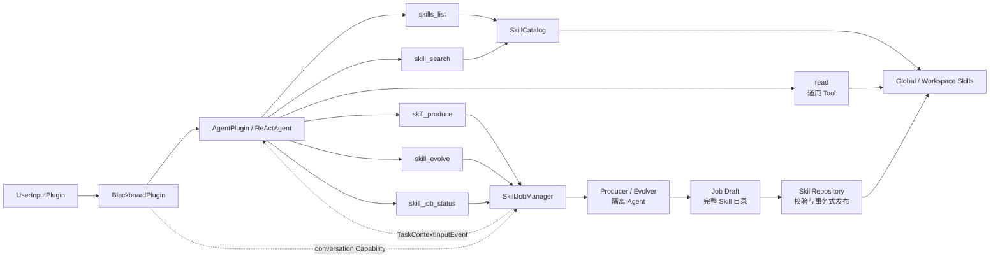

# SkillPlugin 主动召回、生产与演化设计

## 文档定位

本文描述 Icarus Agent 编排层中 `SkillPlugin` 的工具化重构。重构后的核心语义是：

- 停止每轮自动检索和 Skill Context 注入；
- 停止复杂轮次完成后的隐式自动维护；
- Agent 通过 `skills_list` 和 `skill_search` 主动发现 Skill；
- Agent 使用现有通用 `read` Tool 按需读取完整 `SKILL.md`；
- Agent 通过 `skill_produce` 和 `skill_evolve` 显式发起生产与演化；
- 生产和演化作为后台 Job 执行，通过 `skill_job_status` 查询状态；
- 生产和演化分别由显式权限开关控制，默认关闭。

本文替代旧版“每轮 RAG 检索、Blackboard 注入、会话累计 Skill、轮后自动维护”方案，并落实 `plugin-runtime-manifest-lifecycle-design.md` 已确定的五个 Skill Tool。

## 架构边界

- `ReActAgent` 保持无状态，只依赖统一 Tool 接口；
- Plugin Runtime 只负责发现、校验和注册 Plugin、Capability、Tool、Event 与状态提供者；
- EventBus 仍然只按来源 Plugin 路由，不解释 Skill 或 Job 业务；
- Tool 集合可以在不同 Agent Run 之间变化，但单次 Run 使用冻结快照；
- 动态 Skill 内容通过通用 `read` 的 Tool Result 进入当前消息轨迹，不修改稳定 System Prompt；
- SkillPlugin 内部的 Catalog、JobManager、Producer、Evolver 和 Repository 都是普通组件，不注册为子 Plugin；
- Hook 只观测，不参与权限判定、Job 调度或文件提交。

## 目标与非目标

### 目标

- 让 Agent 自主判断何时发现和使用 Skill；
- 支持多步骤任务根据中间信息再次搜索；
- 通过渐进式披露控制上下文开销；
- 让 Agent 显式生产新 Skill 或演化已有 Skill；
- 让 Producer/Evolver 能创建、修改和验证包含脚本、参考资料、模板与二进制资源的完整 Skill 目录；
- 让耗时的生产和演化不阻塞单次 Tool 调用；
- 使用现有运行中 Context 事件把 Job 结果通知仍活跃的 Agent；
- 保存可查询的 Job 终态，并在 Runtime 退出时确定性收束；
- 复用现有目录、覆盖规则、脱敏和安全仓库能力；
- 对所有 Skill 写入实行默认禁止、失败关闭的权限策略。

### 非目标

- 不向每轮 Prompt 注入完整 Skill 列表或自动匹配结果；
- 不新增 `skill_read`，完整文件读取继续复用通用 `read`；
- 不在 Agent Kernel 或 Plugin Runtime 中增加 Skill 专用分支；
- 不恢复运行到一半的 Agent、ToolCall 或 asyncio Task；
- 不自动生成、更新、合并或删除 Skill；
- 不向 Agent 暴露任意 Skill 删除操作；
- 不在首期实现分页、标签表达式或复杂查询 DSL；
- 不在一次 Agent Run 中热注册、热卸载或替换 Tool。
- 不把生成 Agent 的内部消息和 Tool 轨迹写入 Blackboard 对话历史；
- 不以绝对安全沙箱为目标，但必须限制生成过程的写入范围、网络访问、依赖安装和明显危险命令。

## 方案结论

### 不再采用：每轮自动 RAG 注入

旧实现只根据初始用户输入检索，无法利用多步骤任务中的新信息；误召回会直接进入上下文；Blackboard 还必须等待检索完成。被检索到的 Skill 也不等于真正被 Agent 采用。

### 不再采用：每轮注入完整目录

Skill 数量会随生产和演化持续增长。每轮暴露完整目录会形成固定 Token 成本，并降低大目录下的选择质量。

### 采用：主动发现、渐进读取、显式写入

Agent 按需调用轻量目录或关键词搜索，再用通用 `read` 读取完整 Skill。需要沉淀经验时，Agent 显式调用 `skill_produce` 或 `skill_evolve` 创建后台 Job。该方案让召回、上下文和写入成本都按需发生。

## 整体架构



`SkillCatalog` 负责扫描、名称解析、列表、搜索和路径识别。`SkillJobManager` 负责生产与演化 Job 的状态、Draft 生命周期、执行、通知和恢复。Producer/Evolver 在 Job 专属 Draft 中完成整个 Skill，`SkillRepository` 只校验成品并事务式发布。五个 Skill Tool 只负责扁平参数校验和领域调用。

## Agent 可见 Tool 协议

SkillPlugin 固定注册以下五个 Tool：

```text
skills_list
skill_search
skill_produce
skill_evolve
skill_job_status
```

默认 Agent Run 可以看到它们；调用方显式设置 Tool allowlist 时，仍以该 Run 的 allowlist 为准。权限关闭不改变 Manifest 的静态 Tool 集合，对应写 Tool 在执行时返回明确的 `disabled_by_policy` 错误。

### `skills_list`

用途：Agent 想浏览当前可见 Skill 时，按需获取轻量目录。

输入：

```json
{
  "scope": "all"
}
```

`scope` 可选，只允许 `all`、`global` 或 `workspace`，默认 `all`。输出按规范化名称稳定排序，每项只包含：

```json
{
  "name": "unit-test-generator",
  "description": "Use when ...",
  "scope": "global",
  "path": "/resolved/skill/unit-test-generator/SKILL.md"
}
```

调用是按需的，不把目录预先注入 Prompt。Workspace Skill 继续覆盖同名全局 Skill。

### `skill_search`

用途：Agent 不知道准确 Skill 名称时，按当前目标搜索少量候选。

输入：

```json
{
  "keywords": ["python", "unit test", "async"]
}
```

规则：

- `keywords` 必须包含 1 至 8 个非空字符串；
- 每次调用重新扫描当前可见 Skill；
- 搜索字段为 Skill 的 `name`、`description` 和 YAML 中可选的 `keywords` 字符串列表；
- 输入和字段统一执行 Unicode `casefold`，并把连续空格、`-` 和 `_` 归一化为单个空格；
- 每个关键词转义后生成安全正则，只做归一化后的包含匹配，不接受 Agent 提供正则表达式；
- 任一关键词命中即可返回，命中关键词数量越多越靠前；同分时按名称命中、`keywords` 命中、description 命中的顺序比较，最后按规范化名称稳定排序；
- 不做编辑距离、拼写纠错、分词、词干化、BM25 或向量相似度；
- 首期固定最多返回 10 项；
- Agent 可以在同一 Run 中根据中间结果调整关键词并再次搜索；
- 无合格候选时成功返回空数组；
- 输出项与 `skills_list` 一致，不返回正文和内部评分。

Agent 选定候选后，通过返回的 `path` 调用通用 `read`。`skill_search` 本身不算使用 Skill。

### `skill_produce`

用途：Agent 判断当前任务形成了可复用方法时，显式生产新的 Skill。目标写入当前
Workspace 还是全局目录，由主 Agent 明确选择。

输入保持扁平：

```json
{
  "name": "python-unit-test-workflow",
  "scope": "workspace",
  "instructions": "沉淀本次 Python 单元测试生成与验证流程"
}
```

规则：

- `name` 和 `instructions` 必须是非空字符串；
- `scope` 必填，只允许 `workspace` 或 `global`；
- ToolExecutor 透传的只读 `task_messages` 是当前任务证据，不作为 JSON 参数重复传入；
- 没有 `task_id` 或没有有效当前任务消息时拒绝创建 Job；
- `allow_produce=False` 时返回 `disabled_by_policy`；
- 创建 Job 前分别扫描 Workspace 和全局两个物理作用域；任一作用域存在同规范化名称时，
  立即返回 Tool 失败，不创建 Job、不启动 Producer、不写文件，并提示使用 `skill_evolve`；
- Tool 只创建后台 Job，立即返回 `job_id` 和 `queued`，不等待模型生成或文件写入；
- Producer 使用独立生成 Agent，在 Job 专属 Draft 中创建完整 Skill 目录；
- 生成 Agent 能读取任务相关材料、编辑 Draft 并受限执行验证命令，但不能直接写入正式 Skill 根目录；
- Repository 验证整个 Draft 后，只能发布到 `scope` 指定的目标目录；
- 提交前再次扫描两个物理作用域；若生成期间出现同名 Skill，Job 以冲突失败，不覆盖文件。

### `skill_evolve`

用途：Agent 判断已有 Skill 应根据当前任务经验改进时，显式演化该 Skill。

输入：

```json
{
  "name": "python-unit-test-workflow",
  "instructions": "补充异步测试与失败重试规则"
}
```

规则：

- `name` 和 `instructions` 必须是非空字符串；
- `allow_evolve=False` 时返回 `disabled_by_policy`；
- 目标必须是 Catalog 当前可见的有效 Skill；
- Workspace Skill 演化为原路径的事务式更新；
- 全局 Skill 不被直接修改，演化结果写成当前 Workspace 的同名覆盖；
- Job 捕获目标 Skill 快照和只读 `task_messages`；
- Job 把目标的完整目录复制到 Draft，Evolver 在副本上增删改文件，未修改内容自然保留；
- 提交前重新校验目标快照，发生并发变化时 Job 失败，不覆盖新内容；
- Tool 立即返回 `job_id` 和 `queued`。

### `skill_job_status`

用途：查询 produce/evolve Job 的当前或最终状态。

输入：

```json
{
  "job_id": "skill-job-..."
}
```

输出包含：

- `job_id`；
- `operation`：`produce` 或 `evolve`；
- `status`：`queued`、`running`、`succeeded`、`failed` 或 `interrupted`；
- `target_name`；
- 成功时的 `path`；
- 失败或中断时的安全错误摘要；
- 创建、开始和结束时间。

该 Tool 不返回生产 Agent 的内部 Prompt、推理内容或未脱敏证据。未知 `job_id` 返回失败。

## Tool 提示与执行语义

- `skills_list` 的描述说明它只在需要浏览目录时调用；
- `skill_search` 的描述说明任务可能受益于专用流程或领域规范时应主动搜索；
- 搜索结果明确提示先用通用 `read` 阅读完整 Skill，再遵循其中流程；
- `skill_produce` 和 `skill_evolve` 的描述说明它们只在确有可复用增量时调用，不能每轮默认调用；
- 所有行为提示放在 `ToolDefinition`，不新增 Skill 专用 System Prompt。

`skills_list`、`skill_search` 和 `skill_job_status` 是只读操作，可以并行。`skill_produce` 和 `skill_evolve` 会创建写入 Job，作为顺序屏障。同步和异步入口必须共享同一领域实现，不能复制两套权限、扫描或 Job 规则。

## Skill 目录与搜索

正式 Skill 目录分为当前 Workspace 和全局两个作用域：

```text
<current-workspace>/
└── skills/
    └── <skill-name>/
        ├── SKILL.md
        ├── scripts/
        ├── references/
        ├── templates/
        └── assets/

$ICARUS_DATA_DIR/
└── skills/
    └── <skill-name>/
        ├── SKILL.md
        └── ...
```

Workspace Skill 源文件属于当前 Workspace，不放在 `$ICARUS_DATA_DIR/workspaces/<workspace_key>`；后者只保存 Workspace 元数据、Session、日志和 Job 状态。Skill 仍至少要求根目录存在 `SKILL.md`，其 YAML 头包含非空 `name` 和 `description`。可选 `keywords` 必须是字符串列表；字段无效时记录日志并按空列表处理，不让附加元数据导致整个 Skill 不可用。缺少必填字段、无效 YAML 或同作用域重名仍跳过。扫描器解析后的路径必须位于对应 Skill 根目录，符号链接不能把 Catalog 路径指向目录外。

除 `SKILL.md` 外，Skill 可包含任意层级的普通文件，包括 `scripts/`、`references/`、`templates/` 和二进制 `assets/`。目录名不是固定协议；这些名称只是常见约定。Repository 按字节保存普通文件，只对需要理解的文本文件执行文本格式校验。

搜索只依赖扫描结果和上述确定性包含规则，不创建模型、不下载向量资源，也不维护按 Workspace 的使用次数或生命周期权重。旧的 `SessionSkillState`、`SkillTurnState`、累计列表、七轮刷新和使用状态数据库全部删除。

## 生产与演化权限

`SkillSettings` 增加两个独立开关：

```python
allow_produce: bool = False
allow_evolve: bool = False
```

权限语义：

- 缺失时使用默认值 `False`；
- 非布尔配置由 Pydantic 拒绝，不能被宽松转换为开启；
- `allow_produce` 只授权按 Tool 的必填 `scope` 创建新的 Workspace 或全局 Skill；
- `allow_evolve` 只授权更新 Workspace Skill或为全局 Skill 创建 Workspace 覆盖；
- 关闭权限时 Tool 仍按 Manifest 注册，但调用不会创建 Agent、Job 或文件副作用；
- 没有单独的自动维护总开关，因为自动维护被删除；
- 不提供 Agent 可见的 delete 或 merge Tool。

这两个开关控制 SkillPlugin 的领域写操作，不是操作系统级文件沙箱。用户明确要求通用文件 Tool 修改文件时，仍由通用 Tool 自身的权限体系负责，SkillPlugin 不跨层拦截。

## Skill Job

### 创建与执行

`skill_produce` 或 `skill_evolve` 在校验权限和参数后执行前置检查。Produce 必须先检查
Workspace 和全局两个物理作用域，冲突时在创建 Job 前结束；Evolve 必须先解析当前可见目标并
保存原始快照。通过前置检查后：

1. 从 Tool 执行上下文捕获 `task_id`、`run_id`、`step` 和只读 `task_messages`；
2. 直接通过 `blackboard/conversation` Capability 调用 `get_messages()`，取得此前已提交的
   Session 对话；
3. 使用 `context = tuple(history) + task_messages` 组成截至本次 Tool 调用的完整对话证据；
4. 生成唯一 `job_id`，保存 `queued` 状态；
5. 创建由 SkillPlugin 所有的后台 Task；
6. Job 创建专属临时 Draft；Produce 从空目录开始，Evolve 从目标 Skill 完整目录的快照副本开始；
7. Job 进入 `running`，调用隔离的 Producer 或 Evolver Agent；
8. 对输入证据执行现有结构化脱敏；
9. 生成 Agent 通过受控文件与执行能力在 Draft 中完成整个 Skill，并以明确的完成响应结束；
10. Repository 校验 Draft 的目录边界、`SKILL.md`、文件类型、容量、作用域和并发快照后事务式提交；
11. 保存 `succeeded` 或 `failed` 终态并清理 Draft。

`BlackboardPlugin.get_messages()` 已返回新的外层列表，ToolExecutor 也已为当前任务提供消息快照；
SkillPlugin 只把二者组合成 tuple 并按只读数据使用，不再做一层无意义的深拷贝。当前
`task_messages` 的末尾可能是尚未产生 Tool Result 的 `skill_produce` 或 `skill_evolve` ToolCall，
因此不能原样作为另一个模型的协议历史。Prompt Builder 会把完整 `context` 脱敏并序列化成
结构化对话证据，放入 Producer/Evolver 的当前 User Prompt；内部 Agent 的 `history_messages` 保持空。
最后一条任务指令同时明确传入 `name`、`scope`（仅 Produce）、`instructions`、Draft 路径、完成条件和约束。
它们因此可以理解“结合前面确定的内容”具体指什么，同时不依赖从自然语言历史中猜测目标参数。
若未来允许组件修改 Message 内部对象，应统一收紧 Message 的不可变性，而不是在 SkillPlugin 中
散落深拷贝。

Produce Job 只允许创建一个新 Skill。提交临界区内再次扫描 Workspace 与全局两个作用域，任一
同规范化名称都使 Job 失败。Evolve Job 只允许更新一个明确目标：Workspace 目标比较原文件快照，
全局目标还要确认原全局快照未变且未出现同名 Workspace 覆盖。旧 Maintainer 一次返回多项
create/update/merge/delete 的宽泛计划不再使用。

### Draft 与生成 Agent 能力

Draft 是一个 Job 私有的临时目录，只承担生成过程和提交前成品交接，不是新的持久化领域模型。生成 Agent 负责 Draft 中所有内容决策，Repository 不替它补写或改写 Skill。

生成 Agent 应具备完成真实 Skill 所需的能力：

- 浏览和读取当前 Workspace、Workspace Skills、全局 Skills 与当前 Draft；
- 通过文件 Tool 只在当前 Draft 内创建、覆盖、移动和删除文件；
- 从允许读取的位置复制文本或二进制资源到 Draft；
- 在 Draft 中执行必要的检查或试跑命令。

具体 Tool 名称、数量和注册方式属于内部实现，不进入 SkillPlugin 的 Manifest 或公共 Capability 契约。实现应优先复用现有 Agent/Tool 基础设施，并保持 Producer、Evolver 和 Repository 不依赖 `ToolRegistry`。无论选择包装 Tool、执行策略还是其他简单实现，都必须满足以下行为约束：

- 文件 Tool 不能直接写 Workspace 或全局正式 Skill 根目录；
- 命令执行 Tool 把工作目录固定为 Draft，并在执行前拒绝明显危险、越界、联网和依赖安装行为；
- 执行环境不暴露凭据、Token、代理等敏感环境变量；
- 命令具有单次执行超时和输出上限；
- 安全检查拒绝时向 Agent 返回原因，允许它调整验证方式；
- 文件 Tool 的路径边界必须强制执行；命令检查用于降低误操作风险，不宣称能够阻止子进程绕过或构成操作系统安全沙箱。

默认实现复用一个私有的生成 Agent 与其 ToolRegistry，不为每个 Job 重建 Agent、Registry 或模型连接。当前 Draft 和读写根目录通过本次生成调用的执行上下文绑定，不能由模型参数选择；同一 Agent 的并发 Job 必须各自看到自己的 Draft。该执行上下文只服务内部 Tool，不扩展 `BaseAgent` 的公共参数，也不引入全局 Job-to-Draft 领域状态。

生成 Job 不设置固定总时限。模型 Provider 的单次请求超时、受控执行 Tool 的单次命令超时以及 Runtime 退出时的取消机制仍然生效。

### Repository 发布边界

Repository 是正式 Skill 目录的唯一发布入口。提交前至少验证：

- Draft 根目录存在合法 `SKILL.md`，且 YAML `name` 与目标名称一致；
- 所有成员均为 Draft 内的安全相对路径，不包含越界路径或符号链接；
- 文件数量不超过 256，单文件不超过 20 MiB，目录总大小不超过 100 MiB；
- 文本文件满足对应文本约束，二进制文件保持原始字节；
- Produce 的双作用域名称仍无冲突；
- Evolve 的原目录快照仍一致。

校验成功后，Repository 先在目标文件系统准备完整的新目录，再在写协调锁内替换目标。Produce 使用一次目录重命名发布；Evolve 使用旧目录备份、新目录替换和失败回滚实现事务式发布。跨平台实现不承诺对进程外读者提供不可观察的目录交换瞬间，但不会把半写入的文件树作为成功结果保留。

### 通知当前 Agent

Job 到达终态后，SkillPlugin 发布 `TaskContextInputEvent`，内容只包含 Job ID、操作、终态、目标名称以及成功路径或安全错误摘要。AgentPlugin 通过已有 RunControl 在下一个安全检查点把结果加入仍活跃的 Agent Run。

SkillPlugin 消费对应的 `TaskContextInputResultEvent`，按 `request_event_id` 关联通知，并记录
`accepted`、`not_found`、`not_running`、`already_cancelling`、`already_finished` 或
`invalid_content`。通知失败不改变 Job 终态；Agent 或后续会话仍可用 `skill_job_status` 查询。

### 状态与恢复

Job 状态是 JSON 可序列化数据，不保存 asyncio Task、模型连接或运行栈：

- Workspace 状态保存有界的 Job 终态记录；
- Session 状态保存本 Session 创建的 Job ID 和通知投递状态；
- Runtime 恢复时，持久化为 `queued` 或 `running` 的 Job 统一转成 `interrupted`，不自动重放；
- Job 历史采用固定数量上限，优先淘汰最旧终态，避免无限增长。

### 退出收束

- `quiesce()` 后拒绝新 produce/evolve Job；
- `drain()` 允许已经进入 Repository 提交阶段的 Job 完成，并取消仍在生成阶段的后台 Task，
  将其标记为 `interrupted`；
- `drain()` 返回时所有 Job 必须处于稳定终态，保证随后状态快照不会保存活动运行栈；
- `stop()` 只做幂等资源释放，关闭内部 AgentFactory 和 Job 资源；
- Runtime 在 `drain()` 后调用状态快照。

## Plugin、Capability、Event 与 Blackboard

### Manifest 与注册

Skill Manifest 声明：

```text
required_capabilities = [
  "persistence/runtime@>=1,<2",
  "persistence/session@>=1,<2",
  "persistence/state_store@>=1,<2",
  "persistence/redactor@>=1,<2",
  "blackboard/conversation@>=1,<2",
]
provided_capabilities = ["skill_management@1.0.0"]
provided_tools = [
  "skills_list",
  "skill_search",
  "skill_produce",
  "skill_evolve",
  "skill_job_status",
]
published_events = ["TaskContextInputEvent"]
consumed_events = ["TaskContextInputResultEvent"]
state_scopes = ["workspace", "session"]
workspace_state_version = 1
session_state_version = 1
```

Factory 返回同一注册单元中的 Plugin、`skill_management` Capability、五个 Tool 和状态提供者。Runtime 继续负责原子校验、名称冲突处理、来源订阅和 ToolRegistry 冻结。

`skill_management` Capability 暴露与五个 Tool 相同的 list、search、produce、evolve 和
job-status 领域入口，所有调用共享权限、前置检查和 Job 规则。Capability 不暴露内部 Agent、
Repository 或可绕过权限的写接口。

### Blackboard

SkillPlugin 不再发布 `ContextContributionEvent`，Blackboard 的 `required_context_sources` 不再包含 `skill`。没有其他 Context 来源时，Blackboard 收到 `UserInputEvent` 后即可发布 `BlackboardContextReadyEvent`。

Skill 检索延迟由每轮固定关键路径移到 Agent 主动 Tool 调用路径。完整 Skill 内容由通用 `read` 的 Tool Result 自然进入当前 ReAct 轨迹。

`blackboard/conversation` 是 SkillPlugin 的直接只读依赖，只用于 Produce/Evolve Job 拼接已提交
历史。Blackboard 不反向依赖 `skill_management`，也不再等待 Skill 的 Context Contribution，避免
启动依赖或用户输入就绪条件形成环。

## 日志与 Hook

生成或进化过程属于当前 Session 中由 Skill Job 发起的内部子 Agent Run，不属于主 Agent 的正式对话。它沿用触发 Job 的 `task_id`，生成新的 `run_id`，并在 Hook Context 中记录 `parent_run_id`、`skill_job_id`、`agent_kind=skill_generation`、`operation` 和 `skill_name`。LLM 与内部 Tool 的 Hook 继续写入当前 Session 的 `trace.jsonl`，无需新增轨迹存储。

生成 Agent 的中间消息、ToolCall、Tool Result 和推理不写入 Blackboard。Job 终态仍通过 `TaskContextInputEvent` 向原任务发送简短通知；详细过程通过 Trace 按 `skill_job_id` 或子 `run_id` 查询。

在统一 Tool 执行 Hook 之外补充 Skill 领域指标：

- `skill.list`：数量、scope、耗时和错误；
- `skill.search`：候选数量、返回名称、耗时和错误；
- `skill.produce` / `skill.evolve`：Job ID、目标、状态迁移和错误；
- `skill.job_status`：Job ID、当前状态和错误；

内部生成 Prompt 在进入 Agent 前已完成结构化脱敏，Trace 仍通过统一 Redactor 处理 Hook 数据。
生成 Agent 的 Prompt、ToolCall 和 Tool Result 可出现在技术 Trace 中，包括 `write` 的生成内容，
但不会进入 Blackboard 对话历史。Hook 失败不能改变 Tool、Job 或 Repository 结果。旧
`skill.retrieval` 和 `skill.maintenance` Hook 删除。

## 故障处理

- 无效 Skill：记录路径和原因，跳过；
- 搜索无结果：成功返回空数组；
- produce/evolve 权限关闭：返回 `disabled_by_policy`，无副作用；
- 目标冲突或不存在：在创建 Job 前返回明确失败；
- Producer/Evolver Agent 或受控 Tool 失败：若 Agent 无法恢复，Job 进入 `failed`；
- Draft 不完整、脱敏或 Repository 校验失败：Job 进入 `failed`，不写部分结果；
- Draft 清理失败：记录日志，不把已成功发布的 Job 改为失败；
- Produce 前置冲突：立即返回 Tool 失败，不创建 Job；
- Produce 提交前冲突：Job 失败，不覆盖任一作用域中的同名 Skill；
- Evolve 并发快照冲突：Job 失败，不覆盖新内容；
- 运行中 Context 投递失败：只更新通知状态，不改变 Job 结果；
- Runtime 退出时仍在生成：Job 进入 `interrupted`。

## 迁移范围

### 保留并调整

- `SkillScanner`：保留发现与 Workspace 覆盖规则，增加根目录约束；
- `SkillRepository`：把安全快照和原子提交从单文件扩展为完整目录，仍收窄为单目标 produce/evolve；
- 脱敏逻辑：继续用于生成输入和 Trace；单文件 JSON 输出 Parser 不再是 Draft 交接边界；
- `WorkspaceMaintenanceCoordinator`：改为 Job 写入协调，不再驱动自动维护。

### 新增

- `SkillCatalog`；
- `SkillJob` 与 `SkillJobManager`；
- Job 专属 Draft 的创建、清理和完整目录校验；
- 生成 Agent 所需的受控文件与命令执行能力；
- `SkillsListTool`；
- `SkillSearchTool`；
- `SkillProduceTool`；
- `SkillEvolveTool`；
- `SkillJobStatusTool`；
- SkillPlugin Workspace / Session 状态提供者。

### 删除

- 每轮 `_consume_user_input()` 自动检索；
- Skill `ContextContributionEvent` 与注入序列化；
- `SessionSkillState`、累计列表和七轮刷新；
- `SkillTurnState` 与轮后复杂度阈值；
- `SkillRanker`、`SkillUsageStore` 和 `skill-state.sqlite3`；
- `BaseEmbedding`、`EmbeddingFactory`、FastEmbed 实现与 embedding 配置；
- `fastembed` 和 `numpy` 依赖；
- `AgentCompletedEvent` 触发的自动维护；
- 多操作 `SkillMaintenancePlan` 的隐式 create/update/merge/delete；
- 自动检索超时后永久禁用整个 Runtime 的状态。
- Producer/Evolver 固定 120 秒总超时；
- 只允许返回一个 `SKILL.md` 字符串的 `GeneratedSkill` 交接协议。

## 测试策略

### Catalog 与发现 Tool

- list 的 scope、排序、路径与 Workspace 覆盖；
- search 的参数、归一化、字段优先级、最多 10 项和空结果；
- 空格、`-`、`_` 和大小写差异能够命中；
- 多关键词命中数量决定排序，结果稳定；
- 不把 Agent 输入解释为原始正则；
- 无效 YAML、重复名称和越界符号链接被跳过。

### Produce、Evolve 与 Job

- 两个权限默认关闭且相互独立；
- 关闭时没有 Agent、Job 或文件副作用；
- produce 要求显式 scope，并拒绝 Workspace 或全局任一作用域已存在的同名目标；
- produce 在提交前重复执行双作用域冲突检查，覆盖竞态；
- evolve 拒绝未知目标，并正确创建全局 Skill 的 Workspace 覆盖；
- produce 可以生成包含多个文本文件和二进制资源的完整 Skill 目录；
- evolve 从完整目录副本开始，能够保留、增加、修改和删除文件；
- Tool 返回 queued Job，状态按合法顺序迁移；
- Job 输入使用扁平执行身份、Blackboard 已提交历史和只读 `task_messages`；
- Draft 写入边界、受限命令执行、敏感环境清理和安全拒绝反馈；
- Repository 的目录校验、二进制保真、单目标事务式提交和并发冲突保护；
- 生成 Agent 使用独立子 `run_id`，Trace 保留父 Run 与 Skill Job 关联，Blackboard 不接收内部轨迹；
- 生成过程没有固定总超时，单次模型请求、命令执行和 Runtime 退出仍受控制；
- Job 成功、失败、中断、通知投递与状态查询；
- Runtime 恢复把未完成 Job 标记为 interrupted；
- 历史上限和退出资源收束。

### Runtime 集成

- Manifest、PluginRegistration、Capability、五个 Tool 和状态声明完全一致；
- Blackboard 不再等待 Skill Context；
- Agent 可以完成 `skill_search -> read -> 执行 Skill`；
- Agent 可以完成 `skill_produce/evolve -> job_id -> 通知或 job_status`；
- Job 完成通过现有 `TaskContextInputEvent` 通知活跃 Agent；
- Agent Run 仍使用稳定 Tool 快照；
- `ReActAgent`、Plugin Runtime 和 EventBus 不出现 Skill 专用逻辑。

## 验收标准

- 普通用户输入不触发 Skill 扫描或 Prompt 注入；
- Agent 只有主动调用 list/search 时才发现 Skill；
- 完整 Skill 只有通过通用 `read` 才进入 ReAct 轨迹；
- 不存在自动轮后生产或演化；
- `allow_produce=False` 时不能通过 `skill_produce` 写入；
- `allow_evolve=False` 时不能通过 `skill_evolve` 写入；
- Produce 只能写入主 Agent 显式选择的 `workspace` 或 `global`，且两个作用域任一同名时均不创建；
- Producer/Evolver 能看到此前 Session 历史和当前任务截至 Tool 调用时的消息；
- Producer/Evolver 能在独立 Draft 中完成、检查并交付完整 Skill 目录，且不能直接写正式目录；
- Workspace Skill 写入 `<current-workspace>/skills`，全局 Skill 写入 `$ICARUS_DATA_DIR/skills`；
- Skill 可包含二进制资源，Repository 发布时保持其原始字节；
- 生成 Agent 的内部轨迹可由当前 Session Trace 关联到原任务和 Job，但不会污染 Blackboard；
- Skill Job 没有固定 120 秒总时限；
- produce/evolve 以可查询、可通知、可持久化终态的后台 Job 执行；
- SkillPlugin 通过 Manifest 提供 `skill_management` Capability 和五个 Tool；
- Blackboard、Agent Kernel、Plugin Runtime 与 EventBus 保持通用。
