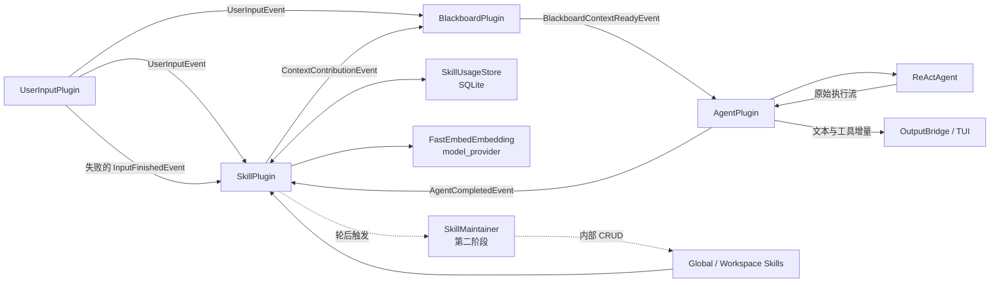

# SkillPlugin Design｜Skill 动态注入与维护设计

## 文档定位

本文描述 Icarus Agent 编排层中的 `SkillPlugin`。该插件负责发现、检索、注入和维护 Skill，并在高复杂度对话成功结束后尝试自动沉淀 Skill。

本文遵循现有 Plugin Runtime、EventBus、Blackboard 和 AgentPlugin 边界：

- `SkillPlugin` 是普通领域 Plugin；
- EventBus 仍然只按来源 Plugin 路由，不理解 Skill Event；
- `SkillPlugin` 不侵入无状态的 `ReActAgent`；
- 动态 Skill 信息进入当前 User Prompt，不修改稳定 System Prompt；
- Blackboard 汇聚各插件上下文并维护实际发送给 Agent 的对话历史；
- Skill 自动维护失败不能阻塞主 Agent 对话。

功能分阶段交付。第一阶段只实现 Skill 动态检索和注入闭环；第二阶段实现轮后自动生成、更新、合并和清理。

## 目标与非目标

### 目标

- 从 Icarus 全局目录和当前 Workspace 目录动态发现 Skill；
- 从 `SKILL.md` YAML 头读取渐进式披露所需的元信息；
- 根据当前用户输入动态选择最相关的 Skill；
- 在一个会话中维护累计 Skill 注入列表；
- 减少重复 Token，同时定期刷新长上下文中的 Skill 信息；
- 记录各 Workspace 对 Skill 的使用时间和次数；
- 让生命周期状态参与 Skill 排名；
- 在复杂对话成功结束后，异步尝试生成或整理 Skill；
- 支持多个 AgentRuntime 共享 Skill 文件和使用状态，同时隔离会话状态。

### 非目标

- 不把完整 `SKILL.md` 默认注入 User Prompt；
- 不在 SkillPlugin 中实现关键词路由或特殊 Skill 强制注入；
- 不向主 Agent 暴露 SkillPlugin 内部 CRUD 接口；
- 不在 ReAct 的每个 step 中启动 Skill 总结；
- 不持久化 Embedding 向量；
- 不恢复 Runtime 重建前的会话 Skill 列表和七轮计数；
- 第一阶段不实现自动生成、合并、删除或跨进程写协调。

## 整体架构



`SkillPlugin` 同时订阅：

- `UserInputPlugin`：收到 `UserInputEvent` 时执行 Skill 检索；收到失败的
  `InputFinishedEvent` 时清理该轮临时状态；
- `AgentPlugin`：只接收 `AgentCompletedEvent`，从完整响应中恢复本轮工具轨迹，
  并在终态判断是否启动自动维护。

AgentPlugin 发布的文本增量、工具开始和工具完成事件继续由 OutputBridge 交给 TUI，
但不进入 SkillPlugin 的 Runtime inbox。

BlackboardPlugin 订阅 `SkillPlugin`，把 Skill 上下文与用户输入及其他 Context Plugin 的结果一起组合。AgentPlugin 只消费 Blackboard 发布的完整调用快照。

## Plugin 事件流

当前运行时已注册 Plugin、来源订阅关系、对话主链路、轮后自动维护链路和状态所有权统一维护在：

- `plugin-event-flow-current-state.md`

本文只描述 SkillPlugin 自身设计，不重复维护全局 Plugin 总图。

## 目录与作用域

Skill 文件统一位于 `ICARUS_DATA_DIR`：

```text
$ICARUS_DATA_DIR/
├── skills/
│   ├── skill-a/
│   │   └── SKILL.md
│   └── skill-state.sqlite3
└── workspaces/
    └── <workspace_key>/
        └── skills/
            └── skill-b/
                └── SKILL.md
```

作用域规则：

- `$ICARUS_DATA_DIR/skills/<skill-name>/SKILL.md` 是全局 Skill；
- `$ICARUS_DATA_DIR/workspaces/<workspace_key>/skills/<skill-name>/SKILL.md` 是 Workspace Skill；
- 全局 Skill 对所有 Workspace 可见，SkillPlugin 自动维护流程只读；
- Workspace Skill 只对当前 Workspace 可见，可以自动创建、更新、合并或删除；
- 全局与 Workspace Skill 的规范化 `name` 相同时，Workspace Skill 覆盖全局 Skill；
- 主 Agent 根据用户明确请求使用文件工具创建或安装 Skill 时，不受内部自动维护的只读接口限制，但仍需遵循被注入 Skill 中的规则。

目录解析由持久化层的路径解析组件扩展提供，SkillPlugin 不自行拼接数据根目录。

## Skill 模型与渐进式披露

### YAML 头

一个可检索 Skill 至少包含：

```yaml
---
name: skill-product
description: Use when the user asks to create, summarize, update, or improve a reusable Skill.
---
```

第一阶段只要求：

- `name`：非空字符串；
- `description`：非空字符串。

其他 YAML 字段由具体 Skill 自己维护，SkillPlugin 扫描器保留但不解释。无效 YAML 头、缺少必填字段或重复的同作用域名称只记录错误并跳过，不阻塞 Runtime 启动或主 Agent。

### 注入内容

SkillPlugin 只向 Agent 提供：

- `name`；
- `description`；
- `SKILL.md` 的规范化绝对路径。

不默认注入 Skill 正文。主 Agent 判断需要使用某个 Skill 后，通过现有 `read` 工具读取完整文件。这是 Skill 的渐进式披露边界。

### 不设置特殊 Skill 分支

`skill-product`、`skill-installer` 与其他 Skill 使用相同的扫描、Embedding 和排名流程。

当用户提出“把本次过程总结成 Skill”或“安装 Skill”时，相关 Skill 应依赖准确的 `description` 自然进入 Top 3。SkillPlugin 不通过关键词规则识别意图，也不额外追加或强制注入 Skill。若匹配效果不足，优先改进 Skill 描述或通用检索策略。

## 动态检索

### 检索时机

每轮 `UserInputEvent` 到达时执行一次检索。ReActAgent 后续产生多少个 step 或工具调用都不会再次触发本轮检索。

### EmbeddingProvider

Embedding 能力属于 `model_provider` 层。SkillPlugin 依赖供应商无关的 `BaseEmbedding` 接口，不直接导入 FastEmbed：

```python
class BaseEmbedding(ABC):
    @abstractmethod
    async def embed_query(self, text: str) -> list[float]:
        ...

    @abstractmethod
    async def embed_documents(self, texts: list[str]) -> list[list[float]]:
        ...
```

第一阶段使用 `fastembed` 提供本地实现，不调用 OpenAI、Anthropic 或其他远端 Embedding API，也不需要 API Key。默认模型为 FastEmbed 支持的多语言模型：

```text
sentence-transformers/paraphrase-multilingual-MiniLM-L12-v2
```

用户输入作为查询向量，Skill `description` 作为文档向量。`FastEmbedEmbedding` 直接调用 FastEmbed 的模型专用查询与文档接口，SkillPlugin 和 Ranker 不处理模型专用前缀。所有 Skill 描述使用一次批量调用生成向量。

`FastEmbedEmbedding` 位于 `model_provider/impl/fastembed_embedding.py`，直接复用包提供的 `TextEmbedding` 和 `embed`，不实现模型推理或网络客户端：

```python
from fastembed import TextEmbedding

model = TextEmbedding(
    model_name=settings.model_name,
    cache_dir=str(fastembed_cache_dir),
)
query_vector = list(model.query_embed(user_input))[0]
skill_vectors = list(model.passage_embed(skill_descriptions))
```

`TextEmbedding` 实例在适配器生命周期内只创建一次并跨轮复用，不在每次用户输入时重复加载模型。`embed` 是同步 CPU 调用，适配器通过 `asyncio.to_thread` 执行，避免阻塞 EventBus 所在事件循环。

对应源码边界：

```text
model_provider/
├── base_embedding.py
├── embedding_factory.py
└── impl/
    └── fastembed_embedding.py
```

`EmbeddingFactory` 是唯一判断 `embedding.provider` 的位置；应用层创建 `BaseEmbedding` 实例后注入 SkillPlugin。具体模型库差异不进入 `agent_orchestration/plugins/skill/`。

Embedding 配置独立于主 Chat 模型配置，并从 `settings.json` 读取：

```json
{
  "embedding": {
    "provider": "fastembed",
    "model_name": "sentence-transformers/paraphrase-multilingual-MiniLM-L12-v2"
  }
}
```

对应配置类型由 `model_config` 统一加载，例如：

```python
class EmbeddingSettings(BaseModel):
    provider: Literal["fastembed"]
    model_name: str
```

Skill 检索参数独立配置：

```json
{
  "skill": {
    "minimum_content_score": 0.8
  }
}
```

`minimum_content_score` 限制在 `[0, 1]`，默认值为 `0.80`。它属于 Skill
检索配置，不属于 Embedding Provider 配置；旧配置未提供 `skill` 段时使用默认值。

主模型继续由 `use_protocol`、`model_settings` 和对应 Chat Provider 配置决定。Embedding 不复用 `openai_base_url`、`OPENAI_API_KEY` 或主模型名称，也不根据主模型当前选择 OpenAI-compatible 或 Anthropic 协议而变化。

FastEmbed 模型缓存目录由路径解析组件固定为：

```text
$ICARUS_DATA_DIR/models/fastembed/
```

首次运行时 FastEmbed 需要联网下载模型；下载完成后从本地缓存加载。缓存不存在且下载失败时，按 Embedding 不可用降级，不阻塞主 Agent。模型缓存不是 Skill 状态，不写入 SQLite。

Embedding 每轮实时计算，不持久化向量。Embedding 失败时，SkillPlugin 发布失败贡献，Blackboard 视为该来源本轮已完成并允许主 Agent 继续。

YAML 头使用 `PyYAML` 解析；Embedding 使用 `fastembed`；向量归一化和余弦相似度使用 `numpy`。不自行实现 YAML、模型推理或向量算法。

### 排名

内容相似度和生命周期共同决定最终排名：

```text
final_score = normalized_content_score * 0.8 + lifecycle_score * 0.2
```

生命周期分值：

| 状态 | 未使用时间 | lifecycle_score |
|---|---:|---:|
| `active` | 0～14 天 | 1.00 |
| `normal` | 15～29 天 | 0.67 |
| `archived` | 30～59 天 | 0.33 |
| `deletion_candidate` | 60 天及以上 | 0.00 |

内容相似度归一化到 `[0, 1]`。候选必须先满足：

```text
normalized_content_score >= minimum_content_score
```

合格候选再按最终分数降序选择 Top 3；候选少于三个时返回全部合格候选。门槛只
作用于纯内容相似度，生命周期权重只能调整相关 Skill 之间的顺序，不能把经常使用但
语义无关的 Skill 重新带回结果。相同分数使用规范化 Skill 名称和路径稳定排序，保证
结果可复现。

默认多语言模型对当前 `skill-plugin-phase-one` 描述的本地校准结果为：普通问候
`0.533`、TUI 多行输入设计 `0.751`、总结 SkillPlugin 第一阶段 `0.895`、验证 Skill
动态检索链路 `0.813`、天气问题 `0.471`、创建可复用 Skill `0.835`。因此默认
`0.80` 会过滤普通问候和无关开发请求，同时保留明确的 Skill 需求。

新发现且从未使用的 Skill 使用 `discovered_at` 计算状态。排名使用本轮检索开始前的状态；Top 3 确定后再更新使用记录。

### 使用定义

只要 Skill 通过最低内容门槛并进入本轮检索 Top 3，就视为本轮可能被使用：

- 更新 `last_used_at`；
- `use_count + 1`；
- 即使该 Skill 已存在于会话累计列表，也更新本轮使用记录。

以下情况本身不算新的使用：

- Skill 内容分低于最低门槛；
- Skill 只因为会话列表不主动移除而继续存在；
- 七轮倒计时到期，仅重新发送累计列表；
- Blackboard 从历史中携带此前注入的 Skill 信息。

## 使用状态存储

所有 Workspace 共用一个 Icarus 级 SQLite 文件：

```text
$ICARUS_DATA_DIR/skills/skill-state.sqlite3
```

第一阶段只有一张表：

```sql
CREATE TABLE skill_usage (
    workspace_key TEXT NOT NULL,
    skill_key     TEXT NOT NULL,
    discovered_at TEXT NOT NULL,
    last_used_at  TEXT,
    use_count     INTEGER NOT NULL DEFAULT 0,
    PRIMARY KEY (workspace_key, skill_key)
);
```

其中：

- `workspace_key` 区分不同 Workspace 对同一 Skill 的独立使用状态；
- `skill_key` 由作用域和规范化名称构成，例如 `global:skill-product` 或 `workspace:code-review`；
- `discovered_at` 是当前 Workspace 首次发现该 Skill 的时间；
- `last_used_at` 是最近一次进入 Top 3 的时间；
- `use_count` 是进入 Top 3 的累计次数。

SQLite 不保存：

- Skill 正文；
- YAML 元信息或路径；
- Embedding；
- Provider 和 Model；
- 派生生命周期状态；
- 会话累计注入列表；
- 七轮计数；
- 自动 CRUD 的过程记录。

数据库是使用状态记录，不是 Skill 的主存储或检索索引。Skill 文件始终是定义来源。SQLite 丢失后可以重新扫描并建立记录，但历史使用时间和次数无法恢复。

## 会话注入状态

每个 SkillPlugin 实例维护独立的 `SessionSkillState`：

```text
selected_skills       当前会话累计 Skill，保持稳定插入顺序
unchanged_turns       自上次完整注入后连续无新增的轮数
```

Skill 列表只增加，不因某轮未命中而主动删除。每轮 Top 3 与累计列表合并后：

同一规范化名称视为同一个会话 Skill。如果同名 Skill 的描述、路径或作用域发生变化，累计列表原位替换为新定义并立即完整注入；典型场景是 Workspace Skill 覆盖此前的全局同名 Skill。其他未命中的旧 Skill 仍不主动退出。

### 有新 Skill

- 将新 Skill 追加到累计列表；
- 发布累计列表的完整元信息；
- `unchanged_turns = 0`。

### 没有新 Skill且未达到七轮

- `unchanged_turns + 1`；
- 发布轻量的 `unchanged` 上下文；
- 不重复发送完整 Skill 元信息。

### 连续七轮没有新 Skill

- 发布当前累计列表的完整元信息；
- `unchanged_turns = 0`。

因此一次完整发送后的第 1～6 个无新增轮次发送 `unchanged`，第 7 个无新增轮次重新完整发送。Runtime 重建后直接从空状态重新开始。

如果扫描结果为空，或者所有候选内容分都低于最低门槛：

- 会话尚未注入过 Skill 时，SkillPlugin 发布 `completed + []`，满足 Blackboard 的固定
  上下文来源协议，但不向 User Prompt 注入空列表或 `unchanged` 文案；
- 会话已经注入过 Skill 时，本轮空召回不主动删除旧 Skill，继续推进现有
  `unchanged` 与七轮刷新机制；
- 空召回不调用 `mark_used`，不更新 `last_used_at` 和 `use_count`。

## Skill Context 协议

SkillPlugin 复用现有 `ContextContributionEvent`，不增加 EventBus 路由规则。完整注入使用一个 `ContextBlock`：

```text
source_plugin_id = "skill"
context_type     = "skills"
content          = 稳定序列化后的 Skill 元信息列表
metadata.mode    = "full"
```

无变化时：

```text
source_plugin_id = "skill"
context_type     = "skills"
content          = "The available skill context is unchanged from the previous full injection."
metadata.mode    = "unchanged"
```

`unchanged` 表示无需重复注入完整列表，不表示 Skill 列表为空。完整列表使用确定性顺序和序列化格式，避免相同状态产生不必要的 Prompt 差异。

## Blackboard 调整

早期实现曾由 AgentPlugin 侧组合 `ContextBlock` 与原始用户输入，导致 Blackboard 保存的历史
与 Agent 实际输入不一致。当前由 BlackboardPlugin 统一生成最终 `input_prompt`。

设计调整为：

```text
Blackboard 收齐 UserInput 和必需 ContextContribution
→ BlackboardPromptComposer 生成最终 input_prompt
→ Blackboard 保存本轮 final_input_prompt
→ BlackboardContextReadyEvent 携带 final_input_prompt
→ AgentPlugin 原样传给 ReActAgent
→ AgentCompletedEvent 到达后
→ Blackboard 将同一份 final_input_prompt 与最终 Assistant Message 写入历史
```

最终 User Prompt 仍保持：

```text
<plugin_context>
...
</plugin_context>

<plugin_context_errors>
...
</plugin_context_errors>

<user_request>
...
</user_request>
```

这样第一轮完整 Skill 信息会进入历史，后续 `unchanged` 轮次可以复用此前上下文；每七轮重新完整注入一次，刷新长上下文中的模型注意力。System Prompt 保持稳定。

Prompt Composer 是 Blackboard 的普通组件对象，不注册为子 Plugin。AgentPlugin 不再解释 Skill、Memory 或 Knowledge 内容。

## 用户显式创建或安装 Skill

用户显式要求主 Agent 创建、总结、更新或安装 Skill 时，仍走普通动态检索：

```text
用户输入
→ Embedding + 通用排名
→ skill-product / skill-installer 自然进入 Top 3
→ Blackboard 注入元信息
→ 主 Agent 按需读取完整 SKILL.md
→ 主 Agent 使用现有文件工具完成用户请求
→ 主 Agent 直接向用户反馈
```

SkillPlugin 不实现关键词分支，不强制注入管理 Skill，也不让内部维护 Agent 接管用户显式请求。管理 Skill 的 `description` 是其检索契约。

## 轮后自动生成与维护

本节属于第二阶段。

### 事件消费边界

SkillPlugin 订阅 AgentPlugin，按 `task_id` 维护本轮临时状态。

Plugin Runtime 在事件进入 inbox 前调用消费者的通用 `accepts_event(source, event)`；
默认 Plugin 接收来源订阅送达的全部事件。SkillPlugin 声明：

- 从 `user-input` 接收 `UserInputEvent` 和状态为 `failed` 的 `InputFinishedEvent`；
- 从 `agent` 只接收 `AgentCompletedEvent`；
- 拒绝其他来源和其他事件。

被拒绝的事件不进入 SkillPlugin inbox，不计入 Runtime 已接收或已处理数量，也不触发
`plugin.consume` Hook。EventBus 仍然只按来源 Plugin 找订阅者，不导入或识别领域事件
类型。

### 检查时机

- 收到 `UserInputEvent`：创建本轮临时状态并记录用户输入、图片和匹配 Skill；
- 收到 `AgentCompletedEvent`：在整轮对话结束点，从完整响应恢复工具轨迹并判断一次；
- 收到 `InputFinishedEvent(status="failed")`：清理失败轮次的临时状态；
- 文字、工具开始、工具完成和 Agent Error 流事件不进入 SkillPlugin。

唯一自动触发条件是：

```text
AgentCompletedEvent AND tool_call_count > 10
```

即至少发生 11 次工具调用。Agent step 数不参与触发。

### 完整工具轨迹

`AgentCompletedEvent.response.messages` 已包含该次 Agent 调用的完整消息序列。
SkillPlugin 从最后一条 User Message 之后恢复当前轮 ReAct 轨迹：

1. 先只统计 Assistant Message 中的完整 `tool_calls`；不超过 10 次时直接结束，不解析
   可能很大的工具结果；
2. 超过门槛后在工作线程中按 Assistant Message 顺序生成 Step 编号；
3. 读取 Assistant Message 中的完整 `tool_calls`；
4. 通过后续 Tool Message 的 `tool_call_id`，关联最早尚未完成的同 ID ToolCall；
5. 从 Tool Message 解析统一的 `ToolExecutionResult`，成功和失败的工具都计数。

完整 messages 的防御性复制同样在工作线程中执行，避免大工具输出阻塞 Plugin Runtime
事件循环。

如果 ToolCall 与 Tool Result 不能形成完整轨迹，自动维护 fail closed：记录聚合错误并
跳过本轮维护，不影响主 Agent 已完成的响应。`finish_reason` 不是 `stop` 时同样不触发
维护。

### 维护 Agent 输入

内部维护 Agent 获得：

- 当前会话截至本轮结束的完整多轮消息；
- 当前轮完整 Agent step、工具调用和工具结果；
- 本轮匹配及累计注入的 Skill；
- 轮后重新扫描得到的可用 Skill 元信息；
- 各 Skill 的 Workspace 生命周期状态；
- 自动创建、更新、合并、删除和 `no_op` 规则。

`AgentCompletedEvent.response.messages` 已包含传给主 Agent 的历史、本轮完整 User Prompt、Assistant 中间消息、工具调用和工具结果，是完整多轮上下文和本轮轨迹的唯一 Agent 事件来源。

维护 Agent 必须先判断主 Agent 是否已经根据用户请求完成 Skill 创建、更新或安装。它结合完整工具轨迹和轮后 Skill 目录重新扫描确认实际结果；已经完成的操作不能重复执行，没有额外维护价值时输出 `no_op`。

### 结构化计划与 CRUD

维护 Agent 不直接操作文件，只输出结构化计划：

```text
create
update
merge
delete
no_op
```

SkillPlugin 校验计划后通过内部 CRUD 执行。内部 CRUD 不注册为 Tool，不向 AgentPlugin 暴露。

权限边界：

- 全局 Skill 只允许读取和作为参考，不允许自动更新、合并后删除或清理；
- Workspace Skill 可以自动创建、更新、合并和删除；
- 进入 `deletion_candidate` 的 Workspace Skill 可以由维护 Agent 判断后直接删除，无需用户确认；
- merge 始终可以写入新的 Workspace 目标，但只清理 `deletion_candidate` 的 Workspace 来源；其他 Workspace 来源和所有全局来源保留；
- `active / normal / archived / deletion_candidate` 都是时间派生状态，不是 CRUD 动作，也不要求移动文件；
- 更新、生成或合并后的目标 Skill 更新使用时间并回到 `active`。

轮后自动维护属于后台操作，不向用户展示。失败只写入现有 Session 日志和 Trace，不改变已经成功的主对话结果。

## 日志与 Trace

日志以完整业务边界为单位，不记录逐 Token 或逐事件流细节。Event 基类提供通用的
`trace_event_flow` 策略，默认开启；以下增量事件关闭 EventBus 和 Plugin Runtime 级
Trace：

- `AgentTextDeltaEvent`；
- `AgentToolStartedEvent`；
- `AgentToolCompletedEvent`。

Observable EventBus 和 Observable Plugin Runtime 只读取通用策略，不判断领域事件类型。
关闭 Trace 不改变事件发布、路由或消费，因此 OutputBridge 与 TUI 仍能收到完整的文本
和工具状态流。

保留的完整记录包括：

- `agent.stream` 的开始、完整结束或错误；
- `llm.stream` 的开始、聚合结果或错误；
- Tool Executor 的单次完整工具执行结果；
- `AgentCompletedEvent`、`AgentErrorEvent`、User Input、Blackboard Context 和 Plugin
  生命周期等非增量事件的 EventBus / Runtime Trace；
- 每轮一次的 `skill.retrieval` 聚合记录；
- 实际启动自动维护时的 `skill.maintenance` 开始、结果或错误。

`skill.retrieval` 成功记录包含：

- `task_id`；
- 扫描候选数量、通过门槛数量和 `minimum_content_score`；
- 最多三个命中项的 `name`、`scope`、`content_score`、`lifecycle_status` 和
  `final_score`；
- 本轮注入模式：`full`、`unchanged` 或 `empty`；
- 当前累计 Skill 数量；
- 检索耗时。

空召回是正常结果，写一条 `selected=[]`、`mode=empty` 的聚合记录，不写错误。检索
失败或超时只写一条聚合错误，包含 `task_id`、错误类型、错误信息和耗时。

`skill.maintenance` 记录沿用完整轮次边界：开始时记录 `task_id`、工具调用数量和
父 Run；结束时记录结构化操作的 action、target、status 和清理结果；失败时记录错误类型
与错误信息。不记录维护 Agent 的流式输出。

Skill 日志和 Trace 不新增以下内容：

- 原始用户 Prompt 或完整会话正文；
- Embedding 向量；
- `SKILL.md` 正文；
- 工具输出正文；
- API Key、Token 或其他凭据。

现有完整 Agent/LLM 观测数据仍经过统一 Redactor；Skill 聚合记录只保存诊断检索与维护
决策所需的最小字段。

## 多 AgentRuntime 与并发

多个 AgentRuntime 共享：

- 全局 Skill 文件；
- 同一 Workspace 的 Workspace Skill 文件；
- Icarus 级 `skill-state.sqlite3`；
- 当前 Workspace 对 Skill 的使用状态。

每个 AgentRuntime 独立维护：

- Blackboard 对话历史；
- 会话累计 Skill 列表；
- 七轮计数；
- 本轮工具调用计数和维护触发状态；
- Session 日志和 Trace。

第一阶段只有并发扫描和 SQLite 短事务 UPSERT。SQLite 启用 WAL、1 秒 busy timeout，并由线程安全锁保护单连接；扫描、排名和数据库操作均通过工作线程执行，不阻塞 Plugin Runtime 的事件循环。SQLite 负责使用状态写入的原子性，不增加应用级协调器。

第二阶段开始修改 Skill 文件时采用简单的同进程协调规则：

- 同一 Workspace 同时最多运行一个自动维护任务；
- 已有维护任务运行时，新的自动触发直接跳过，不排队；
- LLM 分析期间不持有文件写锁；
- 执行计划前重新扫描 Skill，并比较分析前后的内容 Hash；
- 当前进程内的 Repository writer 共享 Workspace 写锁，并在锁内执行最终 Hash 校验与 mutation；
- 被同进程 Repository writer 修改过的目标跳过并记录冲突；
- 文件更新使用同目录临时文件加原子替换；
- 单项失败不回滚此前成功项，也不影响主 Agent。

跨进程 Skill 文件写协调不属于前两个阶段；外部进程、编辑器或不使用 Repository 的 writer 在最终校验后的并发修改不具备原子 CAS 保证。明确多进程部署后再增加 lock-file 或外部协调机制。

## 故障降级

| 故障 | 行为 |
|---|---|
| 单个 Skill YAML 无效 | 记录错误并跳过该 Skill |
| Skill 目录不存在 | 视为空目录，主 Agent 继续 |
| SQLite 初始化或写入失败 | 记录错误；本轮可使用中性生命周期分继续检索 |
| Embedding 失败 | 发布失败贡献；Blackboard 继续组装主 Agent 上下文 |
| 所有 Skill 内容分低于门槛 | 正常空召回；不注入、不更新使用状态 |
| Skill 检索超过 30 秒 | 发布失败贡献并在当前 Runtime 熔断后续检索，避免重复遗留模型任务 |
| ContextContribution 发布失败 | 交给现有 Plugin Runtime 记录，不侵入 EventBus |
| 维护 Agent 失败 | 记录日志和 Trace，不影响已完成对话 |
| CRUD 校验失败 | 跳过对应操作并记录原因 |
| 文件 Hash 冲突 | 跳过冲突操作，不覆盖新版本 |

Skill 是增强上下文，不应因为检索或后台维护失败使主 Agent 不可用。

## 分阶段实施

### 第一阶段：动态检索与注入闭环

实现：

- Skill 路径解析；
- 全局与 Workspace 扫描、YAML 头解析和同名覆盖；
- Embedding 独立配置，以及 `PyYAML`、`fastembed`、`numpy` 依赖；
- 单表 `SkillUsageStore`；
- 供应商无关 Embedding 接口和 FastEmbed 实现；
- 80/20 排名、Top 3 和稳定排序；
- `0.80` 最低内容匹配门槛和空召回；
- 会话累计列表、`full / unchanged` 和七轮刷新；
- `ContextContributionEvent` 发布；
- AgentRuntimeService 注册与订阅 SkillPlugin；
- Blackboard 构造并保存实际发送给 Agent 的完整 User Prompt；
- 扫描、状态存储和 Embedding 的降级行为。

验收标准：

- 明确相关的用户输入能选出预期 Top 3，无关输入可以不召回任何 Skill；
- Workspace Skill 可以覆盖同名全局 Skill；
- 新 Skill 出现时完整注入且不移除旧 Skill；
- 连续六轮无新增发送 `unchanged`，第七轮重新完整注入；
- Top 3 命中正确更新 Workspace 使用状态；
- 历史 User Message 与实际 Agent 输入一致并包含插件上下文；
- Embedding 或 Skill 扫描失败时主 Agent 仍可执行。

### 第二阶段：轮后自动维护

实现：

- 从 `AgentCompletedEvent.response.messages` 恢复本轮完整工具轨迹；
- 仅在成功终态且工具调用数大于十时触发；
- 内部维护 Agent 及其规则 Prompt；
- 完整多轮上下文和本轮工具轨迹输入；
- 结构化维护计划；
- SkillPlugin 内部 CRUD；
- 重复操作识别、同名检查和可合并判断；
- Workspace Skill 自动清理；
- 同进程 Workspace 维护任务去重和写前 Hash 检查。

验收标准：

- 十次工具调用不触发，十一次触发；
- 失败工具计数，失败对话不触发；
- 每轮只在结束后判断一次；
- 维护 Agent 能看到完整多轮上下文；
- 主 Agent 已完成的显式 Skill 操作不会被重复执行；
- 全局 Skill 不被自动修改或删除；
- 自动维护失败不影响主对话。

## 测试策略

测试目录镜像源码目录，使用 pytest 和原生 `assert`。

第一阶段重点测试：

- Scanner：合法、非法、缺字段、同名覆盖、稳定顺序；
- Usage Store：首次发现、重复命中、Workspace 隔离、生命周期边界；
- Ranker：最低内容门槛、80/20 计算、Top 3、少于三个候选、稳定 tie-break；
- Session State：新增、无变化、七轮刷新、Runtime 新实例重置；
- SkillPlugin：Runtime 入队前的来源与完整事件过滤、空召回、task_id 透传、
  成功与失败贡献；
- Blackboard：等待 Skill、完整 Prompt 发布、成功历史提交、失败不提交；
- 应用集成：UserInput → Skill → Blackboard → Agent；
- 降级：Embedding、SQLite 和单个 Skill 解析失败。

第二阶段重点测试：

- 从完整 `AgentCompletedEvent` 恢复工具调用计数、结果和终态触发；
- 多轮上下文传递；
- `no_op` 与重复操作识别；
- CRUD 权限和全局只读；
- 同 Workspace 任务去重；
- Hash 冲突和原子替换；
- 自动维护异常隔离。

观测重点测试：

- 文本与工具增量仍到达 OutputBridge / TUI；
- 增量事件不产生 `event.publish`、`event.route` 和 `plugin.consume` Trace；
- SkillPlugin 不接收增量事件；
- `AgentCompletedEvent`、Agent/LLM 聚合终态、完整工具执行和 Skill 聚合摘要仍被记录；
- Skill 聚合记录不包含原始 Prompt、Embedding、Skill 正文和工具输出正文。

验证顺序：

```bash
apps/agent/.venv/bin/python -m pytest apps/agent/test/agent_orchestration/plugins/skill -q
apps/agent/.venv/bin/python -m pytest apps/agent/test/agent_orchestration/plugins/blackboard -q
apps/agent/.venv/bin/python -m pytest apps/agent/test/application -q
apps/agent/.venv/bin/python -m pytest apps/agent/test -q
apps/agent/.venv/bin/python -m compileall -q apps/agent/src apps/agent/test
git diff --check
```

增加一个使用缓存模型的小规模真实检索 Smoke Test。常规单元测试使用 Stub BaseEmbedding，不依赖网络或模型下载；真实 Smoke Test 只有在 FastEmbed 模型已经缓存或允许下载时才运行。
