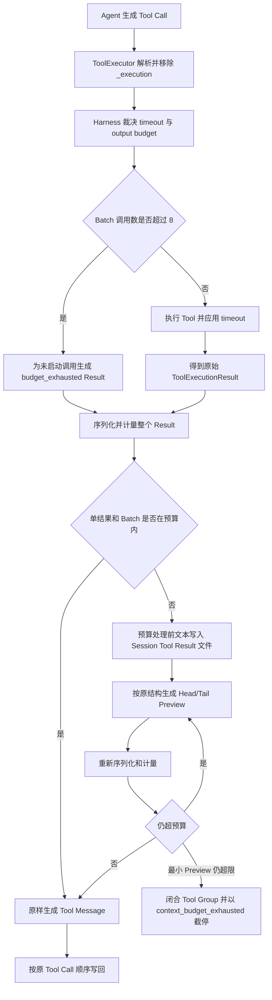

> 本文定义 Icarus Agent 第一阶段 Tool Execution Guard：统一 Tool 调用超时、单结果与 Tool Batch
> Token 预算、结构化 Head/Tail 降级、Session 级 Tool Result `.txt` 文件，以及 List Tool 分页约束。
> Active Run 工作集、Request Assembler、历史 Compact、循环检测、HITL 与副作用恢复不在本文实现范围。

## 1. 背景

**核心结论：** 当前 Tool 执行缺少统一的时间与结果预算，任意 Builtin、MCP 或 Plugin Tool 都可能
把超大输出直接写入后续每次模型请求。本阶段在 `ToolExecutor` 建立统一 Guard，允许 Agent 申请预算，
但由 Harness 使用默认值和硬上限裁决；超预算结果保持原有输出结构，在中间隐藏内容，并将预算处理前
文本保存到当前 Session；超过 16 MiB 采集上限时文件会明确标记为不完整。

### 业务背景

- **当前现象：** 真实 Session 已出现约 53.7 KB 的单个 Tool Result；一次 Task 可能执行多个 Tool
  Group，结果持续进入 Active Run 和跨 Run 历史。
- **业务影响：** 大结果会提高请求延迟与成本，稀释当前用户目标，并可能在模型硬窗口之前先造成
  工作质量下降。无界 Tool 还可能长期挂起，阻塞 Task 收束。
- **使用体验：** Agent 需要在正常输出、申请更高预算和读取已外置完整结果之间做显式选择，不能
  依赖 Tool 偶然返回合适大小。

### 技术背景

- `ToolExecutor` 已经是 Builtin、MCP 和 Plugin Tool 的统一执行入口，但只负责查找、执行、异常归一化
  和并发批次，没有统一 timeout 或 Result Budget。
- `ToolExecutionResult.output` 可以是任意 Python/JSON 值；`ReActAgent` 当前把 `result.as_dict()` 完整
  序列化为 Tool Message。
- `bash` 有自己可选的 `timeout` 参数，其他 Tool 的超时策略各自实现或不存在；模型不传参数时没有
  Kernel 级稳定默认值。
- `read` 当前可以一次读取整个 UTF-8 文件；其他列表能力也没有统一的默认页大小和硬上限。
- Blackboard 保存协议完整、可重放的 Tool Call/Result 历史，其中超预算 Tool Result 是模型可见的
  Preview 和文件路径；长结果正文只保存在 Session Tool Result 文件中。

## 2. 对标

| 对标维度 | Hermes Agent | Icarus 当前实现 |
| --- | --- | --- |
| **业务场景** | 长会话中的 Terminal、文件、Web、MCP 和 Plugin Tool | Builtin、MCP 与 Plugin Tool 进入统一 ReAct 执行链 |
| **单结果保护** | 普通结果 100K 字符、MCP 50K 字符后 Spillover | 无统一结果预算，完整 JSON 直接进入 Tool Message |
| **Batch 保护** | 默认 200K 字符，最大结果优先外置 | 保持 Tool Call 顺序，但无总结果预算 |
| **外置存储** | `$HERMES_HOME/cache/spillover`，默认 24 小时 TTL | Session 已有持久化目录，但无 Tool Result 文件 |
| **Preview** | 普通 Spillover 只保留前 1500 字符；部分路径使用 40/60 Head/Tail | 无 Preview |
| **结构处理** | Tool Result 整体转成字符串，不保持 JSON 结构 | 内部仍持有 `ToolExecutionResult.output` 原始值 |
| **分页** | `read_file` 使用 offset/limit，搜索和外部能力使用 offset 或 Cursor | 缺少统一 List 分页约束 |
| **超时** | MCP、Terminal、Web 等分别处理，没有所有 Tool 共享的 Agent 控制参数 | `bash` 局部支持可选 timeout，Executor 不统一裁决 |
| **历史治理** | 可选 proactive prune 和重复结果引用 | 完整历史已落地，旧结果工作集治理尚未开始 |

### 优势

- Icarus 的 `ToolExecutionResult.output` 在生成 Tool Message 前仍保留结构化值，可以在不破坏原输出
  顶层形态的前提下递归裁剪 JSON，而不是先整体字符串化。
- SessionRuntime 已有稳定的 Session 路径、权限和生命周期边界，Tool Result 文件可以直接归属 Session，
  为未来归档、删除和容量治理保留清晰所有权。
- ToolExecutor 已统一承接 Builtin、MCP 与 Plugin Tool，适合集中注入控制参数和结果保护。

### 不足

- 现有本地 Token 估算只服务 Blackboard 粗略压力判断，缺少 Tool Result 专用、Provider 可替换的
  计量接口。
- 通用同步 Tool 通过线程执行时无法安全强杀；timeout 能终止等待，但不必然代表副作用已经停止。
- 大多数 Tool 不是流式返回，通用 Guard 只能在结果返回后限制上下文与落盘大小，无法完全消除
  Tool 内部瞬时内存占用。

### 结论

借鉴 Hermes 的“单结果外置 + Batch 总量保护 + 分页继续读取”，但不照搬字符级阈值、全局 TTL
目录、只保留开头的 Preview 和 Tool-specific 摘要器。Icarus 使用 Token 预算、字节采集硬上限、
结构化对称 Head/Tail 和 Session 级 Tool Result `.txt` 文件。

## 3. 目标

- 所有 Agent Tool Call 默认具有有界执行时间和有界模型可见结果，不依赖具体 Tool 主动实现保护。
- Agent 可以通过统一 `_execution` 参数申请 timeout 与输出 Token，但不能关闭预算或突破 Harness
  硬上限。
- 超预算结果保持原 Tool Result 的输出类型和顶层结构；隐藏内容可通过当前 Session 下的稳定
  `.txt` 文件继续检查。
- 单结果与整个 Tool Batch 都必须在发送下一次 Provider 请求前满足硬预算，并保持 Tool Call/Result
  一一配对及原调用顺序。
- List Tool 默认分页，不提供无界“返回全部”；主动分页与被动裁剪形成两层保护。

首期默认值如下：

| 参数 | 默认值 | 硬边界 |
| --- | ---: | ---: |
| Tool timeout | 120 秒 | 1～600 秒 |
| 单结果模型可见预算 | 4,000 Token | 512～16,000 Token |
| 单 Batch 可见结果预算 | 16,000 Token | 同时不超过模型窗口的 15% |
| 单 Batch Tool Call 数 | 8 | 8 |
| 实际 Preview 目标 | 有效预算的 90% | 最终序列化结果不得超过有效预算 |
| Head/Tail | 50% / 50% | 一侧剩余额度可转给另一侧 |
| 单 Tool Result 文件采集上限 | 16 MiB | 不可由 Agent 提升 |
| List 默认 page size | 50 | 最大 200 |
| 文件行读取默认 limit | 200 行 | 最大 2,000 行 |

单结果还受模型窗口动态限制：

```text
effective_output_tokens = min(
    Agent 申请值或 4,000,
    16,000,
    model_context_window × 8%,
    当前 Batch 可分配余额,
)
```

## 4. 方案

### 4.1 全景规划



#### 组件边界

| 组件 | 职责 | 不负责 |
| --- | --- | --- |
| `ToolExecutionPolicy` | 默认值、硬上限、Agent 申请值校验与有效预算计算 | 执行业务 Tool、修改输出 |
| `ToolExecutor` | 注入/剥离控制参数、timeout、调用数限制、统一结果保护入口 | 理解业务字段含义 |
| `ToolResultTokenCounter` | 对最终序列化文本计量；优先 Provider 计数器，提供保守 fallback | 决定裁剪内容 |
| `ToolResultRenderer` | 保持类型和顺序，递归生成预算内 Preview | 保存文件、理解 Tool 业务语义 |
| `ToolResultStore` | Session 内原子写入 `.txt`、权限和路径生成 | 主动清理或归档 Session |
| `ToolBatchBudget` | 小结果优先完整、为大结果均衡分配额度、最终总量断言 | Active Run 和完整 Wire Request 管理 |
| List Tool/Adapter | 实现业务正确的 Cursor 或 page_num/page_size | 绕过最终 Result Budget |

#### 兼容性策略

- `ToolRegistry` 保存的业务 Schema 不直接修改；`ToolExecutor.definitions()` 对 Run 快照中的 Schema
  副本自动注入 `_execution`。业务 Tool 不接收该字段。
- `_execution` 是框架保留名称。业务 Tool 原始 Schema 已占用该字段时，在注册检查阶段明确拒绝。
- Tool 自带 timeout 参数保持兼容并继续生效；框架 timeout 是外层总时限，两者取先到者。
  能接收 deadline 的 Adapter（包括 MCP）逐步透传同一个 effective timeout，避免隐藏的固定内层
  timeout 提前破坏 Agent 申请值。
- 未配置新字段时行为使用稳定默认值；不要求现有 Tool 修改 `invoke/ainvoke` 签名。
- Result 未超预算时字节级保持现有 `ToolExecutionResult.as_dict()` 语义，不创建 Tool Result 文件，
  不插入提示。
- Tool Result 文件路径是本机真实绝对路径，供已有 `bash`/`read` 使用；不新增专用读取 Tool。

### 4.2 主要功能点描述

| 功能点 | 解决什么问题 | 设计要点 | 测试关注点 |
| --- | --- | --- | --- |
| 统一执行控制 | Tool 无默认 timeout、参数不一致 | 自动注入 `_execution`，Harness 裁决并剥离 | 默认值、越界、Schema 冲突、业务参数不泄漏 |
| 单结果预算 | 单个 Result 占满上下文 | 整体序列化计量，超限才落盘并递归裁剪 | 字符串、对象、数组、深层 JSON、重新计量 |
| Session Tool Result 文件 | 隐藏内容不可恢复 | Session 下 `.txt`、原子写入、真实路径 | 权限、路径安全、写入失败、完整性 |
| Batch 预算 | 多个中等 Result 累计超限 | 小结果优先完整，大结果 water-filling 分配 | 公平性、顺序、最小额度、协议闭合 |
| List 分页 | 一次列出全部数据 | 默认 50、最大 200，动态数据优先 Cursor | 边界、稳定排序、重复 Cursor、最终 Result Budget |

#### 统一控制参数

所有 Agent 可见 Tool Schema 自动增加可选字段：

```json
{
  "_execution": {
    "type": "object",
    "properties": {
      "timeout_seconds": {
        "type": "number",
        "minimum": 1,
        "maximum": 600,
        "default": 120
      },
      "max_output_tokens": {
        "type": "integer",
        "minimum": 512,
        "maximum": 16000,
        "default": 4000
      }
    },
    "additionalProperties": false
  }
}
```

Agent 的参数表示申请，不表示授权。Harness 取申请值、默认值、Runtime 硬上限、模型窗口比例和
Batch 余额的最小值。缺失、布尔值、非有限数、越界值和未知字段在 Tool 启动前生成参数错误
Tool Result。

#### Timeout 语义

- 异步 Tool 使用统一 deadline；超时后取消执行 Task，并给予短清理窗口。
- `bash` 使用独立进程组；超时先 TERM，清理窗口结束后 KILL，返回明确超时错误。
- 使用 `BaseTool.ainvoke` 默认线程桥接的同步 Tool 无法安全强杀线程，因此本期不允许在 timeout 到达后
  提前返回；它继续等待真实结束。需要确定性 timeout 的 Tool 必须先改造成可取消异步实现或独立
  进程实现。
- Timeout、取消或拒绝都必须为原 Tool Call 生成一个 Tool Result，不能留下孤立 Tool Call。
- 模型可见结果继续使用现有 `success/output/error` 外壳；更细的 `timed_out` 或取消处置写入
  Trace/RuntimeUpdate 元数据，不强迫所有 Tool 改变业务输出结构。

#### Token 计量

计量对象是最终模型可见的整个 `ToolExecutionResult.as_dict()` 序列化文本，不是单个 `output` 字段。

1. Provider Adapter 提供可用计数器时使用对应模型 Tokenizer。
2. 暂无 Provider Tokenizer 时使用保守 fallback：
   `max(Unicode 字符数, ceil(UTF-8 字节数 / 3))`。
3. Preview 生成以有效预算的 90% 为目标，最终仍以 100% 硬预算重新断言。
4. Tokenizer 抛错时自动回退，不能让预算保护失效。

#### Session Tool Result 文件

Tool Result 文件路径：

```text
$ICARUS_DATA_DIR/workspaces/<workspace_key>/sessions/<session_id>/
└── tool-results/<task_id>/<safe_tool_call_id>.txt
```

- 字符串原样保存；JSON 对象或数组以 UTF-8 格式化 JSON 保存；其他值使用统一稳定序列化。
- `.txt` 保存预算处理前的完整 `ToolExecutionResult.as_dict()` 文本，而不是只保存被隐藏字段。
- 目录权限 `0700`、文件权限 `0600`；临时文件写入、flush/fsync 后原子 rename。
- 文件名由 Runtime 安全化；不直接信任模型产生的 Tool Call ID。
- 写入完成后校验字节数，成功后才能在 Preview 中给出路径。
- 单文件最多采集 16 MiB。第一阶段不限制 Session 累计目录大小，也不扫描或预留 Session 总配额。
- Session unload 不删除；未来 Session archive/delete 和空间治理负责整体迁移、删除或配额。第一阶段
  不设置 TTL。
- 预算、原始字节/Token、是否完整、路径和写入失败原因记录到 Trace，不增加 `.meta.json`。

如果通用 Tool 已经在内存中返回超过 16 MiB 的值，Guard 只能保存受限内容并标记 Tool Result 文件
不完整；
不能声称完整结果已保存。`bash` 应改为流式采集，达到硬上限时终止进程组并返回
`output_limit_exceeded`。其他流式 Adapter 后续按同一接口接入。

#### 保持原结构的递归裁剪

Tool 不声明 `always_keep`、`priority_keep` 或专属摘要器。裁剪只依据原始结构、顺序和实际 Token。

- 字符串：保留前后文本，中间插入隐藏 Token 数和 Tool Result 文件路径。
- 数组：按累计 Token 保留前后完整元素，中间插入一个占位对象。
- 对象：保持字段顺序，按累计 Token 保留前后字段，在中间插入占位字段。
- 嵌套节点：若头尾中的单个节点仍过大，对该节点递归应用同一算法。
- 数字、布尔和 `null` 不会单独形成大结果，保持原值。
- 不按字段名推断业务重要性，不重排字段，不调用 LLM 摘要。

占位对象示例：

```json
{
  "_icarus_omitted": {
    "items": 9940,
    "tokens": 38210,
    "path": "/absolute/session/path/call-id.txt"
  }
}
```

对象字段名依次尝试 `_icarus_omitted`、`_icarus_omitted_2`、`_icarus_omitted_3`，选择当前对象
未使用的名称，绝不覆盖业务字段。数组中占位对象也使用同一规则扫描已有对象元素，降低歧义。

Head/Tail 默认各使用可供原始内容预算的 50%；一侧未用完的额度转给另一侧。大量小元素按累计
Token 选择，不按固定条数。无法完整放入的单个元素先尝试递归裁剪，仍放不下则隐藏。

每次生成后必须重新序列化和计量；仍超限时从预算处理前的原值重新生成更小 Preview，不能反复
裁剪已带占位符的结果。降级顺序固定为：

1. 减少头尾完整子节点；
2. 递归缩短头尾的大型节点；
3. 缩短字符串 Head/Tail；
4. 缩短省略提示；
5. 整个 `output` 降级为同类型的最小占位；
6. 只保留最小、协议完整的 Tool Result 外壳。

Tool Result 文件写入失败时省略标记必须说明“完整结果未保存”，不能返回悬空路径。若最小 Tool Result
连同 Provider 包装仍无法放入请求，本阶段闭合当前 Tool Group，不启动下一次 Provider 请求，并以
`context_budget_exhausted` 结束 Task。

#### Tool Batch 预算

单 Batch 最多执行 8 个 Tool Call。模型一次声明更多调用时，超出部分不执行，但每个调用仍收到一个
紧凑的 `budget_exhausted` Tool Result。

对已执行结果使用确定性 water-filling：

1. 计算所有原始 Result 的最终序列化 Token；
2. 小于均分额度的结果优先原样保留，并从待分配集合移除；
3. 每个剩余结果至少获得 512 Token 的最小展示额度；
4. 剩余预算在大型结果之间反复均分，同时受各自 `_execution.max_output_tokens` 上限约束；
5. 需要缩小的结果统一写 Tool Result 文件，并按分配额度生成 Preview；
6. 对完整 Batch 重新计量，仍超限则同步收紧大型 Preview；
7. Tool Message 按原 Tool Call 顺序写回。

若全部 Tool Call 的最小结果外壳也无法放入 Batch 硬预算，则不执行该 Tool Group、不把 Assistant
Tool Call 或部分 Result 加入安全检查点，并以 `context_budget_exhausted` 终止当前 Task。不能通过
只写部分 Result、删除 Tool Call 或继续请求 Provider 来规避协议约束。

#### List 分页

分页语义属于具体数据源，不能由 ToolExecutor 从结果中猜测。所有 List 类型 Tool 应使用共享校验
Helper，并选择以下一种协议：

```json
{
  "query": "optional filter",
  "page_size": 50,
  "cursor": "opaque cursor"
}
```

或对静态、稳定排序的数据：

```json
{
  "page_size": 50,
  "page_num": 1
}
```

- 默认 `page_size=50`，硬上限 200，不支持 `0`、负数或 `all=true`。
- 动态数据和远端服务优先 Cursor；静态本地数据可以使用 page_num。
- 返回中明确包含 `has_more` 和 `next_cursor`，或总页数/下一页信息。
- 能低成本获取时才返回 `total_count`，不能为了总数扫描整个远端数据源。
- 每页结果仍通过单结果和 Batch Budget；分页不是绕过 Result Guard 的方式。
- 文件读取使用 `offset + limit`，默认 200 行、最大 2,000 行。Agent 可对 Tool Result 文件使用现有
  `wc`、`rg` 和有界 `sed`；这些 Bash Result 仍受相同 Guard。

### 4.3 子方案一：ToolExecutor 统一 Guard（推荐）

所有生产 Agent Tool 都通过 ToolExecutor 获得控制参数、timeout、Tool Result 文件、单结果和 Batch
保护。Tool 不维护展示规则，新增 Tool 默认安全。代价是 ToolExecutor 需要注入 Session 级
ToolResultStore 和
模型 TokenCounter，但这一依赖与现有 SessionRuntime 和 Run 快照边界一致。

### 4.4 子方案二：具体 Tool 自行限制（不采用）

`read`、`bash`、MCP 和 Plugin Tool 分别实现 timeout、截断与文件保存，初期改动较少，但默认值、
错误语义和输出结构会快速分裂，新 Plugin Tool 也能绕过保护。只保留业务必须下沉的流式采集和
分页实现，最终裁决仍由统一 Guard 完成。

#### 非目标

本文不实现以下能力：

- Active Run 旧 Tool Result 的 request-local 二次降级；
- 完整 Request Assembler 和 System/Schema/History/图片/输出预留总预算；
- 跨 Run 历史 Compact 或 proactive prune；
- 相同调用、相同结果、Cursor 不推进和无进展循环检测；
- HITL、Tool 风险分类、Effect Journal 和副作用恢复；
- 图片数量、分辨率和视觉 Token 预算；
- Session archive/delete 的产品接口、累计空间上限和自动清理策略。

这些能力继续保留在 `docs/todo/agent-core.md`，不阻塞本阶段建立 Tool Guard。

## 5. 自测

- 控制参数：所有 Tool Schema 自动获得 `_execution`；缺省、合法申请、越界、未知字段和名称冲突
  都有确定结果，业务 Tool 收不到保留字段。
- Timeout：异步 Tool、默认线程 Tool、Bash 进程组分别验证成功、超时、取消和无法确认终止的语义；
  每个调用始终生成一个 Tool Result。
- Token 计量：Provider 计数器与 fallback 都可用；Tokenizer 失败不关闭保护；最终序列化结果严格
  不超过有效预算。
- 结构裁剪：覆盖长字符串、巨大字段、海量小字段、海量小数组项、多层嵌套、Unicode、空结构、
- `_icarus_omitted` 名称冲突和 Tool Result 文件写入失败；裁剪后 JSON 仍合法且顺序稳定。
- Tool Result 文件：验证路径隔离、安全文件名、0700/0600、原子写入、字节校验、16 MiB 单文件
  上限、unload 后可读和无悬空引用。
- Batch：覆盖大小混合、并行乱序完成、8 个以上调用、最小预算不足、water-filling 和最终总量断言；
  写回顺序及 Tool Call/Result 配对不变。
- 分页：覆盖默认/最大 page size、Cursor 与 page_num、空页、末页、非法参数及一页本身仍超预算。
- 回归：Builtin、MCP、Plugin Tool 均通过同一 Guard；未超预算结果保持现有形态；完整 Agent、Gateway
  和 TUI 测试通过。

## 6. 里程碑

### 6.1 优先级

- **P0 阶段 1：执行控制底座。** 增加配置模型、Schema 注入/剥离、有效预算裁决、统一 timeout 和
  Tool Call 数限制。
- **P0 阶段 2：Result 与文件。** 增加 TokenCounter、Session ToolResultStore、结构化递归裁剪、
  最小降级和 Trace 指标。
- **P0 阶段 3：Batch 与分页接入。** 增加 water-filling Batch Budget，并为现有 List/Read 能力接入
  共享分页约束，完成 Builtin/MCP/Plugin 端到端回归。

### 6.2 时间线

| 任务名称 | 任务描述 | 负责人 | 时间点 |
| --- | --- | --- | --- |
| 执行保护 | `_execution`、默认值/硬上限、timeout 与终态闭合 | Agent Core | 第一实施阶段 |
| 结果保护 | Token 计量、递归 Preview、Session Tool Result `.txt` 文件 | Agent Core | 第二实施阶段 |
| 集成收口 | Batch Budget、分页、全链路与恢复测试 | Agent Core | 第三实施阶段 |

## 7. 风险

| 风险项 | 影响说明 | 规避/缓解动作 | 责任人 |
| --- | --- | --- | --- |
| Tokenizer 与 Provider 不完全一致 | Preview 本地计量合格但远端请求仍偏大 | Provider 计数优先、90% 目标、安全 fallback、发送前硬断言 | Agent Core |
| 同步 Tool 无法强杀 | 统一 timeout 不能确定性中止同步副作用 | 本期不提前返回；需要 timeout 的 Tool 改造成异步或独立进程 | Agent Core |
| Tool Result 文件写入失败或磁盘不足 | Agent 无法查看隐藏的完整内容 | 原子写和字节校验；失败不返回路径；仍生成预算内 Preview | Persistence |
| Session Tool Result 文件持续增长 | 长 Session 可能持续占用磁盘 | 本期明确接受；未来由 Session 归档、删除和空间治理统一处理 | Session Runtime |
| 递归裁剪算法复杂 | 极端 JSON 可能超预算或生成非法结构 | 纯函数、每轮重新计量、最大递归深度、同类型最小降级、性质测试 | Agent Core |
| 自动注入字段与业务 Schema 冲突 | Tool 参数含义不明确 | `_execution` 设为保留命名，注册期拒绝冲突 | Tool Registry |
| 分页后数据发生变化 | page_num 可能重复或漏项 | 动态数据优先 Cursor，page_num 只用于稳定排序的数据 | Tool Owner |
