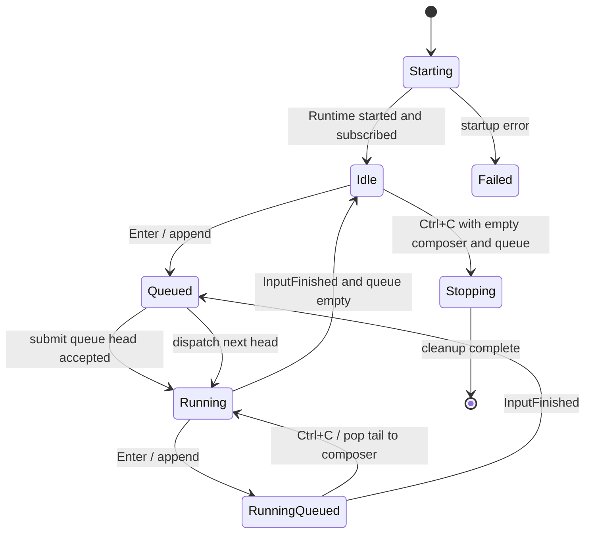
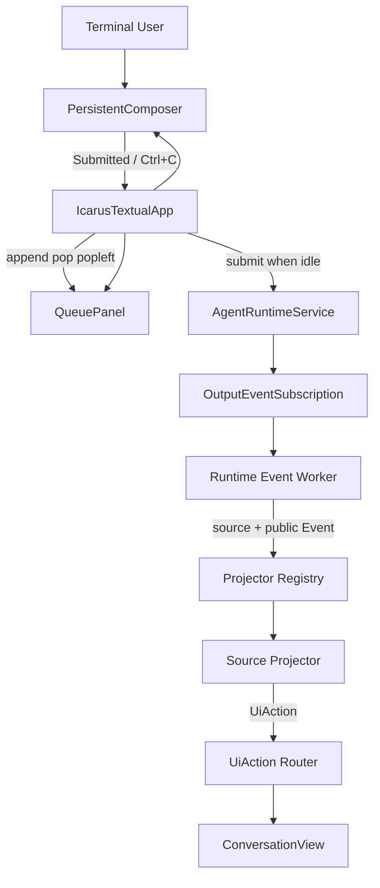

# Textual TUI Persistent Input and Local Queue Design｜持久输入框与本地队列设计

## 文档定位

本文定义 Icarus TUI 当前 Textual 全屏界面、持久输入框、运行中编辑、本地待发送队列和
上下文相关 `Ctrl+C` 行为。该设计已于 2026-08-19 落地；实现与测试位于 `apps/tui/src/`
和 `apps/tui/test/`。

首帧后并发初始化 Runtime、修复布局重叠以及流式输出期间脱离自动跟随的增量设计，
见 `apps/tui/docs/arch/tui-first-interaction-experience-design.md`。该文实施后细化本文的启动时序
与状态展示，并替代 dock 布局和始终滚底选择；本地队列、Event 投影和 Agent 边界继续以本文
为基础。

本设计有意替代第一阶段基于 `prompt_toolkit + Rich + 原生 scrollback` 的交互形态：

- TUI 是独立外部应用，可以使用成熟 UI 框架；
- Textual 负责屏幕、组件、焦点、按键、异步 Worker 和测试；
- 对话历史改为应用内部滚动，不再要求写入终端原生 scrollback；
- 退出 Textual 后恢复启动 `icarus` 前的终端画面；
- 当前仍默认在一个 Workspace 启动一个新 Session；未来通过独立的 Session 历史加载功能
  重新打开已有对话。

TUI 使用框架不改变 Agent 架构边界。Agent Core 继续保持自研，不依赖 LangGraph、
Agent Zero 等 Agent 框架；TUI 只能通过 `AgentRuntimeService` 的公开接口控制 Agent。

本文的主要状态和代码归 `apps/tui` 所有。真正的任务级取消需要扩展 Agent 应用服务和
Plugin，本阶段只记录未来契约，不伪造取消结果。

详细实施步骤见 `apps/tui/docs/plan/textual-tui-development-plan.md`。第一阶段
`prompt_toolkit + Rich` 设计和计划只保留为已落地历史基线，不再指导后续 TUI 开发。

TUI 的信息来源限定为同一个 `AgentRuntimeService` 内由 `OutputBridgePlugin` 暴露的 Plugin
Event。本文不引入外部服务通知、文件系统事件或第二套应用消息总线。

## 问题

迁移前的 REPL 是严格串行的：

```text
prompt_async()
→ Enter 提交并结束当前 PromptSession
→ 等待并渲染 Agent Event
→ InputFinishedEvent
→ 再启动下一次 prompt_async()
```

因此 Agent 运行期间不存在活跃输入组件。输入提示会成为普通终端历史的一部分并被输出
向上推走，用户不能提前编辑或排队下一条消息。继续在两个终端渲染库之间手工协调光标，
会把布局、状态和并发问题留给业务代码。

## 框架选型

### 方案比较

| 方案 | 优点 | 主要问题 | 结论 |
| --- | --- | --- | --- |
| `prompt_toolkit.Application + Rich` | 能保留原生 scrollback，延续现有依赖 | 需要自行实现组件状态、滚动区和两套渲染协调 | 不采用 |
| Textual inline | Textual 组件体系与部分原生历史兼得 | 动态区域与持续增长的外部 scrollback 协调复杂，收益有限 | 不采用 |
| Textual 全屏应用 | 组件、布局、内部滚动、异步 Worker、Markdown 和测试能力完整 | 退出后本次画面不留在终端 scrollback | 采用 |
| Urwid | 老牌、稳定、Widget 丰富 | 开发体验、Markdown 流和现代测试能力弱于 Textual | 不采用 |

### 选择结果

- 使用 Textual 作为 TUI 主框架；
- 使用 Textual `TextArea` 实现持久多行输入；
- 使用 Textual `Markdown` / `MarkdownStream` 或等价官方组件显示 Agent 内容；
- 使用 Textual Worker 持续消费 `OutputEventSubscription`；
- 使用 Textual Reactive state、Message 和 Widget 更新队列与状态；
- 使用 Textual `run_test()` 和 Pilot 做交互测试；
- 保留 Rich 作为 Textual 渲染体系的直接能力，但不再独立运行 `Rich.Live`；
- 迁移完成后移除 TUI 对 `prompt_toolkit` 的直接依赖。

运行依赖加入 `textual`，视觉回归测试依赖加入 `pytest-textual-snapshot`。`styles.tcss` 必须
作为 TUI package data 随 wheel 安装。版本范围在根 `pyproject.toml` 和当前开发依赖入口中
保持一致；snapshot 插件不进入最终用户运行时依赖。

## 已确认交互

### 提交与消费

所有非空输入先进入 TUI 本地 `deque`：

```text
Enter          → deque.append(message)
Agent 空闲     → 从队首提交下一条
Agent 正在运行 → 留在 deque 中等待并显示
任务结束       → 自动尝试提交新的队首
```

正常消费遵循 FIFO。TUI 只在收到当前任务的 `InputFinishedEvent` 后，才允许调度下一条，
因此同一 Session 仍然只有一个已提交到 Runtime 的活动任务。

队首消息提交给 `AgentRuntimeService.submit()` 并获得 `InputAccepted` 后，才从本地队列移除，
成为当前活动消息。活动消息不再属于待发送队列，并作为用户消息加入对话区。

### 持久输入框

- 输入框固定在应用底部，在整个应用生命周期内保持挂载和聚焦；
- Agent 输出期间仍可编辑、移动光标、选择、粘贴和换行；
- `Enter` 提交当前非空缓冲到本地队列，并立即清空输入框；
- `Shift+Enter` 插入换行；`Ctrl+J` 继续作为备用换行键；
- 已提交到本地队列的完整内容不再留在输入缓冲；
- 对话和工具输出在输入区上方的应用内滚动区域显示；
- 队列变化和 Agent 流式刷新不能抢走输入框焦点或改变当前草稿。

如果目标终端无法向 Textual 区分 `Shift+Enter` 与普通 Enter，仍以 `Ctrl+J` 作为跨终端
保证。应用内快捷键提示必须如实表达这一兼容边界。

### `Ctrl+C` 优先级

`Ctrl+C` 只执行第一条满足条件的动作：

| 优先级 | 当前状态 | 动作 |
| --- | --- | --- |
| 1 | 输入缓冲含有任意内容 | 清空当前草稿 |
| 2 | 输入缓冲为空，本地队列非空 | `deque.pop()`，把最新排队消息的完整内容恢复到输入框 |
| 3 | 输入缓冲和队列都为空，Agent 正在运行 | 当前阶段提示 Runtime 尚不支持任务取消，Agent 继续运行 |
| 4 | 输入缓冲和队列都为空，Agent 空闲 | 正常退出当前 `icarus` 程序 |

正常消费从队首 `popleft()`，撤回从队尾 `pop()`。恢复到输入框后，消息可以继续修改并
再次提交，不做静默删除。

空输入上的 `Ctrl+D` 以及完整的 `exit` / `quit` 继续表示显式退出整个程序。显式退出可以
终止当前 Runtime，并放弃仅存在于进程内的待发送队列；这与“只取消当前任务”是不同操作。

## 当前范围

本阶段实现：

- Textual 全屏应用和应用内对话滚动；
- 固定底部的持久多行输入框；
- Agent 运行期间编辑和提交；
- TUI 本地 `deque`、FIFO 调度和 LIFO 撤回；
- 本地队列的实时可视化；
- Agent Markdown、工具状态、错误和任务状态组件；
- `Ctrl+C` 清空草稿、撤回队尾、运行中明确提示以及空闲退出；
- 保持一个 Runtime、一个 Session、一个活动 Agent 任务；
- 退出后恢复原终端画面；
- 保持所有 Agent 控制只经过 `AgentRuntimeService`。

本阶段不实现：

- 假装取消但让 Agent 或工具继续在后台执行；
- 通过停止并重建整个 Runtime 模拟单任务取消；
- 直接访问 `AgentPlugin`、`UserInputPlugin` 或 EventBus；
- Session 历史浏览、恢复或切换；
- 本地队列跨进程持久化；
- 队列重排、任意位置删除、优先级和并行任务；
- 多模态队列项；
- 鼠标必需的核心操作。

## 视觉布局

```text
┌ Icarus ───────────────────────── Workspace / Session ┐
│                                                     │
│  ConversationScroll                                │
│    user message                                    │
│    assistant streaming Markdown                    │
│    tool status                                     │
│    ...                                             │
│                                                     │
├ Queued 2 ──────────────────────────────────────────┤
│  1  下一步先检查配置……                              │
│  2  然后补充测试……                                  │
├─────────────────────────────────────────────────────┤
│  PersistentComposer                                │
│  ❯ 当前可编辑的多行内容█                            │
├─────────────────────────────────────────────────────┤
│  Running · Enter submit · Shift+Enter/Ctrl+J line  │
└─────────────────────────────────────────────────────┘
```

布局规则：

- 顶部 Header 展示 Icarus、Workspace 和当前 Session 标识；
- Conversation 占用剩余主要空间并在应用内部滚动；
- QueuePanel 只在队列非空时显示，设置最大高度并允许内部滚动；
- Composer 固定在底部，按内容增长到设定上限，随后内部滚动；
- StatusBar 展示 `Starting`、`Ready`、`Running`、`Queued n`、失败或临时提示；
- 终端 resize 时由 Textual 布局系统重新计算，不截断 Buffer 或队列原始数据；
- 颜色和边框保持克制，不依赖鼠标理解当前状态。

对话区默认跟随最新输出。用户主动向上滚动后，后续阶段可以增加“有新内容”提示和恢复
跟随操作；第一版可以在任务流式输出时保持自动滚动到底部。

## 本地队列展示

QueuePanel 只表示尚未提交到 Runtime 的本地消息，按 FIFO 消费顺序编号。每项展示紧凑
预览，完整原文保存在 `deque` 中：

- 换行在预览中压缩为可见空格或分隔符；
- 预览按组件宽度截断，但不修改原消息；
- 项目较多时 QueuePanel 内部滚动；
- 队首是下一条将执行的消息，队尾是下一次 `Ctrl+C` 将撤回的消息；
- 撤回后把完整换行、缩进和 Unicode 恢复到 Composer，并把光标放到文本末尾。

当调度器成功提交队首后：

1. 队首从 QueuePanel 消失；
2. 完整用户消息加入 Conversation；
3. Runtime 返回的 `task_id` 保存为唯一活动任务；
4. 后续只有匹配该 `task_id` 的 Agent Event 能修改当前活动消息和调度状态。

Runtime 的 `InputQueuedEvent` 只表示 Runtime 已接收活动任务，不作为本地队列项重复展示。
TUI 一次只向 Runtime 提交一个任务，因此不使用 Runtime 内置 FIFO 代替面向用户的队列。

## 状态与所有权

Textual App 独占交互状态：

```text
runtime_state          starting | ready | running | stopping | failed
pending: deque[str]    尚未发送给 Runtime 的完整消息
dispatch_in_progress   是否正在等待队首的 submit 接受结果
active_task_id         已被 Runtime 接收的当前任务；空值表示 Agent 空闲
active_message_widget  当前正在流式更新的 Assistant 消息组件
status_message         短期 UI 提示，不进入业务对话历史
composer.text          TextArea 持有的当前草稿
```

这不是 Agent 业务 History。Blackboard 继续独占已完成的模型对话上下文；TUI 不拼接、
回传或修正业务历史。Conversation Widget 只是当前进程的 UI 投影。

核心转换：



`Running` 只描述 Agent 调度；Composer 在 Starting、Idle 和 Running 中都保持可编辑。Starting
期间提交的消息可以进入本地队列，但必须等 Runtime 启动并创建实时订阅后才能调度。

## 总体架构



控制路径仍然只有：

```text
AgentRuntimeService.start()
→ subscribe_events()
→ submit(prompt)
→ OutputEventSubscription.next_event()
→ subscription.close()
→ AgentRuntimeService.stop()
```

Textual Widget 不直接调用 Service。IcarusTextualApp 作为应用控制器处理 Widget Message、
本地队列和 Service 生命周期。

## Runtime 内多 Plugin 投影

### 边界

当前输出订阅已经保留来源身份：

```python
source_plugin_id, event = await subscription.next_event()
```

TUI 必须使用这两个维度共同解释信息，不能只按 Event 类型做一个不断增长的全局
`if/elif`。未来 Skill、Memory、Emotion、Action 等 Plugin 可能各自发布用户可见信息，但
它们仍属于同一个 Runtime。

采用来源感知的 Projector：

```text
(source_plugin_id, Event)
→ ProjectorRegistry
→ source-specific EventProjector
→ tuple[UiAction, ...]
→ target-specific Textual view
```

首期只有两个真实 Projector：

```text
agent      → AgentProjector
user-input → UserInputProjector
```

没有当前 Event 和调用方的 `SkillProjector`、`MemoryProjector` 等不提前创建空壳。对应 Plugin
未来接入 Output Bridge 时，再在 TUI 增加 Projector、fixture、golden 和 snapshot。

### 方案选择

| 方案 | 问题 | 结论 |
| --- | --- | --- |
| Plugin 直接发布通用 UI Event | 让 Agent Plugin 知道颜色、Widget 或终端展示语义，形成反向依赖 | 不采用 |
| OutputBridge 转换所有业务 Event | 让 Agent 应用桥接层解释 Skill、Memory 等具体类型，破坏原始广播边界 | 不采用 |
| TUI 按来源注册 Projector | 业务 Event 保持原样，UI 解释归外部应用，新增来源局部扩展 | 采用 |

`OutputBridgePlugin` 继续只广播原始 Event，不导入或解释具体 Plugin Event。
`PluginRuntime` 继续只按来源路由，不知道 UI。

### 可见性双重显式

Plugin 信息对 TUI 可见需要同时满足：

1. `AgentRuntimeService` 组装时显式让 Output Bridge 订阅该来源；
2. TUI 的 `ProjectorRegistry` 显式注册该 `source_plugin_id`。

当前 Runtime 只暴露 `user-input` 和 `agent`。未知来源默认忽略并增加诊断计数或 debug 日志，
不能自动把 `repr(event)` 打到界面。已注册来源中的未知 Event 也由对应 Projector 忽略，避免
内部数据因新增 Event 类意外暴露。

如果未来某个 Plugin 同时包含敏感内部 Event 和公开 Event，应先在 Agent 应用设计中明确
其对外契约，再决定是拆分公开来源还是给 Output Bridge 注入通用过滤条件；不得让 TUI
通过访问 Plugin Registry 绕过应用服务边界。

### UI Action

Projector 输出 TUI 自有、扁平且不可变的 `UiAction`。首期只实现有真实调用方的动作：

```text
AppendAssistantDelta(task_id, text)       → conversation
AppendToolStarted(task_id, call_id, ...)  → conversation
UpdateToolCompleted(task_id, call_id, ...)→ conversation
AppendError(task_id, type, message)       → conversation
SetRuntimeStatus(task_id, status, text)   → status
ShowNotification(level, text)             → notification
FinishTurn(task_id, status)               → conversation + status
```

`UiAction` 不携带 Textual Widget 实例，也不继承 Agent Event。Widget 只理解 UI Action，不导入
Agent、Skill 或 Memory Event 类型。未来需要可展开详情面板时，再随第一个真实调用方增加
Detail Action，不提前保留无实现 target。

`InputFinishedEvent` 既有 UI 投影，也有调度语义。Projector 负责生成 `FinishTurn`；
IcarusTextualApp 仍根据这个已验证的当前 task 终态更新 `ChatState` 并提交下一条。Projector
不直接操作本地队列或调用 Runtime。

## 源码结构

第一阶段 TUI 运行代码约 350 行；迁移 Textual 后会新增布局、Widget、队列状态、Runtime
Worker、事件渲染和确定性回放。继续维持四个平铺文件会让 `app.py` 和 `widgets.py` 变成
大杂烩，因此从本阶段开始按具体职责适度拆分：

```text
apps/tui/
├── src/
│   ├── __init__.py
│   ├── main.py
│   ├── app.py
│   ├── chat_state.py
│   ├── transcript.py
│   ├── replay.py
│   ├── styles.tcss
│   ├── event_pipeline/
│   │   ├── __init__.py
│   │   ├── actions.py
│   │   ├── dispatcher.py
│   │   └── projectors/
│   │       ├── __init__.py
│   │       ├── agent.py
│   │       └── user_input.py
│   └── widgets/
│       ├── __init__.py
│       ├── composer.py
│       ├── conversation.py
│       ├── messages.py
│       ├── queue_panel.py
│       └── status_bar.py
├── scripts/
│   └── replay_events.py
└── test/
    ├── fixtures/
    │   └── synthetic_tui_events.jsonl
    ├── golden/
    │   └── synthetic_tui_transcript.txt
    ├── __snapshots__/
    ├── widgets/
    │   ├── test_composer.py
    │   ├── test_conversation.py
    │   └── test_queue_panel.py
    ├── test_app.py
    ├── test_app_snapshots.py
    ├── test_chat_state.py
    ├── event_pipeline/
    │   ├── test_dispatcher.py
    │   └── projectors/
    │       ├── test_agent.py
    │       └── test_user_input.py
    ├── test_replay.py
    └── test_timeline_transcript_golden.py
```

迁移后删除被替代的 `input.py`、`repl.py` 和旧式直接终端 `renderer.py`。不要为了兼容内部
旧模块保留两条 TUI 主流程。

当前只有一个聊天界面，所以不创建 `screens/`。未来真正实现 Session 列表和历史会话时，
再增加 `screens/session_list.py` 与 `screens/chat.py`。当前也不创建重复包装
`AgentRuntimeService` 的 `services/` 层。

### `main.py`

- 定义 console script 和参数；
- 启动时捕获 `Path.cwd().resolve()`；
- 创建 `AgentRuntimeService` 与 `IcarusTextualApp`；
- 运行 Textual App 并返回其退出码；
- 在 Textual 无法启动时向 stderr 输出简洁错误；
- 不拥有队列、Widget 或 Event 映射。

### `app.py`

- 组合全屏布局并设置初始焦点；
- 启动 Runtime，随后创建唯一长生命周期输出订阅；
- 持有 `ChatState`，但不在 UI 回调内重复实现状态转换；
- 处理 Composer 提交和四级 `Ctrl+C`；
- 只在 Runtime ready 且没有活动任务时调度队首；
- 启动异步 Worker 持续消费 Event；
- 退出时关闭订阅并停止 Service；
- 把匹配的公开 Event 交给 `ProjectorRegistry`，并路由生成的 `UiAction`；
- 不解析 Markdown 或直接访问 Agent Plugin。

### `chat_state.py`

- 使用纯标准库类型保存 `runtime_phase`、本地 `deque` 和 `active_task_id`；
- 实现 enqueue、查看队首、Runtime 接受后移除队首、结束活动任务和撤回队尾；
- 根据草稿、队列和运行状态返回四级 `Ctrl+C` 动作；
- 不依赖 Textual，不调用 Agent Runtime，不保存业务 History；
- 所有状态转换都可通过同步单元测试验证。

### `event_pipeline/`

- `actions.py`：定义首期实际使用的不可变 `UiAction`；
- `dispatcher.py`：`EventProjector` Protocol、显式来源注册和未知来源诊断；
- `projectors/agent.py`：Agent 文本、工具、错误和完成事件投影；
- `projectors/user_input.py`：任务 accepted、started 和 finished 状态投影；
- Dispatcher 接收真实 `(source_plugin_id, Event)` 并检查当前 `task_id`；
- Projector 不拥有 Runtime、本地输入队列或 Textual Widget；
- 同一组 UiAction 同时供真实 Textual View 和纯文本 Transcript 使用。

### `transcript.py`

- 把 UiAction 转为稳定、无 ANSI 的规范化文本；
- 固定工具参数 JSON、换行和终态格式，作为 Event 顺序的 golden oracle；
- 不追求复刻视觉布局，避免 CSS 改动导致语义 golden 抖动。

### `replay.py`

- 定义仅用于 TUI 开发和测试的版本化 JSONL 格式；
- 解码为现有公开 Event 类型，不复制 Agent 业务模型；
- 支持合成事件按固定顺序立即回放，以及真实 shell 按可调速度回放；
- 拒绝未知 schema version、缺失字段和不支持的 Event 类型；
- 不读取或修改 Agent Persistence。

第一版 JSONL 使用最小稳定 envelope，只保留 UI 回放需要的数据：

```json
{
  "schema_version": 1,
  "source_plugin_id": "agent",
  "event_type": "agent_text_delta",
  "correlation_id": "task-1",
  "payload": {"step": 1, "text": "正在检查配置……"}
}
```

`event_type` 使用由 TUI codec 维护的白名单，不依赖 Python 类的完整导入路径。Tool Call、
Tool Result、错误和任务终态只编码对应公开 Event 的可见字段。API Key、完整环境变量和
未展示的 Tool Result 不得进入 fixture。

现有 Session `trace.jsonl` 记录 Hook/观测事件，且高频 `AgentTextDeltaEvent`、Tool started 和
Tool completed 明确不进入 Event flow trace，所以它不能作为完整 TUI 回放源。TUI replay
JSONL 是开发测试夹具，不改变 Hook、Persistence 或 Runtime 主流程。未来如需从真实会话
录制，应在 `OutputEventSubscription` 消费侧显式启用独立 recorder，而不是修改 Agent Event。

### `widgets/`

- `composer.py`：`PersistentComposer(TextArea)`，负责 Buffer、提交 Message、换行和草稿恢复；
- `conversation.py`：应用内滚动、Conversation 类 `UiAction` 应用、消息挂载和自动跟随；
- `messages.py`：User、Assistant Markdown、Tool、Error 和 Task Status 组件；
- `queue_panel.py`：本地队列的只读投影，不执行 `append`、`pop` 或 `popleft`；
- `status_bar.py`：Runtime 状态、队列数量和临时提示。

Widget 只发布用户动作或渲染只读数据，不调用 Runtime。消息组件单独成文件，避免流式
Markdown 和工具展示细节重新堆回 `ConversationView`。

### `styles.tcss`

- 集中维护全屏布局、组件高度、颜色、边框和窄终端规则；
- 作为 `apps.tui.src` 的 package data 随 wheel 安装；
- Python 代码只保留确实依赖运行状态的 class 切换，不散落静态样式。

### `scripts/replay_events.py`

- 默认把 JSONL 转成纯文本 transcript，快速检查顺序；
- `--tui-real` 在完整 `IcarusTextualApp` shell 中回放，不调用模型；
- `--speed` 只影响真实 shell 的演示间隔，不影响确定性测试；
- 这是 app 自有开发工具，不作为 Agent Runtime 的第二个生产入口。

## 并发数据流

### 启动

```text
mount Textual UI
→ focus Composer
→ start Runtime worker
→ await service.start()
→ subscription = service.subscribe_events()
→ start event-consumer worker
→ state = ready
→ dispatch pending head if any
```

UI 先出现，Runtime 初始化不会让终端表现为无响应。Starting 期间用户可以编辑并排队，
但订阅创建前绝不调用 `submit()`，避免纯实时 Event 丢失。

### 提交

```text
Composer Submitted(text)
→ validate non-empty / exit command
→ pending.append(text)
→ clear Composer and refresh QueuePanel
→ if ready and active_task_id is None: dispatch head
```

调度队首时，在 `service.submit()` 成功之前保留队首，并用 `dispatch_in_progress` 防止第二次
并发提交。成功后再 `popleft()`、挂载用户消息、设置 `active_task_id` 并刷新队列。失败不得
静默丢消息。

`submit()` 会先把 `InputQueuedEvent` 发布到 Runtime EventBus，再返回 `InputAccepted`。因此输出
Worker 不直接修改 Widget 或按当时的 `active_task_id` 丢弃 Event；它只把原始 OutputEvent
投递为 Textual Message。App 的提交处理器在 `await submit()` 返回后先设置 `active_task_id`，
随后 Textual 才顺序处理已排队的 Runtime Event Message。这样无需创建第二套 Event 缓冲，
也不会丢失当前任务最早的 queued / started Event。

### Event 消费

一个 Textual async Worker 持续调用 `subscription.next_event()`，并把结果封装成 App Message：

- Worker 不解析、过滤或直接渲染 Event，所有状态变更都回到 Textual Message Loop；
- App 忽略或仅诊断 correlation ID 不匹配的 Event；
- 匹配 Event 交给 `ProjectorRegistry` 生成 UiAction，再按 target 应用到对应 View；
- `InputFinishedEvent` 关闭本轮 UI，清空 `active_task_id`；
- 如果本地队列非空，立即尝试调度下一条；否则进入 ready/idle；
- Worker 更新 UI 不创建第二个 Agent 输出通道。

## 首期 Event 映射

| 来源 | Event | UiAction / Textual 显示 | 调度影响 |
| --- | --- | --- | --- |
| `user-input` | `InputQueuedEvent` | `SetRuntimeStatus(accepted)` | 无；本地队列已经移除活动项 |
| `user-input` | `InputStartedEvent` | `SetRuntimeStatus(running)` | 无 |
| `user-input` | `UserInputEvent` | 不投影，避免重复显示已提交用户消息 | 无 |
| `user-input` | `InputFinishedEvent` | `FinishTurn(completed/failed)` | 清 active，调度下一条 |
| `agent` | `AgentTextDeltaEvent` | `AppendAssistantDelta` | 无 |
| `agent` | `AgentToolStartedEvent` | `AppendToolStarted` | 结束当前 Markdown 段 |
| `agent` | `AgentToolCompletedEvent` | `UpdateToolCompleted` | 结束当前 Markdown 段 |
| `agent` | `AgentErrorEvent` | `AppendError` | 等待对应 InputFinished |
| `agent` | `AgentCompletedEvent` | 默认不投影完整 Response | 等待 InputFinished |
| 任意 | 未注册来源或未知 Event | 忽略并诊断 | 无 |

模型是否在工具前输出可见叙述仍由模型决定；只要成为 `AgentTextDeltaEvent`，TUI 就按
Markdown 显示。隐藏 reasoning 不因迁移 Textual 而自动暴露。

## 过渡期任务取消

当前 `AgentRuntimeService` 没有 `cancel(task_id)`，`UserInputPlugin` 没有活动任务取消协议，
`AgentPlugin` 也没有按 correlation ID 暴露任务句柄。因此第三类 `Ctrl+C` 在本阶段只通过
StatusBar 或 Notification 显示：

```text
Current Agent task cannot be cancelled by this Runtime yet.
```

它不得：

- 停止消费输出并伪装任务已结束；
- 向模型发送一条普通的“停止”用户消息；
- 调用 `service.stop()` 后重建 Session；
- 允许下一条消息越过仍在运行的任务。

提示后 Composer 继续可用，用户可以编辑并排队后续消息。

## 未来任务级取消契约

Agent Core 后续需要独立实现并验证：

- `AgentRuntimeService.cancel(task_id)` 的公开应用服务接口；
- UserInputPlugin 对活动任务和尚未启动任务的明确取消结果；
- AgentPlugin 使用 `task_id -> asyncio.Task` 精确停止对应 Agent Stream；
- 工具调用和模型流对 `CancelledError` 的真实传播与资源清理；
- `InputFinishedEvent.status` 增加 `cancelled`；
- Blackboard 对取消轮次只清理任务状态，不提交不完整用户/助手历史；
- Skill、Persistence 和其他订阅方对 cancelled 终态做一致处理；
- 重复取消、任务已结束和 task ID 不匹配时返回幂等、可判断的结果。

真实取消完成后，已显示的部分输出仍保留在 Conversation，当前 Markdown 流先结束，再
追加明确的 cancelled 状态。取消轮次不写入 Blackboard 对话历史，已经产生的文件修改或
外部副作用不回滚。该契约只替换第三类 `Ctrl+C` 动作，不改变其余优先级。

## Session 与历史边界

当前启动方式保持：

```text
cd /path/to/workspace
icarus
→ 默认创建该 Workspace 下的新 Session
```

Textual Conversation 只承载当前进程内的会话投影。退出后恢复原终端画面，不把 transcript
复制到原生 scrollback。现有 Persistence 继续记录 Session 数据；未来历史功能负责：

- 列出当前 Workspace 的历史 Session；
- 选择一个 Session 重新打开；
- 从持久化数据重建 Conversation Widget；
- 恢复后继续使用同一 Agent Runtime 应用服务边界。

本阶段不提前实现历史读取 UI，也不因为采用应用内滚动而改变 Persistence 数据格式。

## 错误与退出

- Runtime 启动失败：保留 UI，显示可读错误，禁止调度并允许用户退出；
- `submit()` 失败：队首保留，显示错误并停止自动重试，防止忙循环和消息丢失；
- Subscription 异常关闭：当前任务不得伪装完成，显示 fatal 状态并进入统一清理；
- Projector 投影、`UiAction` 路由或 Conversation 更新失败：显示可读错误，保持 Composer 与退出能力；
- unrelated Event：不改变活动 task 或触发下一条；
- `Ctrl+D`、`exit`、`quit` 或空闲空状态 `Ctrl+C`：请求 App 正常退出；
- App 退出时先禁止新调度，再关闭 Subscription，最后 `await service.stop()`；
- 清理过程幂等，Textual Worker 取消不能跳过 Runtime 清理；
- 正常退出码为 `0`；启动或未处理错误为非零；
- 退出后 Textual 恢复启动前的终端画面。

## 确定性开发与验证流程

TUI 开发默认不使用真实模型复现布局或顺序问题。每次功能或缺陷修改按以下顺序进行：

```text
synthetic / recorded public-output JSONL
→ Projector / Dispatcher unit tests
→ canonical transcript golden
→ Textual run_test / Pilot interaction tests
→ SVG snapshot regression
→ full Textual shell replay
→ screenshot review
→ optional live Agent smoke
```

同一个跨来源 fixture 必须能同时驱动 transcript、headless Textual App 和完整 shell，避免三套测试
各自编造不同事件语义。只有确实依赖模型供应商或真实工具副作用的链路，才在上述确定性
验证通过后运行 live Agent。

### Fixture 覆盖

`synthetic_tui_events.jsonl` 至少覆盖：

- 一个用户任务的 accepted、started、分段 Markdown 和 completed；
- 文本 → tool started → tool completed → 文本的段边界；
- 工具失败和 AgentError；
- unrelated correlation Event；
- 多个 task ID 的任务终态，供 Pilot 输入第二、第三条消息后验证 FIFO 自动调度；
- Markdown 列表、代码块、中文、宽字符和多行内容。

本地 Composer 和 Queue action 不伪装成 Agent Event；它们由 Pilot 操作或 App 测试夹具
驱动，并与输出回放并行验证。

## 测试策略

### Widget 测试

- Composer 的 Enter 提交、Shift+Enter/Ctrl+J 换行；
- 多行编辑、方向键、粘贴、清空和完整草稿恢复；
- QueuePanel 顺序、编号、截断与内部滚动；
- Conversation 的用户消息、Markdown 流、工具状态和错误项；
- Agent 输出刷新不会改变 Composer 焦点、文本或光标；
- 小窗口和 resize 后底部输入仍可见。

### App 状态测试

使用 Textual `run_test()` 和 Pilot：

- UI mount 后 Runtime 启动，订阅早于首次 submit；
- Starting 期间输入可以排队，ready 后自动调度；
- 空闲提交经过 append 后立即按 FIFO 调度；
- 运行中连续提交保持顺序并实时显示；
- 当前任务结束后只提交一条队首；
- submit 成功前不移除队首；
- `submit()` 返回前到达的 queued / started Event 在接受 task ID 后仍被正确处理；
- dispatch 握手期间的重复触发不会并发调用第二次 `submit()`；
- unrelated Event 不结束当前任务；
- 四级 `Ctrl+C` 每次只触发一个分支；
- 退出路径关闭订阅并停止 Service。

### Projector 与 Dispatcher 单元测试

- `(source_plugin_id, Event)` 到 UiAction 的映射不依赖 Textual；
- 同一种 Event 类型来自错误来源时不得被其他 Projector 误处理；
- 未注册来源和已注册来源的未知 Event 都不产生可见 Action；
- 多个 Delta 形成一个完整 Markdown 段且不重复；
- 文本、工具、文本形成正确的 UiAction 顺序；
- ToolResult 默认不完整展开；
- AgentError 与 InputFinished 产生明确终态；
- unrelated correlation、隐藏 reasoning 和未知 Event 不显示；
- 同一个跨来源 Event 序列多次运行得到相同 UiAction。

### Transcript golden

- `TranscriptRecorder` 消费和 Textual UI 相同的 UiAction；
- Golden 固定文本、工具摘要、错误和任务终态的语义顺序；
- CSS、颜色和组件尺寸改变不能影响 transcript；
- 只有经过人工检查的预期语义变化才更新 golden；
- Golden 不保存动态时间、随机 event ID 或绝对临时路径。

### Snapshot 回归

使用 `pytest-textual-snapshot` 对固定终端尺寸生成 SVG，至少覆盖：

- 初始空界面；
- Agent 正在流式 Markdown 且 Composer 有草稿；
- Agent 运行并有多条本地队列；
- 工具执行、工具失败和 AgentError；
- 长 Markdown、长队列和窄终端布局。

Snapshot 失败时先生成对比报告，关闭 difference overlay 查看原始 current 与 historical，
确认变化符合设计后才允许更新基线。CI 通过不能替代人工视觉检查。

### 强制截图审查

任何视觉或布局变更完成前必须直接查看生成的 SVG 或转换后的 PNG：

1. 先看原始 current snapshot，检查输入框、队列、焦点、Markdown 和状态栏；
2. 再看 historical 和差异层，确认无意外漂移；
3. SVG 查看受限时使用浏览器引擎渲染 PNG，不用可能改变字体布局的图片转换方式；
4. 报告测试结果时明确记录实际查看了哪些状态；
5. 未直接查看截图时，不得声明“视觉验证通过”。

### 无模型完整 shell 回放

先执行：

```text
replay_events.py synthetic_tui_events.jsonl
→ 输出 canonical transcript

replay_events.py --tui-real synthetic_tui_events.jsonl
→ 在完整 IcarusTextualApp shell 中回放
```

完整 shell 回放使用 ReplayService/Subscription 测试适配器实现与
`AgentRuntimeService` 相同的 TUI 所需接口，但不注册 Plugin、不访问模型、不写 Session。它
只用于开发工具和测试依赖注入，生产 `icarus` 入口始终创建真实 `AgentRuntimeService`。

### 真实终端交互验收

使用可控慢 Agent Stub 和真实 PTY：

1. 启动后进入 Textual 全屏界面，Workspace 正确；
2. 第一条任务持续流式输出；
3. 输出期间编辑并提交第二、第三条；
4. 队列顺序可见，Composer 始终可编辑；
5. `Ctrl+C` 把第三条恢复到 Composer；
6. 第一条结束后第二条自动执行并从 QueuePanel 消失；
7. 对话区可在应用内部滚动；
8. 空闲空状态按 `Ctrl+C` 以状态码 `0` 退出；
9. 退出后恢复启动 Icarus 前的终端画面。

上述步骤优先使用 ReplayService，不产生 API 成本。仅在已有凭据且不暴露密钥时，再补充
一次真实模型与工具冒烟；没有凭据时必须明确记录未执行，不能用 snapshot 冒充真实模型
验证。

## 验收标准

- Icarus 使用 Textual 全屏应用，不再由独立 `PromptSession` 和 `Rich.Live` 协调界面；
- Agent 输出期间 Composer 始终存在且可编辑；
- 用户提交后可以立即继续输入下一条；
- 本地待发送消息顺序和数量持续可见；
- 正常执行 FIFO，撤回消息 LIFO，并恢复完整原文；
- 活动任务完成后下一条自动提交，QueuePanel 同步减少；
- Agent Markdown、工具状态和错误按 Event 顺序显示；
- 对话历史在应用内部滚动，退出后恢复原终端；
- 四级 `Ctrl+C` 除真实任务取消外都按当前能力执行；
- 不把“尚不支持取消”伪装成成功取消；
- TUI 仍只通过 `AgentRuntimeService` 与 Agent 交互；
- Agent Core 没有引入第三方 Agent 框架；
- Event replay、transcript golden、Textual Pilot、snapshot、TUI/Agent 回归、compileall 和
  diff check 通过；
- 完整 Textual shell 已使用无模型 fixture 回放，并直接审查生成截图后才能声明视觉通过；
- 真实模型冒烟仅在凭据可用时执行并单独报告。
