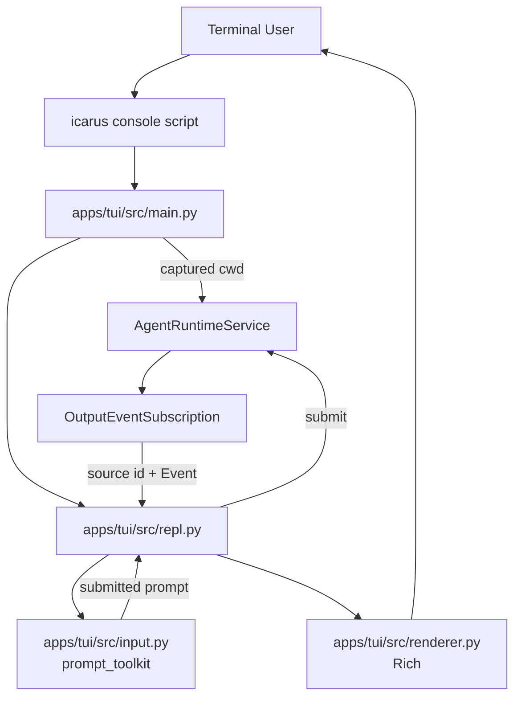

# TUI Terminal Framework Design｜TUI 终端框架设计

## 文档定位

本文定义 Icarus 第一阶段终端交互框架。它把当前标准库串行 REPL 升级为保留终端
原生滚动历史的 Claude Code / Hermes 风格界面，并为后续 TUI 本地消息队列、任务取消
和运行时状态机提供稳定边界。

本文是终端框架升级的架构依据：

- `apps/agent/docs/arch/agent-runtime-service-tui-design.md` 继续描述
  `AgentRuntimeService`、Plugin 组装和最小 REPL 的既有边界；
- 本文覆盖其中关于终端输入、输出和交互框架的 MVP 约束；
- `apps/agent/docs/arch/plugin-event-flow-current-state.md` 继续作为当前 Plugin Event
  主链路的事实说明；
- 实施步骤见 `apps/tui/docs/plan/tui-terminal-framework-development-plan.md`；
- `apps/tui/docs/plan/repl-tui-development-plan.md` 只保留为标准库 MVP 的历史实施记录。

本文不改变 Agent Core、Plugin Runtime、EventBus、Blackboard 或 Hook 的职责。

持久底部输入框、Agent 运行期间编辑和 TUI 本地双端队列的下一阶段设计见
`apps/tui/docs/arch/tui-persistent-input-queue-design.md`。下一阶段已经确认迁移为 Textual
全屏应用和应用内滚动，因此有意替代本文第一阶段的原生 scrollback 交互选择；当前实施
计划见 `apps/tui/docs/plan/textual-tui-development-plan.md`。

## 背景

当前 `apps/tui` 已经能够完成真实串行对话：

```text
Terminal input()
→ AgentRuntimeService.submit()
→ OutputEventSubscription.next_event()
→ plain TextIO renderer
→ InputFinishedEvent
→ next input()
```

当前实现适合验证 Agent 主链路，但不适合作为持续使用的终端入口：

- 必须从仓库入口运行 Python 模块，没有全局 `icarus` 命令；
- 没有欢迎页和 Workspace 提示；
- 标准 `input()` 不支持多行编辑；
- 输入、普通输出和流式输出没有明确的终端职责边界；
- Agent Markdown 只按纯文本增量输出；
- `apps/agent/settings.json` 通过源码相对路径读取，安装为命令后需要稳定的资源定位。

当前应用输出已经使用独立实时订阅。TUI 在提交任务前创建一个长生命周期
`OutputEventSubscription`，不同应用消费者不会竞争同一个队列。终端框架继续复用该契约，
不新增第二条输出链路。

## 目标

第一阶段实现以下能力：

- 安装后可在任意 Workspace 目录执行 `icarus`；
- 把命令启动瞬间的当前目录作为该次 Agent Runtime 的 Workspace；
- 展示简洁欢迎页，包括 Icarus 标识、Workspace 和基础按键提示；
- 保留终端原生 scrollback，不进入 alternate screen，不清空既有终端历史；
- 将已经提交的对话内容与当前可编辑输入区域分开管理；
- 支持多行输入、原样粘贴多行文本和方向键光标移动；
- `Enter` 提交，`Shift+Enter` 插入换行；终端无法区分 `Shift+Enter` 时提供
  `Ctrl+J` 备用换行键；
- 实时渲染 Agent Markdown、工具状态和错误；
- 保持当前单 Workspace、单 Runtime、单 Session、串行任务执行语义；
- 任意正常或异常退出路径都关闭输出订阅并停止 `AgentRuntimeService`。

## 本阶段不实现

以下能力需要独立的运行时状态机设计，不进入本阶段：

- Agent 运行期间保持输入框可编辑；
- Agent 运行期间按 `Enter` 提交到 TUI 本地待发送队列；
- 面向用户的本地消息 FIFO 和队列动态展示；
- 当前任务完成后自动提交本地队首消息；
- `Ctrl+C` 取消正在执行的 Agent 任务；
- 撤销待发送消息并把内容恢复到输入框；
- Runtime、UserInputPlugin 和 TUI 之间的取消协议；
- Session 恢复、Session 切换和业务历史管理；
- 全屏布局、固定底栏、鼠标交互和 Textual 应用；
- 模型 reasoning 原文展示。

`InputQueuedEvent` 是 Agent Runtime 已有的任务接收事件，不等价于未来由 TUI 维护的
本地待发送队列。本阶段可以把它显示为当前任务已接收状态，但不能据此宣称已经实现
TUI 排队能力。

## 交互形态选择

### 方案比较

| 方案 | 优点 | 主要问题 | 结论 |
| --- | --- | --- | --- |
| 标准库 `input()` + ANSI | 依赖少，当前改动小 | 多行编辑、光标控制和流式重绘需要自行实现 | 不采用 |
| Textual 全屏应用 | 固定布局和并发组件能力完整 | 默认交互形态与原生 scrollback 目标冲突，本阶段过重 | 不采用 |
| `prompt_toolkit` + Rich | 输入编辑和内容渲染职责清晰，可保留普通终端历史 | 需要处理两个库的输出协调和按键兼容 | 采用 |

### 选择结果

- `prompt_toolkit` 只负责当前输入缓冲、按键和光标；
- Rich 只负责已经确认的终端输出、欢迎页、状态和 Markdown；
- 终端本身负责滚动历史；
- `apps/tui` 负责串行交互编排；
- `AgentRuntimeService` 仍是唯一 Agent 应用控制入口。

第一阶段不使用固定分屏。这里的“对话区与输入区分离”是职责和生命周期分离：

```text
committed Rich output     → 写入普通终端历史，不再作为输入控件重绘
active prompt_toolkit UI  → 只管理当前尚未提交的输入缓冲
```

用户提交后，输入控件结束本次编辑，TUI 再把用户消息作为已确认对话写入 scrollback。
当前任务结束后才创建下一次输入提示，因此本阶段不存在 Agent 输出与活跃输入控件并发
写终端的问题。后续开放运行中输入时，再基于状态机设计输出协调策略。

## 总体架构



TUI 的控制路径只能经过 `AgentRuntimeService`：

```text
start()
→ subscribe_events()
→ submit(prompt)
→ subscription.next_event()
→ subscription.close()
→ stop()
```

Renderer 可以识别应用服务返回的公开 Event 类型，但 TUI 不直接访问
`OutputBridgePlugin`、EventBus、PluginManager、UserInputPlugin、BlackboardPlugin 或
ReActAgent。

## 模块边界

### `apps/tui/src/main.py`

职责：

- 定义 Python console script 入口；
- 解析 `--session-id` 等顶层参数；
- 在启动时立即捕获 `Path.cwd().resolve()`；
- 创建 `AgentRuntimeService` 和 TUI 组件；
- 运行 asyncio 顶层生命周期；
- 将启动失败、未捕获异常和中断映射为进程退出码。

`main.py` 不处理 Event 渲染、按键或对话循环。

### `apps/tui/src/repl.py`

职责：

- 启动 Service，并在第一次提交前创建一个长期输出订阅；
- 展示一次欢迎页；
- 串行执行“读取输入、提交、消费当前任务 Event、结束本轮”；
- 只渲染 `correlation_id == accepted.task_id` 的当前任务 Event；
- 识别空输入、`exit`、`quit`、EOF 和输入阶段中断；
- 通过 `finally` 关闭订阅和 Service。

REPL 不拼接业务 History，不保存待发送消息队列，也不推断 Agent 是否正在 reasoning。

### `apps/tui/src/input.py`

职责：

- 持有 `prompt_toolkit.PromptSession`；
- 定义多行输入和按键绑定；
- 提供异步读取接口，避免用线程包装标准 `input()`；
- 对测试暴露可替换的输入边界。

它不打印 Agent 输出，也不调用 Agent Runtime。

### `apps/tui/src/renderer.py`

职责：

- 通过 Rich Console 展示欢迎页和已提交的用户消息；
- 将公开 Event 映射为 Agent Markdown、工具状态和错误；
- 管理当前流式 Markdown 段的开始、刷新和固化；
- 在一轮结束时保证终端光标和换行状态正确。

Renderer 不订阅 Event、不筛选 task ID，也不提交用户输入。

## 启动与 Workspace 语义

项目根目录提供 Python 打包配置和 console script：

```text
icarus = apps.tui.src.main:main
```

用户使用方式：

```bash
cd /path/to/workspace
icarus
```

命令必须满足：

- 不依赖当前目录是 Icarus 仓库；
- 不执行隐式 `chdir`；
- 把启动时捕获的绝对路径传给 `AgentRuntimeService(workspace_path=...)`；
- 相对工具路径继续由 Agent Runtime 以该 Workspace 解析；
- 开发安装和普通安装使用同一个 console script，不维护额外 Shell alias。

### 安装后的默认配置资源

当前 `get_config()` 通过 `config_loader.py` 的源码相对路径寻找
`apps/agent/settings.json`。打包后不能依赖仓库目录层级，因此第一阶段同时调整为 Python
package resource：

- `settings.json` 随发行包安装；
- `config_loader` 通过 `importlib.resources` 读取默认配置；
- `OPENAI_API_KEY`、`ANTHROPIC_API_KEY` 和 `ICARUS_DATA_DIR` 继续由环境变量覆盖；
- `.env` 只作为源码开发便利，不作为全局命令的安装契约；
- 第一阶段不新增用户级配置目录和配置迁移规则。

## 输入设计

### 提交与换行

输入契约：

- `Enter`：提交当前非空缓冲；
- `Shift+Enter`：在终端能上报独立按键序列时插入 `\n`；
- `Ctrl+J`：始终作为插入 `\n` 的备用键，并在欢迎页明确展示；
- 空白缓冲：不提交；
- 多行粘贴：保留粘贴文本中的换行，不拆成多次提交。

传统终端通常把 `Enter` 和 `Shift+Enter` 都编码为同一个回车序列。应用无法从相同字节
反推出 Shift 修饰键。因此“Shift+Enter 换行”是有能力协商边界的最佳努力支持：

- 对能上报独立序列的目标终端注册对应绑定；
- 无法区分时，`Enter` 仍然提交，用户使用 `Ctrl+J` 换行；
- 欢迎页不能承诺所有终端都能区分 `Shift+Enter`；
- 自动化测试必须固定 `Enter` 和 `Ctrl+J` 的通用行为，并覆盖一种可区分
  `Shift+Enter` 的受支持序列。

### 光标与内容

- 左右键按字符移动；
- 上下键优先在当前多行缓冲内按可视行移动；
- 输入缓冲不承担跨轮业务 History；
- 判断空输入和退出命令时使用 trim 后的视图；
- 实际提交给 Service 的内容保留用户原始多行文本，避免破坏代码缩进。

### 输入阶段退出

- `exit` 或 `quit` 仅在 trim 后的整个输入与命令完全相等时退出；
- 空缓冲上的 `Ctrl+D` 作为 EOF 正常退出；
- 输入阶段 `Ctrl+C` 放弃当前编辑缓冲，并重新显示空输入提示；
- 输入阶段 `Ctrl+C` 不结束整个进程。

Agent 执行阶段的 `Ctrl+C` 取消不在本阶段实现。若进程收到顶层中断，只执行既有清理
和退出流程，不能把它描述为“取消当前任务并回到输入框”。

## 欢迎页设计

欢迎页保持简洁，不占用全屏。至少展示：

```text
Icarus
Workspace  /absolute/path/to/workspace

Enter submit · Shift+Enter newline when supported · Ctrl+J newline
Ctrl+D exit
```

Rich 可以使用轻量边框和低强度辅助文字，但欢迎页不得：

- 清屏；
- 隐藏已有终端内容；
- 启用 alternate screen；
- 持续占据固定高度；
- 输出与当前环境无关的大段帮助。

## 输出与 Markdown 设计

### 已提交用户消息

`prompt_toolkit` 接受输入后，Renderer 将完整输入作为一个用户消息写入 scrollback。
这份已提交副本与后续输入缓冲无关，不会因为下一轮编辑而变化。

### 流式 Markdown 段

一个连续的 `AgentTextDeltaEvent` 区间构成一个 Markdown 段：

```text
text delta...
text delta...      → 同一个 Rich Live Markdown 区域
tool started       → 固化 Markdown，打印工具状态
tool completed     → 打印工具结果状态
text delta...      → 新建下一个 Markdown 区域
InputFinished      → 固化最后一个 Markdown 区域
```

实现约束：

- Renderer 累积当前段的原始 Markdown 文本；
- Rich `Live` 在普通 screen 中刷新，`transient=False`，结束后保留最终结果；
- 不完整 Markdown 语法按当前缓冲做最佳努力渲染；
- 工具、错误或任务终止事件到达前，必须先固化当前 Markdown 段；
- 工具后的文本必须建立新段，不能重绘工具状态上方已经提交的内容；
- 一轮结束时最终文本不得语义重复或丢失；
- 超长内容的重绘性能先以刷新节流控制，不改变 Event 或 Service 契约。

这里保留的是每个流式段的最终形态，而不是把每次 token 刷新的中间屏幕都写入
scrollback。

### Event 映射

| Event | 正常显示 | 说明 |
| --- | --- | --- |
| `AgentTextDeltaEvent` | 流式 Rich Markdown | 只展示模型可见文本 |
| `AgentToolStartedEvent` | 工具名和紧凑参数摘要 | 先固化当前 Markdown |
| `AgentToolCompletedEvent` | 成功或失败状态 | 默认不展开完整 ToolResult |
| `AgentErrorEvent` | 明确错误摘要 | 先固化当前 Markdown |
| `InputQueuedEvent` | 当前任务已被 Runtime 接收 | 不代表 TUI 本地消息队列 |
| `InputFinishedEvent` | 固化本轮；失败时显示任务失败 | 结束当前任务等待 |
| 其他 Event | 默认不显示 | 可在未来 debug 模式扩展 |

模型内部 `reasoning_delta` 当前由 Agent 聚合但不会发布为
`AgentTextDeltaEvent`，因此 Renderer 不显示隐藏 reasoning。模型是否在工具调用前输出“接下来执行
某工具”之类的可见叙述，由模型生成内容决定；只要它进入 `AgentTextDeltaEvent`，TUI 就按
Markdown 展示。

## 单轮数据流

```text
1. prompt_toolkit 返回完整输入
2. REPL 判断空输入或退出命令
3. Renderer 固化用户消息
4. AgentRuntimeService.submit(prompt) 返回 InputAccepted(task_id)
5. REPL 从长期 OutputEventSubscription 读取 (source_plugin_id, event)
6. 忽略 correlation_id 不等于当前 task_id 的 Event
7. Renderer 按 Event 类型更新普通输出或当前 Markdown 段
8. 收到匹配的 InputFinishedEvent 后固化本轮
9. 回到下一次 prompt_toolkit 输入
```

订阅必须在第一次 `submit()` 前创建。因为订阅是纯实时、无回放的，如果先提交再订阅，
快速产生的事件可能永久丢失。

## 生命周期与错误处理

### 正常生命周期

```text
capture cwd
→ construct service and terminal components
→ service.start()
→ service.subscribe_events()
→ show welcome
→ serial conversation loop
→ subscription.close()
→ service.stop()
```

### 错误原则

- 配置或 Service 启动失败：向 stderr 输出简洁错误并返回非零退出码；
- 输入读取失败：结束当前 REPL，执行统一清理；
- Event 消费失败：不继续假装当前任务完成，交给顶层错误路径；
- `AgentErrorEvent`：展示错误，并继续等待对应 `InputFinishedEvent`；
- Renderer 异常：固化可固化的 Live 区域后进入统一清理；
- 输出订阅必须显式 `close()`；
- Service 无论成功、EOF、异常还是中断都必须执行 `stop()`；
- 默认不打印完整 Python traceback，现有日志和 Trace 继续承担诊断职责。

## 依赖和兼容性

新增运行时依赖：

- `prompt_toolkit`：输入编辑；
- `rich`：终端展示和 Markdown。

版本范围需要在打包配置和开发依赖文件中保持一致。Rich 使用自动颜色能力探测，非彩色
测试输出不依赖 ANSI。第一阶段以交互式 VT100 类终端为目标，不承诺在完全非交互 stdin
下提供同等编辑体验。

终端兼容性的最低保证是：

- `Enter` 提交；
- `Ctrl+J` 换行；
- 方向键编辑；
- `Ctrl+D` 退出；
- 内容最终写入普通 scrollback。

`Shift+Enter` 是否可独立识别取决于终端协议，是增强能力，不影响最低保证。

## 测试策略

### 输入单元测试

使用 `prompt_toolkit` 的 pipe input 和 dummy output 验证：

- Enter 提交；
- Ctrl+J 插入换行；
- 支持的 Shift+Enter 序列插入换行；
- 左右上下键移动；
- 多行粘贴只产生一次提交；
- Ctrl+C 放弃当前缓冲；
- Ctrl+D 产生 EOF。

### Renderer 单元测试

使用固定宽度、无颜色 Rich Console 验证：

- 欢迎页包含正确 Workspace 和快捷键；
- 用户多行消息只提交一次；
- 多个文本 Delta 最终不重复、不丢失；
- Markdown 跨 Delta 正确形成最终内容；
- 工具事件会切分并固化 Markdown 段；
- 工具结果不默认完整展开；
- Agent 和任务失败可读；
- 未知 Event 不破坏当前渲染。

### REPL 与 CLI 测试

通过输入、Renderer、Service 和 Subscription Stub 验证：

- Service 启动后、第一次提交前创建订阅；
- 欢迎页只显示一次；
- 多轮严格串行；
- 只消费当前 task correlation；
- 原始多行 Prompt 传给 `submit()`；
- EOF、exit、quit、异常和输入阶段 Ctrl+C 行为；
- 任意退出路径关闭订阅并停止 Service；
- console script 使用启动命令所在目录作为 Workspace。

### 安装验证

- 构建或安装项目后存在 `icarus` console script；
- 从 Icarus 仓库之外运行 `icarus --help`；
- 从临时 Workspace 启动后欢迎页和 Runtime 都使用该目录；
- 安装环境中能够读取随包发布的 `settings.json`。

## 验收标准

- 用户可以从任意 Workspace 目录执行 `icarus` 进入一个新 Session；
- 欢迎页显示绝对 Workspace 和真实可用的按键提示；
- 终端既有内容和 Icarus 已提交对话保留在原生 scrollback；
- Enter 提交，Ctrl+J 换行，受支持终端上的 Shift+Enter 换行；
- 多行编辑、方向键和粘贴行为稳定；
- 用户输入、Agent Markdown、工具状态和错误按事件顺序显示；
- 流式 Markdown 最终内容完整，不语义重复；
- TUI 继续只通过 `AgentRuntimeService` 控制 Agent；
- 当前实时订阅、task correlation 和 `InputFinishedEvent` 终止语义不回归；
- 本阶段没有引入 TUI 本地消息队列、运行中输入或伪取消；
- 相关 TUI、应用层和配置测试通过，compileall 与 `git diff --check` 通过。

## 后续演进边界

下一阶段需要先独立设计 TUI 状态机，再实现：

```text
WAITING_INPUT
→ RUNNING_EDITABLE
→ LOCAL_QUEUE_NON_EMPTY
→ CANCELLING / RESTORING_INPUT
→ next task
```

届时 TUI 本地 FIFO 才成为待发送消息的权威来源，并需要明确 Agent terminal Event、取消
确认、队首移除时机和输入恢复规则。该状态机只能调用扩展后的应用服务契约，不能绕过
`AgentRuntimeService` 直接操纵 Plugin Runtime。
