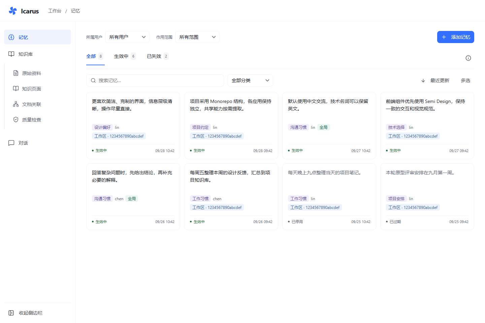
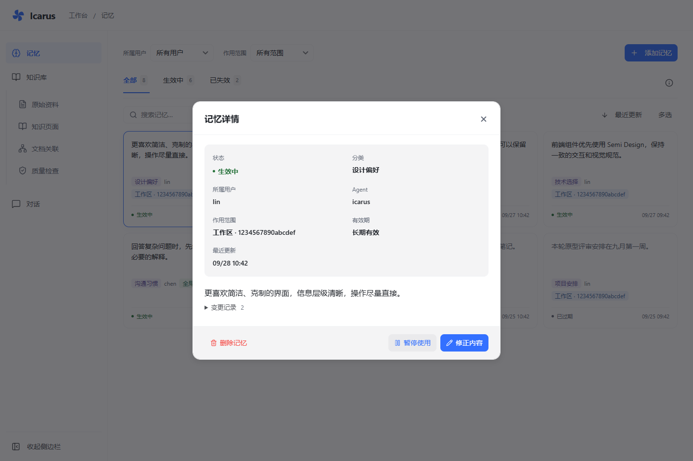
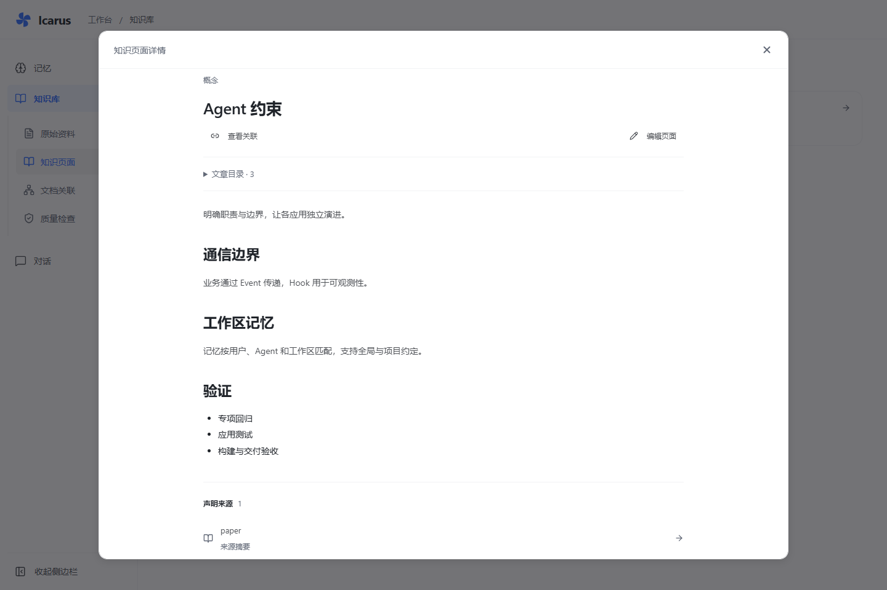
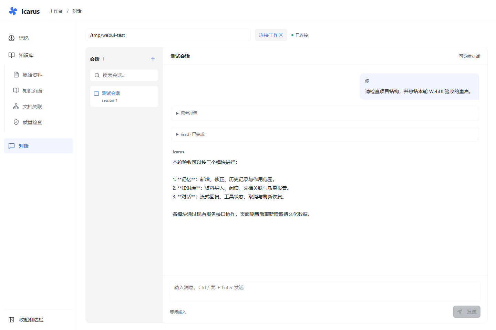

# WebUI PR 准备与验证

2026-10-02。目标是把 `feat/webui` 的工作交付到 `feature`；本次未暂存、提交、推送或创建远端 PR。
此前的 [execution.md](execution.md) 和 [acceptance.md](acceptance.md) 保留各自时间点的历史证据，
当前交付状态以本文为准。

## 分支与提交范围

已查询远端：`upstream` 为 `Removel/Icarus`，`origin` 为 `xilele777/Icarus`。
`feat/webui` 包含当前 `upstream/feature`（`fe2a758`），在此基础上有 4 个已提交的 WebUI 原型提交，
以及本次尚未提交的实现。`origin/feature` 仍停留在 `2633c14`，不能把两个远端的同名分支当成同一基线。
实际发 PR 时再次核对目标仓库；面向主仓库的集成目标为 `Removel/Icarus:feature`。

应用分支合入 `feature`，再由 `dev` 准备发布，最终进入正式分支。现有远端正式分支实际名为
`main`；仓库规则记录了它与“master/线上正式分支”这一角色的对应关系，未进行分支重命名。

本次包含 WebUI 以及必需的 Agent/Gateway 记忆归属、Mem0 属性历史、OpenKB 报告与资料接口。
Windows Bash 修复作为独立逻辑提交，避免埋在页面改动里。逐文件清单见 [commit-plan.md](commit-plan.md)，
PR 正文见 [pr-description.md](pr-description.md)。`.claude/worktrees/` 和 `.playwright-mcp/` 已加入忽略规则，
未删除任何本地工作树。`docs/progress-baseline-2026-09-24.md` 是此前的独立未跟踪文档，暂不纳入此 PR。

## 当前验证结果

| 检查 | 结果与范围 |
| --- | --- |
| WebUI 常规回归 | 100 passed、7 skipped，196.94 秒；跳过的是真实服务测试，随后单独执行 |
| WebUI 工程检查 | lint、Prettier、TypeScript、Vite build、Node 语法检查通过 |
| 真实服务及模型 | 7 passed，57.11 秒；Mem0 读写/历史/暂停恢复，OpenKB 库与模型编译，Gateway 文本/工具/重连/取消，手动全局及工作区记忆召回 |
| 新 WebUI 容器联调 | 7 passed，52.88 秒；新构建镜像的 Basic 认证与 HTTP/WebSocket 代理连接实际后端，结束后删除临时容器 |
| Agent 受影响文件（Windows） | 78 passed，58.69 秒 |
| 最终跨平台 CI 专项（Windows） | 112 passed，13.76 秒；Memory factory/plugin/adapter/tools、Runtime、Bash 与 Gateway 全套 |
| Agent/Gateway 专项（Linux） | 117 passed，14.26 秒；比 Windows 门禁多包含 5 项生命周期配置测试 |
| Agent 全套（Linux） | 709 passed，61.65 秒；隔离源码、空根 `.env`，Python 3.12 |
| Gateway 全套（Windows） | 16 passed，4.82 秒 |
| Mem0 同步/异步更新与 SQLite 历史 | 76 passed，19.06 秒；通过新 `icarus` Hatch 环境执行 |
| OpenKB 受影响接口（Linux） | 217 passed，10.13 秒；实际新构建镜像中的资料、报告、模板和 API 测试 |
| OpenKB 全套（Linux） | 1264 passed、1 failed；失败为基线已有的模块行数检查，见下文 |
| Docker 完整构建 | WebUI、Mem0、OpenKB 均使用仓库 Dockerfile、`--no-cache` 完成构建 |
| CI 静态校验 | 三个工作流通过 actionlint 1.7.12；GitHub Actions 远端执行尚未发生 |
| 编译、锁文件与差异 | Python compileall、OpenKB `uv lock --check --offline`、`git diff --check` 通过 |

本轮仅修改规则、文档、CI、Hatch 测试环境、构建上下文与 OpenKB 的 Debian 下载方式，没有再次修改
WebUI 业务逻辑。100 项常规回归和工程检查沿用本次会话已验证的相同前端源码，避免重复执行无变化的检查。

### 已确认的基线问题

- Windows Agent 全套为 629 passed、44 failed、36 skipped，涉及 POSIX 文件系统、Skill 进程以及
  被本机环境影响的生命周期配置断言。旧 HEAD 的 Windows 全量对照在旧 Bash 测试阶段长时间不再前进，
  超过 8 分钟后停止了该测试进程树，不能据此宣称完成了 Windows 全量基线差异证明。
  相关新实现的 Windows 专项和当前 Linux 全量通过。
- Windows OpenKB 全套为 1249 passed、16 failed；导出旧 HEAD、使用相同环境重跑得到
  1239 passed、相同 16 项失败，未增加失败项。Linux 仅剩 `test_no_module_exceeds_limit`：
  `api.py` 810 行、`api_helpers.py` 800 行；这两个文件本轮未修改，不以添加豁免的方式掩盖旧问题。
- Mem0 核心 memory 目录为 392 passed、1 failed，旧 HEAD 同环境为 388 passed、同一项失败：
  `test_async_notice_wrapper_uses_shared_helper`。因此本次 CI 门禁明确覆盖受影响的更新/历史两个测试文件，
  不把该门禁称作 Mem0 全库通过。
- Mem0 全库在测试专用依赖环境中有 37 个收集错误、9 skipped，原因是可选供应商依赖未安装；
  全供应商兼容验证仍使用上游 `dev_py_*` Hatch 环境，不混入本次核心接口门禁。

原始本地失败日志曾包含进程环境的配置值，已对本次日志执行脱敏，日志保留在被忽略的 `.icarus-data/`，
不作为 PR 附件。后续离线测试在不含凭据的源码副本中运行，根 `.env` 为空，避免 dotenv 向父目录寻找本机配置。

## CI 范围

- `.github/workflows/webui.yml`：Ubuntu、Node 22、Python 3.12、冻结锁文件、浏览器回归和工程检查；
  保存 JUnit 及失败截图。
- `.github/workflows/backend-contracts.yml`：Windows/Linux 的受影响 Agent/Gateway 契约、Linux Agent 全套、
  Mem0 更新/历史、OpenKB 受影响接口；离线运行，不注入服务或模型密钥，不放宽断言。
- `.github/workflows/images.yml`：三个应用从仓库 Dockerfile 独立完整构建，只构建、不推送镜像。

上述门禁补齐了 WebUI PR 的跨应用检查；它们不代表 Windows 全项目、Mem0 全供应商或 OpenKB 全量旧问题已修复。
远端结果必须在提交和推送后取得，不能用本地 actionlint 代替远端 CI。

## 构建与运行复现

在仓库根执行：

```bash
docker build --no-cache -t icarus-webui:pr-check -f apps/webui/Dockerfile apps/webui
docker build --no-cache -t icarus-mem0:pr-check -f apps/mem0/server/dev.Dockerfile apps/mem0
docker build --no-cache -t icarus-openkb:pr-check -f apps/openkb/Dockerfile.icarus apps/openkb
```

本机 Docker Hub 认证域名连接失败；从 Docker Official Images 的 Public ECR 分发源拉取同名基础镜像，
标记为原 Dockerfile 所用名称后重新构建，没有用旧业务镜像替代源码构建。基础镜像来源：

| 镜像 | 本次拉取的 manifest digest |
| --- | --- |
| `public.ecr.aws/docker/library/python:3.12` | `sha256:4f80f79240325e61337d9d2dcc7b6aff90570356f1a222f7f1b85382d6f9ab42` |
| `public.ecr.aws/docker/library/python:3.12-slim` | `sha256:dddfd7e07f9d15aeeca61529320492139d21cac7f0070c00609243e51e4e0016` |
| `public.ecr.aws/docker/library/node:20-alpine` | `sha256:fb4cd12c85ee03686f6af5362a0b0d56d50c58a04632e6c0fb8363f609372293` |

Node 22 使用此前取得的官方镜像本地缓存。OpenKB 的 Debian HTTP 下载在本机失败，已改为同一官方源的
HTTPS 并设置 3 次重试；之后从头构建成功。Mem0/OpenKB 的 `.dockerignore` 避免复制本地虚拟环境和凭据。

生产联调使用新 WebUI 镜像及已运行的实际 Mem0/OpenKB/Gateway；Mem0/OpenKB 新镜像没有替换用户当前服务。
按 [部署说明](../../deployment.md) 配置独立入口后，在 `apps/webui` 执行：

```powershell
$env:WEBUI_BROWSER_CHANNEL = 'msedge'
$env:WEBUI_LIVE_TESTS = '1'
$env:WEBUI_LIVE_MODEL = '1'
$env:WEBUI_LIVE_KNOWLEDGE_MODEL = '1'
# 测试已有容器时，另设 WEBUI_LIVE_URL 和 WEBUI_LIVE_PASSWORD，入口用户名为 live-test。
pnpm test test/integration -q
```

测试只创建唯一标识的数据并清理本次创建的记忆和知识库。Gateway 临时工作区历史按既有约定保留。
完整开关和清理边界见 [集成测试说明](../../../test/integration/README.md)。

## 升级和回滚

本版本 WebUI 需要配套 Gateway 的 `memory.get_context`、Mem0 的历史 `changes`、OpenKB 的
`report/delete` 与资料标识字段。先备份 Mem0 `history.db` 及 OpenKB 数据，再按后端、Gateway、WebUI 的顺序升级。
手动新增依赖当前 Agent 的身份配置；仅页面升级不能兼容旧 Gateway。
旧 Mem0 的 schema 迁移可能丢弃新增审计列，回滚时保留升级前备份和升级后的数据库副本。

## 截图与功能边界

下图由当前页面和仓库测试 fixture 生成，全部使用合成数据；它们说明界面布局，真实服务证明来自上述独立测试。






本次保留单用户部署、记忆最多加载 1000 条、本地列表筛选、历史展示分页及知识缺少版本回滚等既有边界。
主入口约 783 kB（gzip 239 kB）为后续体积优化项；知识加工中间流程的人工干预仍待单独定义。

## 提 PR 前最后一步

按提交清单审查并组织提交，核对目标为 `feature`，随后推送并创建 PR。远端 CI 必须通过；上述已有全量问题
需在评审中保留说明，不宣称全项目无失败。这些 Git 操作仍需用户明确发起，本轮只完成准备材料。
